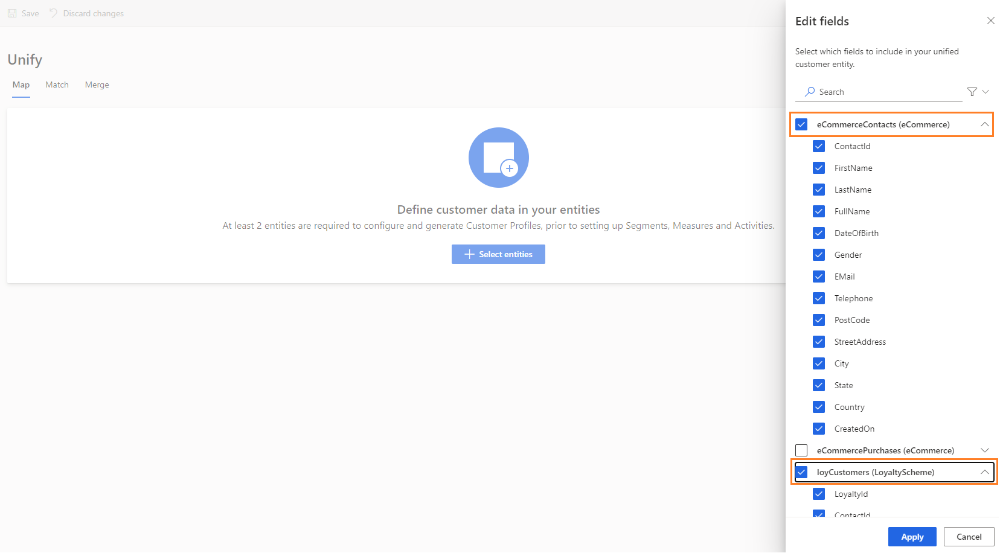

# Map

[!INCLUDE [cc-beta-prerelease-disclaimer](../includes/cc-beta-prerelease-disclaimer.md)]

There are two main goals behind the *Map* phase:

- **Entity selection:** Identify the entities which, upon unification, may lead to a dataset with a more complete information around your customers.
- **Attribute selection:** For each customer entity, identify the columns upon which you will want to combine and reconcile your data in the next data configuration phases, *Match* and *Merge* (those columns are also called **Attributes**).

Select the **Map** tile on the **Configure Data** page to start the *Map phase*:

// update 1
> [!div class="mx-imgBorder"] 
> 

### Selecting First Entities
Start the Map phase by selecting **Add entities**:

> [!div class="mx-imgBorder"] 
> 

Within the next screen, add all the entities which, upon unification into a unified customer dataset, might lead to a better understanding around your customers:

> [!div class="mx-imgBorder"] 
> 

In the example above, the user used the **Search Field** to search for the *Contact* and *Survey* entities since these include information that might be valuable to combine. One example might be understanding what address corresponds to what survey participant (given that the *Address* attribute exists only in the *Contact* entity). 

Then, the user selected the *Contact* and *Survey* entities. Those were found within the **Dynamics** and **Surveydata** data sources that were ingested through the **Data Sources** screen. Lastly, the user selected **Save**.

> [!NOTE] 
> You should search for and select at least two entities in order to benefit from the data configuration process.

### Viewing System Auto-Selections:
The following page appears upon completing your entities' selections:

> [!div class="mx-imgBorder"] 
> 

- On the left, you can see your ingested entities. By default, the first entity is auto-selected (contactCSV in the example above).     To move to any other entity click that entity's tile. 

- Note that the system auto-selected for you all the attributes for which attribute-type was auto-identifified. Those attributes include Names, Email Adresses, and several others in the example above. As shown in red, those pre-selected attributes appear in the first column while their types are specified in the third column. You should review those pre-selected attributes since they will be used to combine your entities in the next configuration phase (*Match*). 

### Adding and Removing Attributes
That can be done via the **Edit** button: 

// missing 1

Upon clicking **Edit**, the **Attributes Panel** will open:

// missing 2

Use either the **Search Field** or scroll down the **Attributes List** (shown in red above) to locate and select your attributes of interest. Finish by selecting **Save**. Note that you can also choose *all* the attributes by selecting **Select all** (green). Once one attribute is selected (or ore), the same button can be used to unselect all your selections (now appear as a **Clear all** button).

## Adding and Removing Entities
Click **Select** to either add or remove entities:

> [!div class="mx-imgBorder"] 
> 

Select the entities that you want to add to your existing entities list and deselect entities that you want to remove: 

> [!div class="mx-imgBorder"] 
> 

### Selecting Primary Keys and Defining Attribute Types

> [!div class="mx-imgBorder"] 
> 

There are two mandatory selections you must complete prior to the completion of the Map phase:

- **1.Primary key:** (shown in red above) It's mandatory to select one attribute as a primary key for each of your chosen entities. Note that in order for an attribute to be a valid primary key, it should not include either duplicate values, missing values or *Nulls*. 
- **Attribute Type:** Categories under which your attributes fall such as *Email* or *Name*. Adding a custom entity type is also possible: Select the type field for that attribute and type your custom attribute-type name. You can also change the attribute-types that were auto-identified by the system.  

## Next Step
As part of the data configuration process, proceed to the **Match** page either by selecting **Match** in the left side menu or by selecting the **Match** tile within the **Configure Data** page. Visit the **Match** section to learn about this phase.
