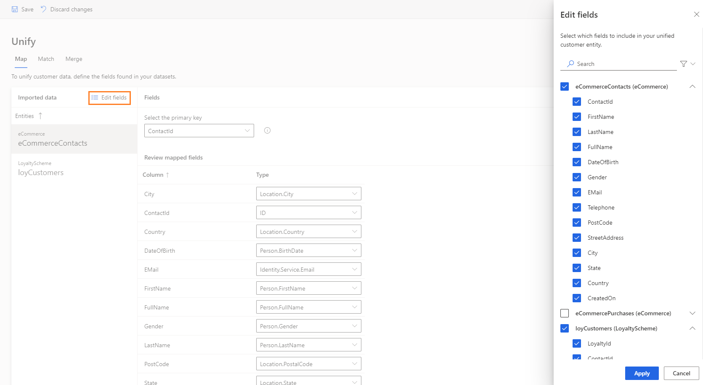

# Map

**Map** is the first stage in the data unification process in Dynamics 365 Customer Insights. Mapping consists of two phases:

- *Entity selection*: Identify the combinable entities that lead to a dataset with more complete information about your customers.
- *Attribute selection*: For each entity, identify the columns you want to combine and reconcile in the *match* and *merge* phases. In Customer Insights, these columns are called *Attributes*.

For more information about the general flow of data unification, see [Unify](pm-configure-data.md).

## Select the first entities

1. In Customer Insights, go to **Unify** > **Map**.

2. Start the map phase by selecting **Add entities**.

3. In the **Add entity** pane, select the entities you want to add. We recommend selecting at least two entities to benefit from the data unification process.

   > [!div class="mx-imgBorder"]
   > 

   For example, we're adding the **Contact** and **Survey** entities. It might be useful to understand which address corresponds to a survey participant.

4. Select **Save** to confirm your selections.

## Review system-selected attributes

After selecting your entities, the **Map** page list the ingested entities.

> [!div class="mx-imgBorder"]
> 

The system automatically selected all the attributes for which an attribute type was identified. Those attributes include names, email address, and several others. Review these attributes their specified types since they'll be used to combine your entities in the *match* configuration phase.

## Add and remove attributes

1. On **Unify** > **Map**, select the entity to select attributes from.

2. Select **Edit** to add or remove attributes.

   > [!div class="mx-imgBorder"]
   > 

3. Use the search or scroll down to find and select your attributes of interest.

4. Select **Save**.

> [!NOTE]
> One field should map to the attribute Person.FullName to populate the customer name in customer card. Otherwise, the customer cards will appear nameless. 

## Add and remove entities

1. On **Unify** > **Map**, select the **Select** control to add or remove entities.

   > [!div class="mx-imgBorder"]
   > 

2. In the **Entities** pane, select the entities you want to add, or clear the selection for entities you want to remove. Currently, you can't remove entities if they've already been matched.

   > [!div class="mx-imgBorder"]
   > 

## Select primary key and define attribute types

Before completing the matching phase, you need to define the primary key and its attribute type for every added entity.

> [!div class="mx-imgBorder"]
> 

- **Primary key**: Select one attribute as a primary key for each of your entities. For an attribute to be a valid primary key, it shouldn't include either duplicate values, missing values, or null values.

- **Attribute type**: Categories of your attributes, such as email address or name. Adding a custom entity type is also possible. Select the type field for that attribute, and type your custom attribute-type name. You can also change the attribute types that were auto-identified by the system.

## Set attributes for organizations

For Organizations (Preview), the attribute type should be mapped to "Organization.Name"
> [!div class="mx-imgBorder"]
> 

## Next step

As part of the data unification process, go to the **Match** page. Visit [**Match**](pm-match.md) to learn about this phase.

> [!TIP]
> Check out the following video: [Getting Started: Creating a Unified Customer Profile](https://youtu.be/oBfGEhucAxs).
