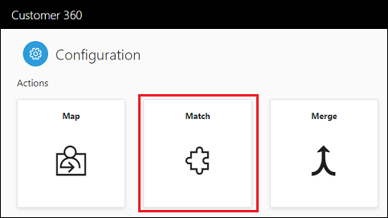
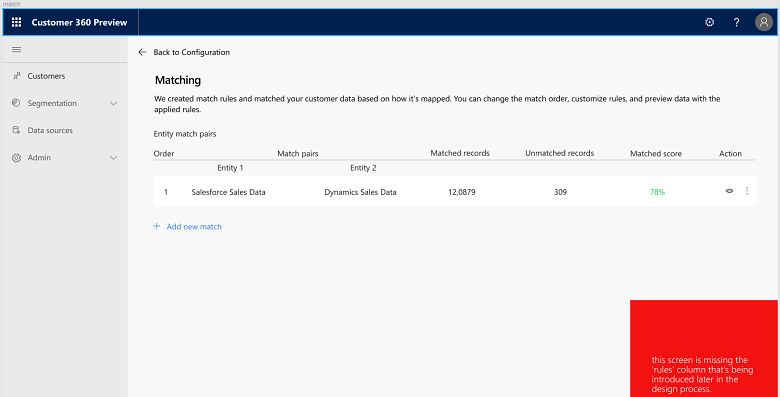
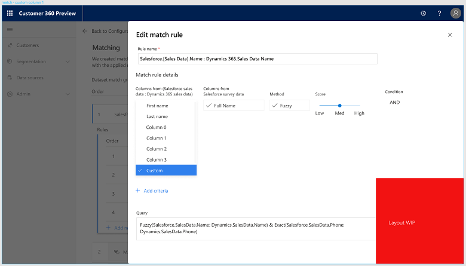

# Match

[!INCLUDE [cc-beta-prerelease-disclaimer](../includes/cc-beta-prerelease-disclaimer.md)]

Once mapping is completed, you are ready to match your mapped entities. Clicking the *Match* tile in the *Configuration page* will take you to the *Match page*.

In the *Match* page below, some matches were already automatically identified based on your Map phase selections. However, since there are many ways and orders by which customer entities might be matched, this phase enables you to specify the match logic that best resonates with:
- Your understanding of how your datasources are related to one another
- Your understanding of what sources are most reliable for your mapped attributes

## Exploring the Match page
The *Match* page includes two major sections: **Summary** and **Details** as explored below. Above these components you will find three tiles that specify your total number of customers (right tile), total number of customers for which information has been already matched (left **Matched Customers** tile) and total number of customers for which data had not been matched yet (center **Unmatched Customers** tile).   

## Summary Section
This diagram visualizes the hirarchy by which your ingested entities are currently matched. Each of the entities is represented by a tile with the entity's name, the datasource from which it was dervied, number of records, end possibility to view those records by clicking the button at the bottom-right corenr of the tile.                                

To examplify the logic that is captured in the **Summary** part, the following matching sequence is reflected in the diagram below:
- First, *Sales Data* from *Salesforce* will be matched with *Sales Data* from *Dynamics 365*
- Then, the matched dataset that resulted from step one will be matched with *Survey Data* from *Salesforce*
- Then, the matched dataset from step two will be matched with *Solication Data* from *Salesforce*
- Lastly, the matched dataset from step three, will be matched with another *Sales Data* dataset from *Salesforce*
    
[]

In addition to entities, the Suammry diagram includes three types of status for the different matchings. Those are stated on top of the links that connect each matching pair. 
- In the example above, all these links have the same status: **Rules Needed**. This status implies that no rules were defined for the match pair. As we will see, at least one rule **must** be added to each of the matchings and it can be done in the **Details** section
- Once rules were defined for a given match pair, it's status will turn to **Ready to Run**. As we will see, running a match is also available within the **Details** section. 
- **Matching** is the third status you can see for a given match pair. This status implies that the matching process is currently under progress (reflected as a percentage).   
- **Complete** is the forth and last status you can see for a given match pair and it reflects the completion of the matching process both for this matching and for all the matchings that precede it. In the example shown below, the first two matchings were completed while the third matching is under progress:

[]

- **Adding and Editing Match Pairs**
Both actions can be done by clicking the **Edit** botton:

[]

Upon clicking it, the following panel opens up:

[]

Each match pair occupies one row in this panel. 
- **Adding a new a match pair:** Click the **Plus Sign** that is highlighted in the image above. Then choose the two entities that will be included in the new match pair. 
- **Editing a match pair's entities:** Upon clicking a match pair entitiy you will be able to change it to any of the other entities
- **Changing the order by which matches are executed:** That can be done by replacing a given row's values with another row's values. In the example above, in order to switch the order of the first match pair () and the second match pair (), we will need to replace the entities in the first match pair with those of the second match pair and vice versa. 

### Details Section
This section captures your matchings in a table. Let's explore the **Details** table fields, going left to right:
   - The first column specifies the order by which the matchings will take place (reflecting the same sequence as in the summary part)
   - The next two columns specify the specific match pair members, whether these are single entities (highlighted in blue in the example below), or datasets resulted from prior matchings (highlighted in red in the example below).
   - The next two columns specify the number of matched and unmatched records **for that specific matching** 
   - The last column includes a status circle: This circle is checked once a match pair is in **Complete** status (as explained above)

Next to these fields you will find a **three dots icon**. Clicking it will enable you to perform the following actions:
- **Running a match pair**. Clicking **Run** will run the specific match pair you are hovering over. For running all your match pairs at the same time, go to the bottom of the Match screen and his the **Run All** button.
- **Adding and Editing Match Pair Rules:** Clicking **Edit** will open the **Edit Match Rule** pop-up window:

[]

Besides the role name, this panel enables you to specify all the ***Criteria*** for that role. Each Criteria is represented by a row that includes (going left to right):
- The attribute that will be used for matching within the first match pair entities
- The attribute that will be used for matching within the second match pair entities
- The method used for that criteria where selecting ***Exact*** will dictate that only matching records will be matched and selecting ***Fuzzy*** will dictate that records that are not 100% matching will also be matched. The threshold for Fuzzy matches will be selected next to it: You can define these as either *Low*, *Medium* or *High*.
- An either *OR* or *AND* operator where:
  - *AND* states that the criteria will be executed together with the next criteria
  - *OR* states that either this or the next criteria should be executed

