# Match

[!INCLUDE [cc-beta-prerelease-disclaimer](../includes/cc-beta-prerelease-disclaimer.md)]

Once the map phase is completed, you're ready to match your entities. Select **Match** on the **Unify** page to get to the **Match** page.

<!--note from editor: In 2nd bullet item--change "the following page" to the **Match** page?   -->

- Note that the match phase requires at least two mapped entities. If you have not mapped at least two entities, you receive a message to go back to the **Map** page and meet the requirement.

- If you did map at least two entities, you can expect to reach the following page. Select **Set order** once you are ready to start the match phase.

<!--note from editor: re: bullet item above--I don't see "Set Order" in the screen shot   -->

  > [!div class="mx-imgBorder"] 
  > 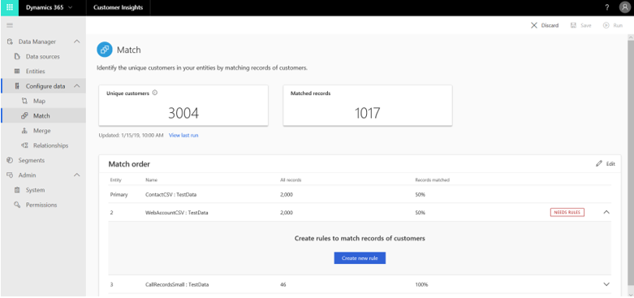

## The match phase

The match phase enables you to specify how to combine your datasets into a unified **Customer Profile** dataset, which will be used later to unlock unique insights about your customers.

If this is the first time you are going through the match process, complete these mandatory steps:

1. Specify the order by which your mapped entities will be matched.
2. Define rules for the first matched pair.
3. Run your specified matches.

In addition, you might want to complete the following steps:

4. (Optional) Review and validate your matches.
5. (Optional) Make changes to your **Match order** and **Rules** definitions.
  
The following sections describe these steps. 

## Step One: Specify the match order

Each match involves two entities that are unified into a single entity, while maintaining each unique customer record. In the following example, the user has selected three entities: **ContactCSV: TestData** as the **Primary** entity, **WebAccountCSV: TestData** as **Entity 2**, and **CallRecordSmall: TestData** as **Entity 3**. The diagram above these selections illustrates how the match order will be executed: 

- **First match**: First, the **Primary** entity is matched with **Entity 2**.
- **Second match**: Then, the dataset that results from the first match is matched with **Entity 3**.
- And so forth (in our example, we made selections only for two matches, but the system supports more than two).

  > [!div class="mx-imgBorder"] 
  > 
  
> [!IMPORTANT]
> The entity that you choose as your **Primary** entity will serve as the basis for your unified master dataset. In other words, any future entities that are selected during the match phase will be added to this entity. At the same time, this doesn't mean that the unified entity will include **all** of the data included in this entity.
>There are two considerations that can help you select your **Primary** entity:
> - What entity do you consider having the most complete and reliable data about your customers?
> - Does the entity that you just identified have attributes that are also shared by other entities (for example, name, phone number, or email address)? If not, choose your second most reliable entity.

> [!NOTE]
> The questions you asked to make your first selection can help you choose **Entity 2** as well. Among your ingested (and mapped) entities, what entity do you consider to have the second most reliable and complete data? Moreover, does it include at least one field that is shared by the **Primary** entity, and possibly additional fields that are shared by other ingested entities?

<!--note from editor: Move the "Important" and "Note" text out of notes and format as normal body text?   -->

You can always remove entities from your match order. Select **Save** to save your match order as shown here.

<!--note from editor: Re: the above--"Select Save"--the screen shot shows an icon--is that the "Save" button? -->

> [!div class="mx-imgBorder"] 
> 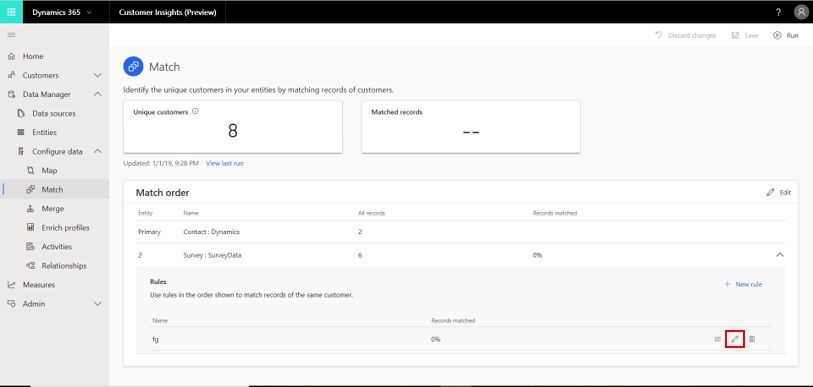

## Step Two: Define rules for your first match pair

Once you've completed Step One, you can expect to reach the **Match** page, which includes your defined matches (in the following example, the user specified two matches). Note that the tiles at the top of the screen will be empty until you run your match order in Step Three. These will be used for validation as explained in Step Four.

> [!div class="mx-imgBorder"] 
> 

The warning sign (outlined in the preceding example) implies that we didn't define at least one match rule for our match pair, which is mandatory. Match rules dictate the logic by which a specific pair of entities will be matched. In order to define your first rule, open the **Rule Definition** pane by selecting the corresponding match row in the matches table (#1) and then selecting **Create new rule** (#2).

> [!div class="mx-imgBorder"] 
> 

That opens the **New rule** pane.

> [!div class="mx-imgBorder"] 
> 

<!--note from editor: Change 2nd sentence in para below to: "For each entity in the condition, you are required to choose an attribute and a precision level:   -->

The **New Rule** pane enables you to specify the conditions for that role. Each condition is represented by two rows that include the following mandatory selections:

<!--note from editor: I'm finding this list confusing--not sure how the bullets match to the UI. Also, do you see and choose the normalization options at this time, or is this done later?. In list item #1, the 2nd sentence doesn't make sense to me; seems contradictory.   -->

1. An attribute that will be used for matching from the first match pair entity (for example, name, phone, or email address). Choose an attribute that is likely unique to the customer, and similar information can be found in other entities.

  >[!IMPORTANT]
  > You should avoid matching on the basis of activity-type attributes. In other words, if an attribute seems to be an activity, then it might be a poor criteria to match by.  

2. An attribute that will be used for matching from the second match pair entity.

3. **Normalization method**: Various normalization options are available for the attributes chosen in fields (1) and (2) from removing punctuation, to removing spaces, to many others. 

4. The level of precision that will be used for that condition:

   - Select **Exact**, on the left-side of the scale, if you want only exact matching records to be matched. 

   - Select one of the other levels to match records that are not 100% identical. **High** fits cases where precision is more important than reach, such as a financial service to a specific customer. **Low** fits cases where the opposite is true, such as a marketing campaign. The **Medium** level serves as a middle-ground option. 

### Add multiple conditions

If you want to match your entities only if multiple conditions are met, you can do so by adding more conditions that are linked through an **AND** operator. Select **Add condition** (#1 in the following example). You can also remove conditions by selecting the delete button (#2 in the following example).

> [!div class="mx-imgBorder"] 
> 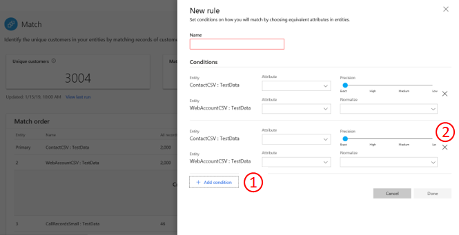

For the purpose of this section we will limit our match rule to only one condition.

### Add multiple rules

If each condition applies to a single pair of attributes, then rules represent sets of one or more conditions. If you believe that your entities can be matched on the basis of different sets of attributes, you should add more rules using **Add rules**. 

Note that when creating rules, order matters. The matching algorithm tries to match on the basis of your first rule (represented by the first row in the table in the following example) and continues to the second rule (represented by the second row) only if no matches were identified under the first rule.

> [!div class="mx-imgBorder"] 
> 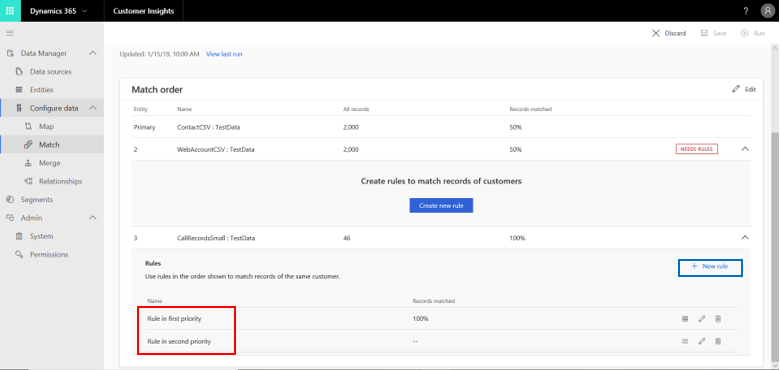

For the purpose of this section, we will stay with only one rule.

## Step Three: Run your specified match order

Now you are ready to run the match order that you have defined in Steps One and Two. This can be done by selecting **Save** and then **Run** as shown in the following example. Next to these buttons there is a **Discard changes** button that lets you delete the definitions of your match.

> [!div class="mx-imgBorder"] 
> 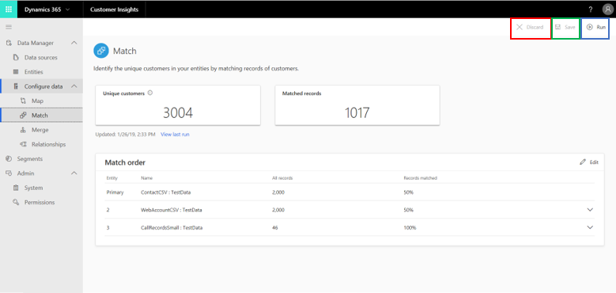

It's possible that the matching algorithm will take some time to complete. While running, you can expect to see the following status diagram.

> [!div class="mx-imgBorder"] 
> 

While it's not possible to use any of the **Match** page functionalities until the match process completes, you can visit other product modules through the left navigation pane. For example, you can use this time to define relationships through the **Relationships** page or activities via the **Activities** page. 

Above the status diagram, a **Matching records** notification displays for as long as the match algorithm runs. When the match process is complete, the **Match** page becomes available again, and the **Matching records** message disappears. 

> [!div class="mx-imgBorder"] 
> 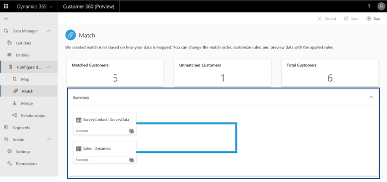

As mentioned in Step One, the first match results in the creation of a unified master entity. All subsequent matches result in the expansion of that entity. Upon completion of the match process, see a preview of the unified customer entity by selecting the following button.

<!--note from editor:  include name of button  -->

> [!div class="mx-imgBorder"] 
> 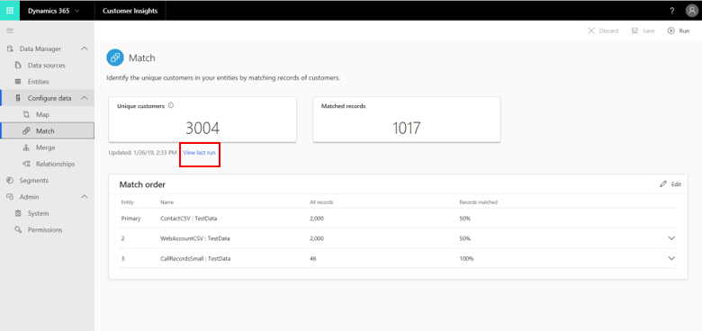

The customer profile preview opens. 

> [!div class="mx-imgBorder"] 
> 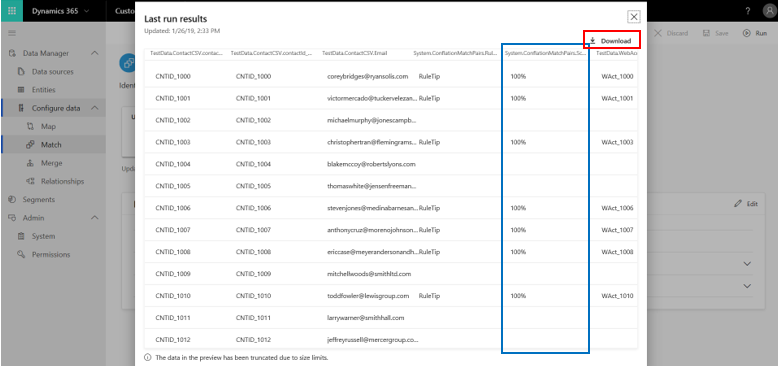

The highlighted column shown in the preceding example reflects, for each of your records, how certain it is that it was accurately matched (confidence score). The remaining columns present the data that was taken from the two original entities. Columns to the left of the highlighted column present data that was taken from the first match pair entity, while columns to the right present data taken from the second match pair entity. Select **Download** to download the customer profile dataset. 

Note that you can also view the customer profile entity on the **Entities** page.

At this point, you can either continue to the **Merge** page or go through any of the optional steps in this section (Steps Four and Five). However, we recommend you review some of the match preview results to validate that records were matched according to your expectations.

## Step Four (optional): Review and validate your matches

Here you will learn how to evaluate in depth the quality of your match pairs and improve it. There are a few things you can do.

First, you can gain first insights by reviewing the tiles at the top of the page (shown in #1 in the following example):

> [!div class="mx-imgBorder"] 
> 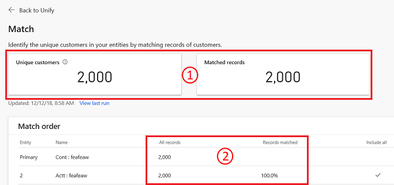

- The left tile shows the number of unique profiles that the system identified.
- The right tile shows the number of matches, in total, that were completed across all of your match pairs. This tile will provide you more context into the first number—is it a relatively good or poor result?

Second, you can assess the results of each match pair as shown in #2 in the preceding example—by viewing the number of records that came from this match-pair entity side-by-side with the percentage of successfully matched records.

> [!div class="mx-imgBorder"] 
> 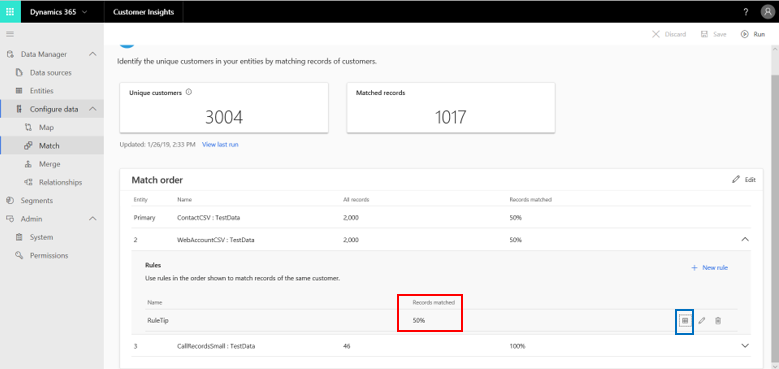

Third, you can view the percentage of successfully matched records at the rule level (shown in #1 in the preceding example). By selecting the button that is shown in #2, you can view all these records (again, on the rule level). The following window exemplifies the preview you can expect to see.

> [!div class="mx-imgBorder"] 
> 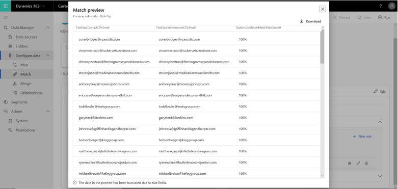

We recommend that you review at least a part of it in order to validate that records were matched according to your expectations.

Fourth, you can experiment with different thresholds around your conditions in order to identify the optimal thresholds. In order to perform these experiments, follow the next few steps.

1. Select (...) for the match pair rule that you want to experiment with (an example is shown in #1 in the following example). Then select **Edit**, shown in #2.

  > [!div class="mx-imgBorder"] 
  > 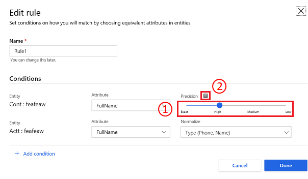

2. Identify the condition that you want to experiment with. Each criterion is represented by one row in the **Match rule** pane.

3. The page that you see depends on the match level you have selected for that condition. 

   If you chose **Exact** for that condition, you will see the following page.

     > [!div class="mx-imgBorder"] 
     > 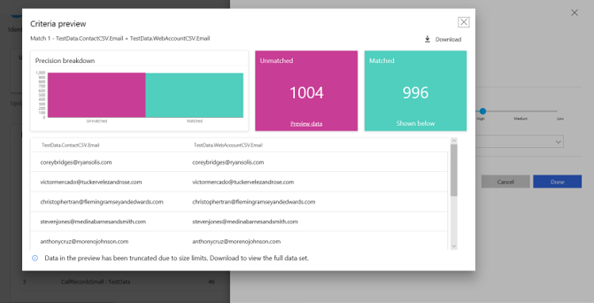

   Here you can view the number of matched and unmatched records for that condition (shown in #1 in the following example. You can also view the records in the table section (shown in #2).
       
   If you chose one of the other levels for that condition, you will see the following page.

    > [!div class="mx-imgBorder"] 
    > 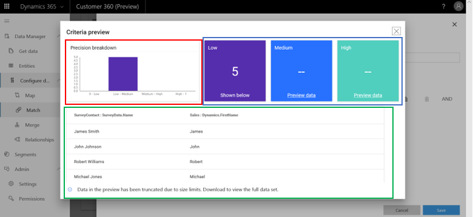
     
   This page gives you a rich understanding of the effects of the three threshold levels. You can compare how many records will be matched under each of the threshold levels, as well as viewing the records under each option. Select each of the tiles and view the table section. 
       
## Step Five (optional): Make changes to optimize your matches

If you followed Step Four, at this point you should have a better understanding of the quality of your first match. You can translate that understanding into better match quality by reconfiguring some of your match parameters:

<!--note from editor:  2nd bullet item below: Delete the sentence about substituting?  -->

- **Change the match order**: This can be done by selecting **Edit**, shown in the following example, and editing the match order fields.

  > [!div class="mx-imgBorder"] 
  > 

- **Change the order of your rules**: If you defined multiple rules, it might be worth changing their order so you can yield a better match quality. This can be done by substituting the two rules' attributes. Delete and re-create the two rules new attributes.

- **Edit your rules**: This includes several important changes that you should try as you optimize the match quality. The following options are accessible via the rule's **Edit** button:

    - **Changing attributes for a condition**: This can be done by reselecting new attributes within the specific condition row.
    - **Changing threshold for a condition**: This can be quickly achieved via the threshold bar. In Step Four, we covered how to get insight into the effects of the three threshold levels on your match quality.
    - **Changing normalization method for a condition**: This can be done by reselecting the normalization method.
    
### Next Step
<!--note from editor: include links to cross-ref topics   -->
Once you've completed the match process for at least one match pair, you are ready to resolve possible contradictions in your data by going through the **Merge** section.

