# Match

[!INCLUDE [cc-beta-prerelease-disclaimer](../includes/cc-beta-prerelease-disclaimer.md)]

Once the Map phase is completed, you're ready to match your entities. Select the **Match** tile in the **Configuration** page to get to the **Match** page.

> [!div class="mx-imgBorder"] 
> 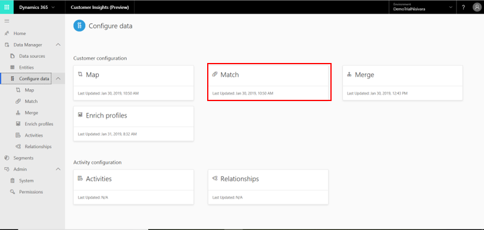

Note that the Match phase requires at least two Mapped entities. If you have not mapped at least two entities, you can expect to receive the following message which required you to go back to the Map screen and Map at least two entities:

## The Match phase
As part of the data configuration process, the match phase enables you to specify how to combine your datasets into a unified Master Customer Dataset that will be utilized later to unlock unique insights about your customers.

If it's your first time through the match process, you should complete all the steps in this section:

1. Specifying the first pair of entities that you want to match (also called a *Match Pair*)
2. Defining rules for the first match pair
3. Running your first match 
4. (Optional) Reviewing and validating your first match pair
5. (Optional) Making changes to your rules and definitions
6. (Optional) Adding additional matches as needed
7. (Optional) Reviewing the order by which you chose to match your entities 
  
We will explore these steps in a sequential order. Prior to that we will give a quick introduction into the **Match** screen as we will perform all our steps from that screen:

> [!div class="mx-imgBorder"] 
> 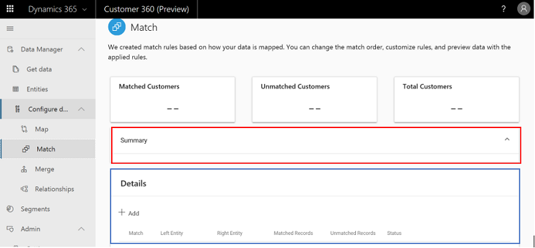

## Quick introduction to the Match Page

The **Match** page shown above includes two major sections: **Summary** (highlighted in red above) and **Details** (highlighted in blue). We will first use the Details section to specify the match pair and setting its rules (Steps 1-2 and Steps 5-6). Later, we will use the Summary section to track the progress of our match until completion as well as to validate the order by which we are matching our entities (validating Step 3 and performing Step 7). Lastly, above these components you will find three tiles. These will be used for Step 4 above. For now there are no counts in those tiles since no match was executed yet.

## Step One: Specifying a first match pair

Each **Match** pair involves two entities that are unified into a single entity. Within the Description section, select **Add** to create the first (as well as any future) match pair:

> [!div class="mx-imgBorder"] 
> 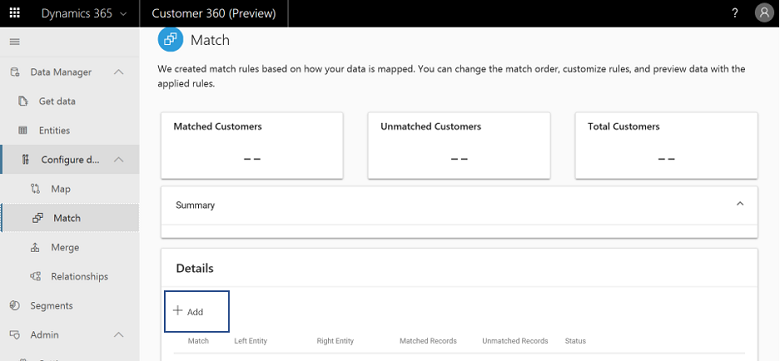

After selecting **Add**, the following panel opens up:

> [!div class="mx-imgBorder"] 
> 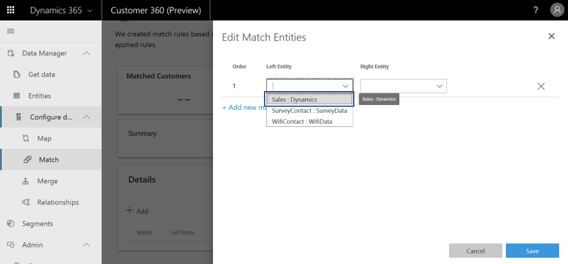

Within this panel you will set the definitions for your first match pair. Start by choosing the first entity of your match pair by selecting the left field (shown above in blue). 

> [!IMPORTANT]
> The entity that you will choose at this point will serve as the basis for your unified master data set. In other words, any future entities that you will be selected during the match phase will be added to this entity. At the same time it doesn't mean that the unified entity will include all the data of this entity. > 
>There are two considerations that can help you select your first entity:
> - First, what entity do you consider having the most reliable data?
> - Second, does the entity that you identified under consideration one has attributes that are also shared by other entities (Name, Phone, Email, etc)? If not, you should continue to your second most reliable entity and so forth. 

Continue by selecting the second entity of your match pair by selecting the right filed (shown below in red):

> [!div class="mx-imgBorder"] 
> 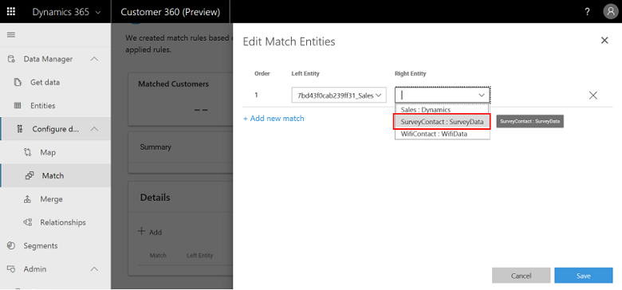

> [!NOTE]
> Considerations for your first selection can help you choose that entity as well. Among your ingested (and mapped) entities, what entity you consider having the second most reliable data? Moreover, does it includes at least one field that is shared by the master entity and possibly more fields that are shared by other entities that you have ingested?

Lastly, select **Save** and you will see that the **Description** section includes the match pair you have just created. You can always delete or edit that match pair by selecting **Edit** button as highlighted in blue below. The warning sign (highlighted in red) implies that we didn't define rules yet for that match pair which we will do in Step Two.

> [!div class="mx-imgBorder"] 
> 

## Step Two: Defining rules for first match pair

For each of your match pairs you should define at least one match rule. Match rules dictate the logic by which a specific pair of entities will be matched. In order to define rules for your first match, select your match within the Description section. Then select **Add new rule** as shown below:

> [!div class="mx-imgBorder"] 
> 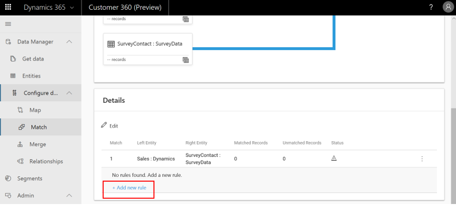

Select **Add Rule** to open the following panel:

> [!div class="mx-imgBorder"] 
> 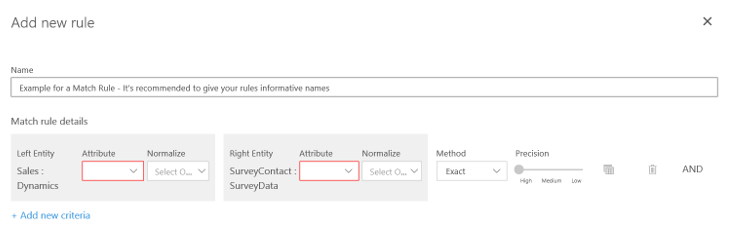

Besides the rule's name, this panel enables you to specify all the ***Criteria*** for that role. Each Criteria is represented by a row that includes the following mandatory selections:

1. **Attribute that will be used for matching from the first match pair entities**: Name, Phone, etc. Highlighted in blue below.
2. **Normalization for first attribute:**: Whether you want to normalize the values for the attribute you chose in (1). Various normalization options are available - from removing punctuation, removing spaces, to many others. Note that for some attribute types, as defined under the **Types** column in the **Map** page, a specific and optimal combination of normalizations will be automatically chosen for you. These are called Semantic Normalization as highlighted in green in the image below. You can change this default setting to any of the other options.
3. **Attribute that will be used for matching from the second match pair entities**: Highlighted in red in the image below.
4. **Normalization for second attribute:** Same definitions as described under (3). Punctuation was chosen as an example in the image above. Highlighted in orange below.
5. **The method that will be used for that criteria:** Selecting ***Exact*** will dictate that only matching records will be matched and selecting **Fuzzy** will dictate that records that are not 100% equal will also be matched. The threshold for fuzzy matches will be selected next to it. You can define it as either **Low**, **Medium**, or **High**. **High** fits cases where precision is more important than reach such as a financial service to a specific customer. **Low** fits cases where the opposite is true such as a marketing campaign. The method button and the threshold bar are both highlighted in black in the image below.

> [!div class="mx-imgBorder"] 
> 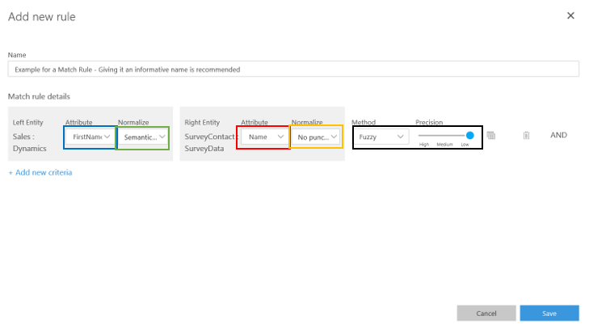

### Adding multiple criteria
If you wish to match your entities **only** if multiple conditions are met, you can do so by adding more criteria which will be linked through an **AND** operator. To add criteria, simply click **Add New Criteria** as shown below in red. You can also remove criteria by selecting the same button. This will show up as a **Minus** for existing criteria as shown in blue.

> [!div class="mx-imgBorder"] 
> 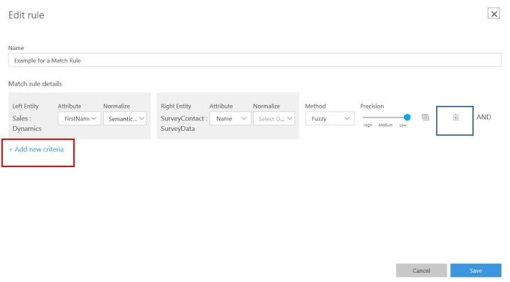

For the purpose of this section we will limit our match rule to only one criterion.

### Adding multiple rules
If each criterion reflects a condition around a single pair of attributes, then rules represent sets of multiple criteria. If you believe that your entities can be matched on the basis of different sets of attributes, you should add more rules with **Add Rules**. Note that when creating rules order matters: The matching algorithm will try to match on the basis of your first rule (stated as (1) in the **Description** section) and only then continue to the second rule (stated as (2) in the **Description** section) if no matches were identified under the first rule. 

For the purpose of this section we will stay with only one rule.

## Step Three: Running the first match 
Now you are ready to run the matching that you have defined in Steps One and Two. This can be done by clicking **Save** and then **Run** as shown below. Next to these buttons there is a **Discard** button that enables you to delete the definitions of your match (shown in red).

> [!div class="mx-imgBorder"] 
> 

It's possible that the matching algorithm will take some time to complete. As highlighted below, there is a message that shows that the matching is still running:

> [!div class="mx-imgBorder"] 
> 

Note that while waiting you can track the progress of your match. To do so, you should click the message shown above (**Match Running**) and review the **Summary** section that appears:

This diagram visualizes the hierarchy by which your ingested entities are currently matched. Each of the entities is represented by a tile with the entity's name, the data source from which it was derived, and the number of records.
In addition to entities, the Summary diagram includes the status of your match. You can see that your match is in a **Matching** state which means it's in progress (also represented by a green line as shown above).

Upon the completion of the matching the **Match Running** message will disappear and the Summary section will show a blue line:

> [!div class="mx-imgBorder"] 
> 

**Note**: You must refresh your page as shown below. In the future, we expect to not have this requirement.

> [!div class="mx-imgBorder"] 
> 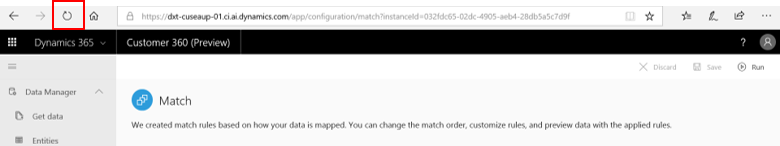

As mentioned in step one, the first match results in the creation of a unified master entity while all subsequent matches result in the expansion of that entity. Hence, beyond the blue line status on the summary section, another signal for the completion of the matching process is the appearance of the unified entity in the **Entities** page, called **Conflation Match Pairs**:

//match addition 1 11/19

Clicking the master entity will show you a preview of it's records as shown below. Note that:
- The **Scored** column reflects how certain it is that each of the records were accurately matched (confidence scores)
- The rest of the columns present the data that was taken from the two original entities. Columns to the left of the *Scored* column (highlighted in blue below) present data that was taken from the first match pair entity while columns to the right of the *Scored* column present data taken from the second match pair entity (highlighted in green below):

// match addition 2 11/19

- At this point you can either continue to the **Merge** page or go through any of the optional steps in this section (Steps 4-7). However, it's recommended to go through at least a portion of step 4 in order to validate the quality of your match which, in turn, can help you decide whether to continue to Merge or reconfigure your match definitions.

## Step Four (optional): Reviewing and validating the first match pair
Here you will learn how to evaluate in depth your first match's quality and improve it. There are a few things you can do.

**First**, you can gain first insights by reviewing the tiles at the top of the page:

> [!div class="mx-imgBorder"] 
> 

1. The left tile shows the number of records that were successfully matched.
2. The center tile shows the number of records that were not successfully matched.
3. The right tile shows the number of customers that are included in the original two match pair entities whether they were matched or not. This tile will provide you more context into the first number above - is that a relatively good or poor result?

Note that if you match more entities in the future these three numbers will present the total numbers of matched records, unmatched records, and customers across all your matchings taken together. When creating more matches, you can always view those numbers for a specific match by looking at this match's row within the **Description** section. 

**Second**, you can click the following button within the **Description** section in order to view the records for that specific match pair at the rule-level as shown below:

> [!div class="mx-imgBorder"] 
> 

This page presents all your match pair records. It also includes the **Scores** field which states how likely it is that this record was indeed matched accurately (can also be thought of a kind of a confidence score). It is recommended to go through at least a part of it in order to validate that records were matched according to your expectations.

> [!div class="mx-imgBorder"] 
> 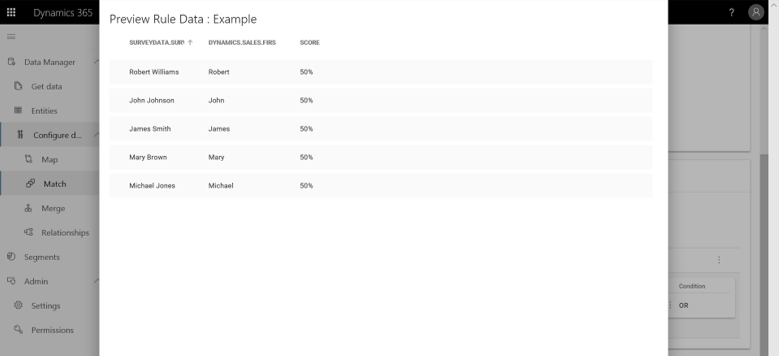

**Lastly**, you can experiment with different thresholds around your criteria in order to identify the optimal thresholds. In order to perform these experiments, follow the next few steps.

1. Select the **Three Dots Icon** for the match pair rule that you want to experiment with (an example is shown in red below). Then, click **Edit** as also shown in red:

  > [!div class="mx-imgBorder"] 
  > 

2. Identify the criterion that you want to experiment with. Remember, each criterion is represented by one row in the panel below. Once you've identified the criterion you want to experiment with, select the following:
   
  > [!div class="mx-imgBorder"] 
  > 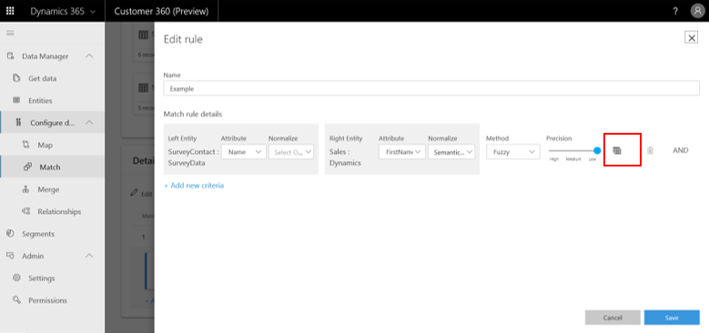

3. At this point the page that you see depends on whether you selected a fuzzy or exact match for that criteria. 

  If you chose **Exact** for that criteria, you will see the following page.
       
  > [!div class="mx-imgBorder"] 
  > 

       
  Here you can view the number of matched and unmatched records for that criteria (shown in red below). You can also view the records in the table section (shown in blue).
       
  If you chose fuzzy for that criteria, you will see the following page.
       
  > [!div class="mx-imgBorder"] 
  > 

       
This page gives you a rich understanding around the effects of the three threshold levels. You can compare how many records will be matched under each of the threshold levels (shown below in red), as well as viewing the records under each option. Select each of the tiles (shown in blue) and view the table section (shown in green).
       
## Step Five (optional): Making changes to the rules' definitions
If you followed Step Four, then at this point you should have a better understanding around the quality of your first match. At this point you can translate that understanding into a better match quality by reconfiguring some of your match parameters.

- **Changing the Match Pair entities**: That can be done by selecting the match row in the **Description** section and editing the match pair fields. Remember that the field to the left represents the entity that will be used as a basis for your end-state master entity and hence it should contain reliable data and some attributes that are shared by other entity or entities. 

- **Changing the order of your rules**: If you defined multiple rules, it might be worth changing their order in order to yield a better match quality. That can be done by selecting **Edit** as shown earlier within the match row and substituting the first rule's attributes with the second rule's attributes.

- **Editing your rules**: This includes several important changes that you should try as you optimize the match quality.
    - **Changing attributes for a criteria**: This can be done by reselecting new attributes within the criteria row.
    - **Changing threshold for a criteria**: This can be quickly achieved via the threshold bar. In Step Four we covered how to get insight into the effects of the three threshold levels on your match quality.
    - **Changing normalization methods for a criteria**: This can be done by reselecting the normalization methods.
    - **Changing from an *Exact* match to a *Fuzzy* match:** Doing so can lead to a higher number of matched records at the possible expense of lower accuracy. Doing the opposite might carry the opposite tradeoff - higher accuracy for a lower number of matched records.
    
## Step Six (optional): Adding additional matches if needed
Up to now, you have created, run, and evaluated one match. In many cases, you will want to bring data to your unified master data set from more entities. Prerequisite for doing so is that these additional entities were ingested through the **Get Data** page and mapped through the **Map** page.

In order to match a new entity with the unified data set that you created in Steps One and Two, select  **Edit** in the **Description** section:

> [!div class="mx-imgBorder"] 
> 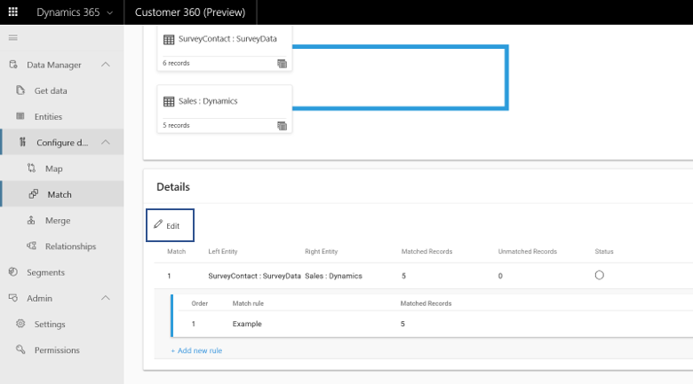

Then select the **Add New Match** button in order to add another match pair:

> [!div class="mx-imgBorder"] 
> 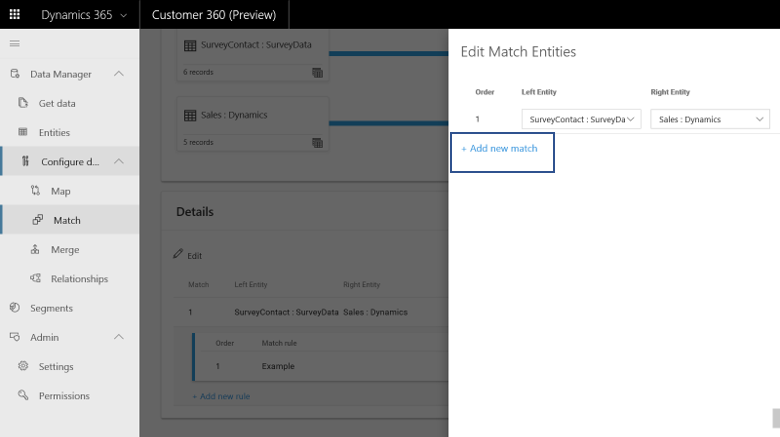

Note that upon selecting **Add New Match**, a new row was created and the unified data set that you created in Steps One and Two now appears as one of the new match pair entities (highlighted in blue below).

> [!div class="mx-imgBorder"] 
> 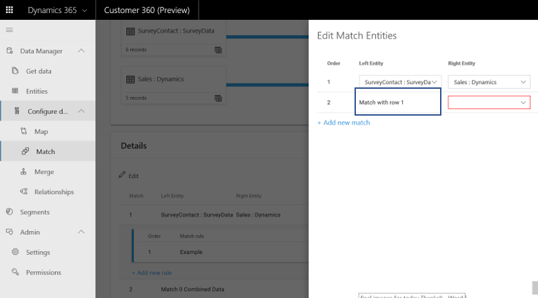

In order to complete the creation of your second match, select the new entity that you want to match with your unified master entity (shown in red below) and select **Save**.

> [!div class="mx-imgBorder"] 
> 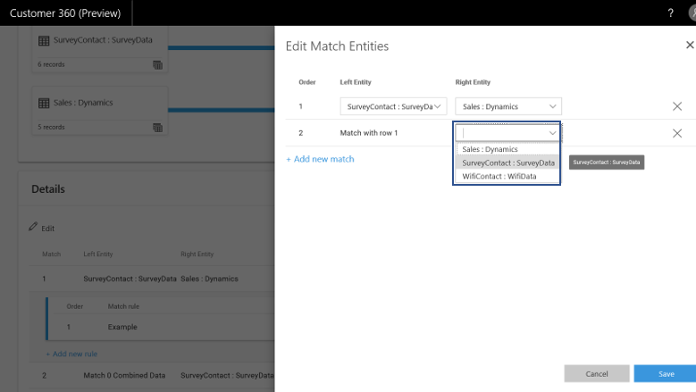

Note that this new match will also appear in the **Summary** section (shown in red below).

> [!div class="mx-imgBorder"] 
> 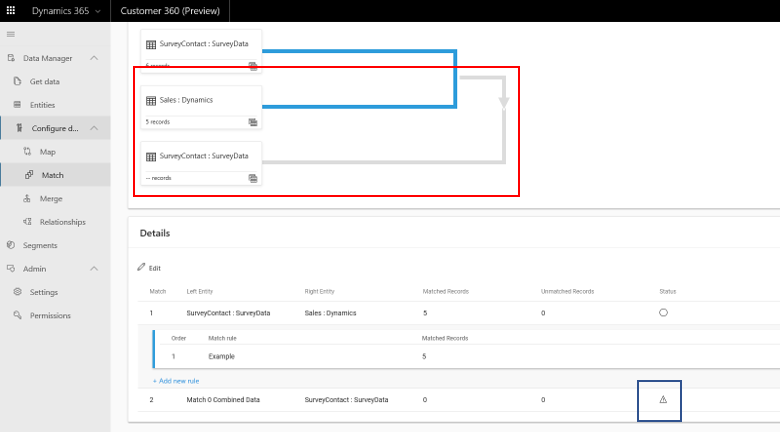

You can also notice that this new match has a **Rules Needed** status (shown as a warning sign within the match's row as shown in blue above). That implies that you haven't defined rules for that match pair which is mandatory for running the match. You should repeat Steps Two and Three for that new match pair.

## Step Seven (optional): Reviewing and changing the order by which multiple matchings are executed
**Reviewing the matchings order**: That can be quickly done via the Summary section as exemplified below for multiple matches:

> [!div class="mx-imgBorder"] 
> 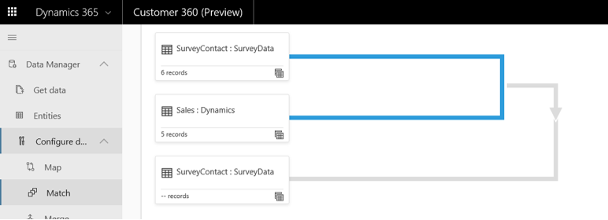

Within the example above, the **SurveyContact** entity from the **SurveyData** datasource was chosen as the basis for the **master data set** that will be the end result of the **data configuration process**. That entity was first matched with the **Sales** entity from the **Dynamics** datasource which produced the **first Match Pair**. Then, this first match pair was matched with the **WifiContact** entity from the **WifiData** datasource which produced a second match pair.

**Changing the order by which matches are executed:** This can be done by replacing a given row's values with another row's values. In the example above, in order to switch the order of the first match pair and the second match pair, we will need to replace the entities in the first match pair (**SurveyContact** and **Sales**) with those of the second match pair (**Sales** and **WifiContact**) and vice versa. 

## Next Step
Once you've completed the match process for at least one match pair, you are ready to resolve possible contradictions in your data by going through the **Merge** section, the third and last **Data Configuration** step. 

