---
title: "Measures| MicrosoftDocs"
description: Text to go here
ms.custom: ""
ms.date: 11/05/2018
ms.reviewer: ""
ms.service: "dynamics-365-ai"
ms.suite: ""
ms.tgt_pltfrm: ""
ms.topic: "get-started-article"
applies_to: 
  - "Dynamics 365 (online)"
  - "Dynamics 365 Version 9.x"
ms.assetid: 83200632-a36b-4401-ba41-952e5b43f939
caps.latest.revision: 31
author: "jimholtz"
ms.author: "jimholtz"
manager: "kvivek"
robots: noindex,nofollow
---

## Measures

[!INCLUDE [cc-beta-prerelease-disclaimer](../includes/cc-beta-prerelease-disclaimer.md)]

The **Measures screen** enables you to define all the KPIs that best reflect your specific business domain and goals.                     Once defined, you can benefit from your measures in a verity of ways. For example:
- Consume on your Homepage screen 
- View for a specific customer as part of the **Customer Card** (visit the **Customer Card Installation** section to learn more) 
- Use to define a customer segment, using the Segment Builder Screen (visit the **Segments** section to learn more).

### Step1: Choosing between Three Measure Types
There are two early decisions you should make with regard to your desired measure. These decisions will help you choose between the three options that are available to you upon clicking the **New Measure** button:

> [!div class="mx-imgBorder"] 
> 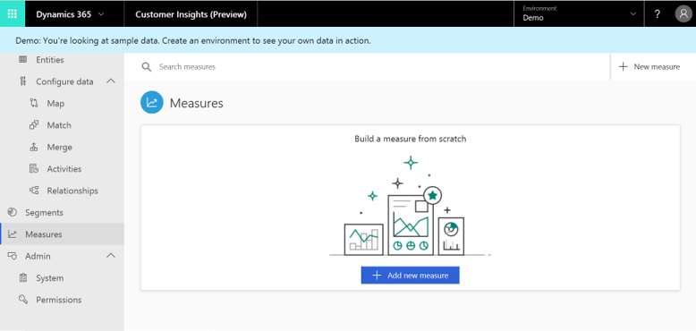

// 2

- First, you should decide whether you wish to:
  - Save your measure as an attribute within one of your existing entities - than you should choose the **Profile Attribute** option 
  - Or create a new entitiy around your measure 
  
- 2.If decided to save the measure as a new entity, you should also decide whether to:
  - Create the measure on the basis of field/s from the Customer Profile entity - which corresponds to a **Profile Measure** option
  - Or create it on the basis of another ingested entity - which corresponds to a **Business Measure**
  
Also note that your choice at this point will affect the number of dimensions supported for your measure. **Dimension** is... You will choose your dimensions in step 4 when we will go through the *Measure Definition* process. 
- Profile attribute and Profile Measure are limited to a single dimension
- Business Measure, on the other end, supports multiple dimensions 

In the next three sub-sections we will explore the steps you should complete in order to define your measure. 

### Step2: Choosing the Base Entity
Upon choosing one of the options, you can expect to reach the **Measure Creation Panel**.

**Panel you can expect to see upon selecting the *Business Measure* option**:

> [!div class="mx-imgBorder"] 
> 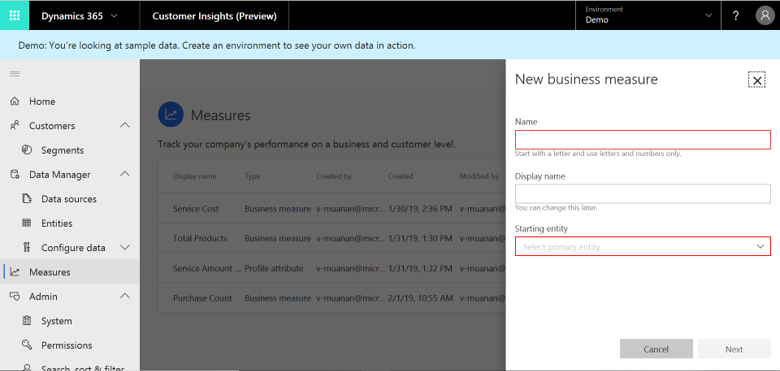

**Name** (mandatory): Upon completing the configuration of your measure, it will show up in the Measures screen as a saved measure that you can edit. Within the measures screen, your saved measure will carry the name you define under the **Name** field in this panel.
**Display Name** (optional): As mentioned earlier, your measure will also be added as an attribute or be saved a new entity. In both cases, the measure will carry the name you define under the **Display Name** field in this panel.
**Starting Entity** (mandatory): Here you should choose the entity on the basis of which you wish to construct your measure. If you wish to include in your measure fields from multiple entities, choose at this point any of these entities.  

**Panel you can expect to see upon selecting the *Profile Measure* option: 

> [!div class="mx-imgBorder"] 
> 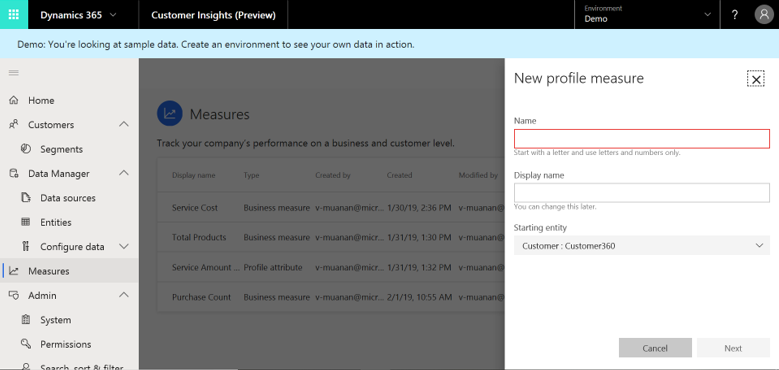

This panel is the same panel we explored under the previous options except for one difference: **The Customer Profile entity will automatically be selected as your starting entitiy**. Morvoer, this default selection can't be changed.

**Panel you can expect to see upon selecting the *Profile Measure* option: *Profile Attribute* option**:

> [!div class="mx-imgBorder"] 
> 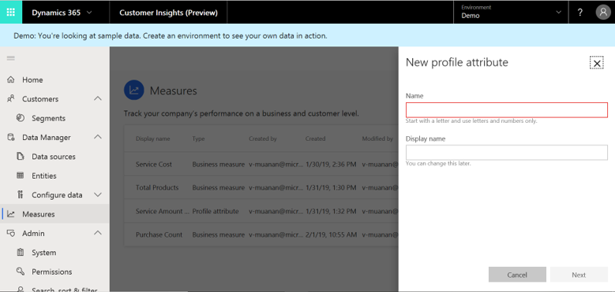

### Step3: Choosing Related Entities
Once completing step one, you can expect to see the following screen:

> [!div class="mx-imgBorder"] 
> 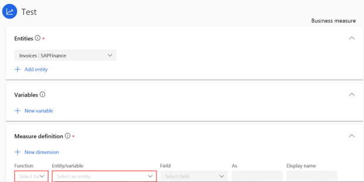

Within this screen we will complete steps 3-5 in the Measure definition process.

First you should decide whether additional entities are needed as part of your measure definition. One use case might be creating an expression that will be based on attributes from two or more different entities (we will explore that use case in step 4). Another use case, specifically for **Profile Measure** and **Business Measure** is creating an entity for your measure that is composed of multiple entities (we will explore that use case in step 5).

In order to choose additional entities, simply click the **Add new entity** button and pick the entitites of your interest:

> [!div class="mx-imgBorder"] 
> 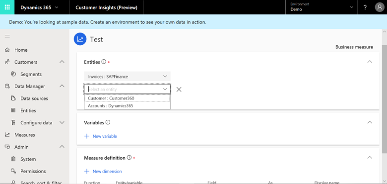

**Note**: You can only select entities which have relationships to your base entity. If you havn't define relationships yet, make sure to read the **Relationships** section.

### Step4: Calculating a Variable
Ths step is accessable via the **Add new variable** button:

> [!div class="mx-imgBorder"] 
> 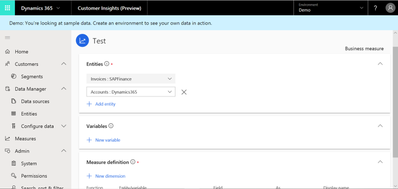

Upon clicking it, you should reach the **Variable Definition Panel**:

> [!div class="mx-imgBorder"] 
> 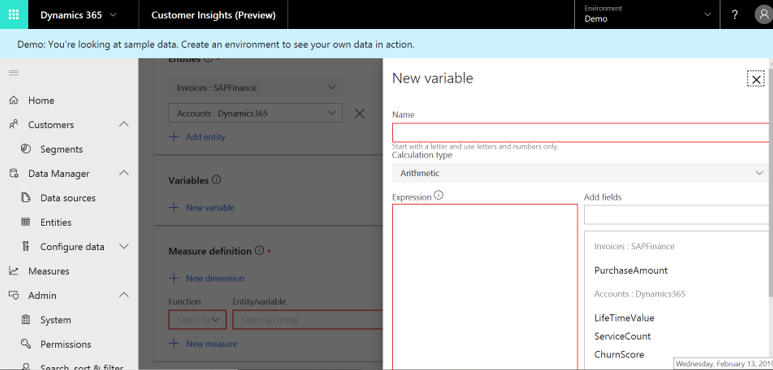

Let's explore the steps you should complete in this panel:
1. Giving your variable a name: You can give your variable a recognizable name
2. Clicking the Expression are
3. Choosing a field from the fields shown to the right:
4. Typing an expression in the expression area while choosing more fields (**Note**: At this point we only support arithmethic expressions)
5. Clicking **Done**.

In the example shown below, we have defined a calculation for the relative contribution of a single Purchase to the Customer Lifetime Value (CLTV):

> [!div class="mx-imgBorder"] 
> 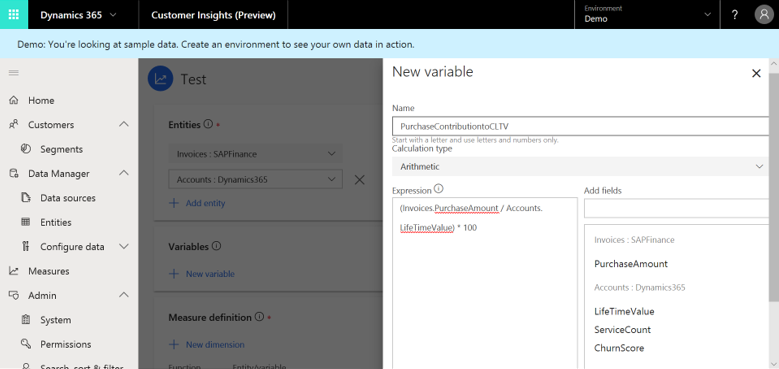

### Step 5: Defining your Measure Entity/Attribute
In this final step we will decide how to aggragate our chosen entities and calculations into a measure entity/attribute which we can start using in Homepage, Segments, as well as other screens. 

**Step 1:** Defining first dimension
Those are the selections you should fill (exploring left to right the definitions shown below):

> [!div class="mx-imgBorder"] 
> 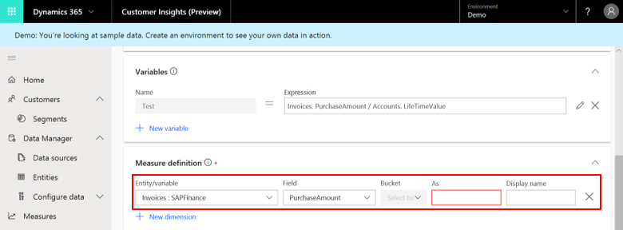

**Entity/Variable**: You should include at least one attribute in your Measures entity. **Note: If you are defining a Measures Attribute it can be only one attribute.** This selection is about choosing either the entity that includes that attribute, or one of the Variables you have created in step 4.
**Field**: Here you should pick the specific attribute/variable to be included either in the Measures entity or in another entity as a field.
**Bucket**:
**As**: Here you should define the name of your new field in the Measures entity/attribute.
**Display Name**: Here you should define the display name of your field in the Measures entity/attribute.

**Step 2 (optional):**: Adding more dimensions by clicking **Add new dimension** button:

> [!div class="mx-imgBorder"] 
> 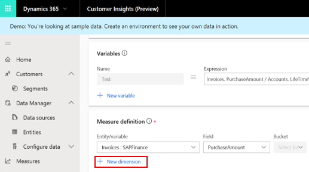

**Step 3 (optional)**: Adding measures
This option should be used in case you wish to aggragate any of your dimensions via summation, counting, etc (so these aggragations will happen at the end of the selected field in your Measures entity/attribute. 

First, click the **New Measure** button:

> [!div class="mx-imgBorder"] 
> 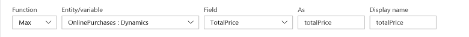

Then, make those selections (exploring left to right the definitions shown below):

> [!div class="mx-imgBorder"] 
> 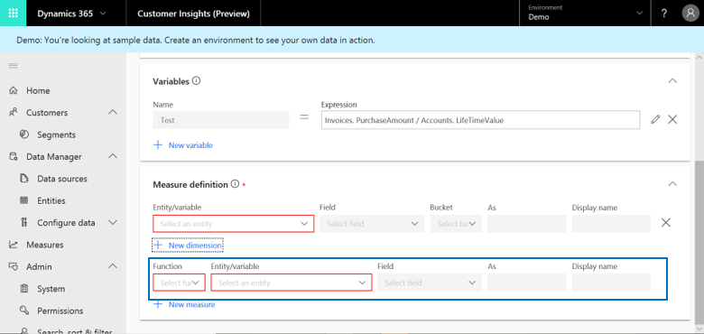

**Function**: At present we support **Sum, Min, Max, Count and Unique Count** as aggragation options
**Entity/Variable**: You should include at least one attribute in your Measures entity. **Note: If you are defining a Measures Attribute it can be only one attribute.** This selection is about choosing either the entity that includes that attribute, or one of the Variables you have created in step 4.
**Field**: Here you should pick the specific attribute/variable to be included either in the Measures entity or in another entity as a field.
**As**: Here you should define the name of your new field in the Measures entity/attribute.
**Display Name**: Here you should define the display name of your field in the Measures entity/attribute.

Lastly, don't forget to save your measure: 

> [!div class="mx-imgBorder"] 
> 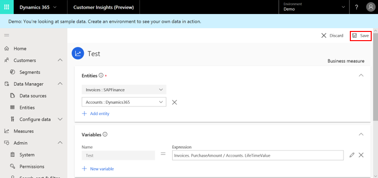

### Viewing and Editing your Measures 
Once completed your first measure, you expect to see the following screen that summarizes your created measures:

// 16

Anytime you can create a new measure via the **Add Measure** button shown above.

You can also edit, delete, rename, and refresh the data of any of your created measures by first clicking the following button:

// 17

And then choosing from the options drop down:

// 18

Here is an example of the Measure Rename window:

// 19

Regarding the edit option, it is done on the same screen we used to create our first measure. 

### Next Step

