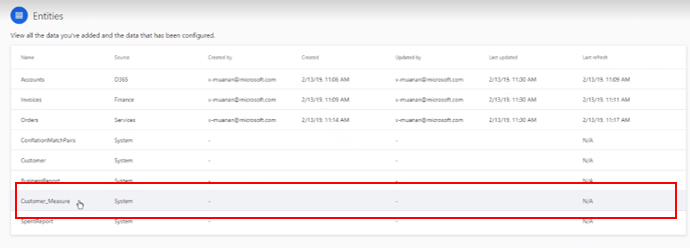
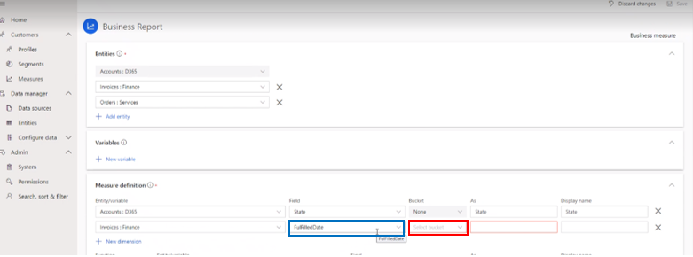
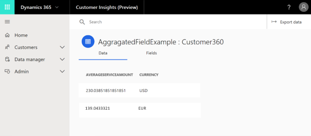
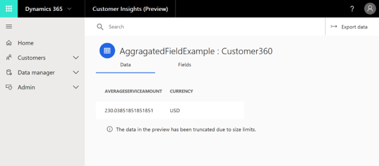
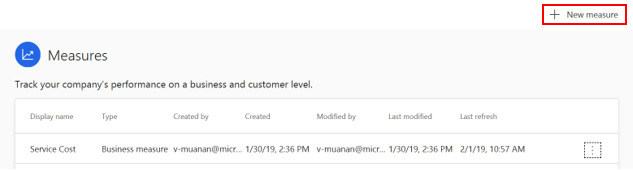
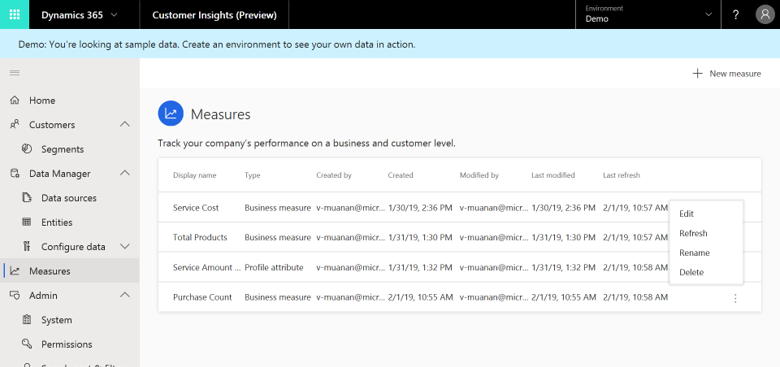
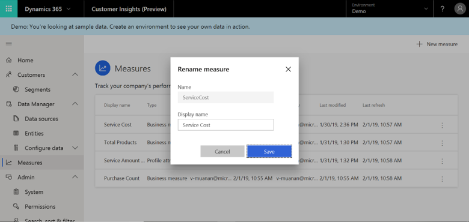

# Measures

[!INCLUDE [cc-beta-prerelease-disclaimer](../includes/cc-beta-prerelease-disclaimer.md)]

The **Measures** page enables you to define all the key performance indicators (KPIs) that best reflect the performance and health of your specific business. You can define customer-related measures such as *Lifetime Value* and business-health measures such as *Monthly Active Users*. Customer Insights provides an intuitive experience for building different types of measures, with a query-builder wizard that doesn’t require you to manually code or validate a query. 

Once you define measures, you can benefit in a variety of ways. For example:

- Track business measures on your home page.
- View measures for a specific customer as part of the **Customer Card**. See the **Customer Card Add-in section** to learn more.
- Use measures to define a customer segment using the **Segment Builder** page. See the **Segments section** to learn more.

<!--note from editor: Suggest deleting "Step One" from the below heading, keeping the heading title "Choose between three measure types". Below at Line 56, insert heading "Step One: Select **New Measure**".   -->

## Step One: Choose between three measure types

Customer Insights supports three types of measures:

- **Customer Attribute**: This measure is a single value per customer that reflects a score, value, or state for the customer. Profile attributes are created as attributes in a new system-generated entity called **Customr_Measure.** Examples are *Lifetime Value* and *Total Sales*.

> [!div class="mx-imgBorder"] 
> 

- **Customer Measure**: This measure provides input on customer behavior with breakdown by dimensions. A new entity is generated for each measure, with potential multiple records per customer. Examples: *Number of visits per channel* and *Total sales per day*.
- **Business Measure**: This measure helps you track your business performance and health. Examples: *Average sales per customer* and *MAU*.

There are two possible outputs for a business measure:
    - A single-number measure that displays on the home page.
    - A new entity.

Later we show how to create these outputs.

<!--note from editor: Screen shot shows "Add New Measure"--change text to match UI.   -->

To begin defining a measure, from the **Measures** page, select **New Measure**:

> [!div class="mx-imgBorder"] 
> 

## Step Two: Choose the starting entity

<!--note from editor:   Is there a step missing here, in between opening the measure creation pane and selecting the Business Measure option? Suggest a change along these lines:
"Selecting **New Measure** opens the measure creation pane. From here, select one of three options:
-Business measure
-Customer measure
-Customer attribute -->

Selecting **New Measure** opens the measure creation pane. 

After selecting the **Business Measure** option, you will see the **New business measure** pane:
<!--note from editor: instead of "see the following", say "be asked to enter the following information", followed by list; then put screen shot after list.  -->

> [!div class="mx-imgBorder"] 
> 

- **Name** (mandatory): After completing the configuration of your measure, it shows up in the **Measures** page under this name.
- **Display name** (optional): As mentioned earlier, your measure is added as an attribute or saved as a new entity. In both cases, the measure carries over the Display Name to the home page and Customer Card.
- **Starting entity** (mandatory): Choose the entity based on how you want to construct your measure. If you want to include fields from multiple entities in your measure fields, choose any of these entities.  

<!--note from editor:  Change "Starting entity" description to: "An entity you choose based on how you want to construct your measure."  The second sentence is confusing.-->

You see the **New profile measure** pane when you select the **Customer Measure** option:

> [!div class="mx-imgBorder"] 
> 

This pane is similar to the one you see when you select the **Business Measure** option, except for one difference: The Customer Profile entity is automatically selected as your starting entity. This default selection can't be changed.

You see the **New profile attribute** pane when you select the **Customer Attribute** option:

> [!div class="mx-imgBorder"] 
> 

## Step Three: Choose related entities

After completing Step Two, you'll see the following page:

> [!div class="mx-imgBorder"] 
> 

Customer Insights lets you build measures by leveraging data from multiple data sources that are now connected through the Customer entity. At this point, you should decide whether additional entities are needed as part of your measure definition. 

One use case might be creating an expression that is based on attributes from two or more different entities (see Step Four).  Another use case, specifically for the customer measure and business measure, is creating a measure entity that is composed of multiple entities (see Step Five). 

In order to choose additional entities, select **Add new entity**, and choose the entities you want.

> [!div class="mx-imgBorder"] 
> 

>[!NOTE]
> You can select only those entities that have relationships to your starting entity. If you haven't defined relationships yet, see the **Relationships** section.

## Step Four: Calculate a variable
<!--note from editor: Add intro text   -->

> [!div class="mx-imgBorder"] 
> 

<!--note from editor:  names of panes: text should match UI   -->

Select **New variable** to open the **New Variable** pane.

> [!div class="mx-imgBorder"] 
> 

Complete these steps:

1. Give the variable a recognizable name. 
2. Select the **Expression** area.
3. Choose a field from the list of fields to the right of the **Expression** area.
4. Type an expression in the **Expression** area while choosing more fields. 

  >[!NOTE]
  >Currently, Customer Insights supports arithmetic expressions only.

5. Select **Done**.

In the following example, we have defined a calculation for the relative contribution of a single purchase to the Customer Lifetime Value (CLTV).

> [!div class="mx-imgBorder"] 
> 

## Step Five: Define your measure entity/attribute

In this step, you will decide how to aggregate and summarize your chosen entities and calculated variables into a Measures entity or attribute. 

**Step 1: Defining first dimension**

What is a dimension? You can think of a dimension as a “group by” function: The data within your new Measures entity or attribute will 
be grouped by all of your defined dimensions.

<!--note from editor: In the para below and elsewhere, is it "Measures" entity or "Measure" entity?   -->

In the following example, we have defined **State** as the dimension field of the **BusinessReport: Customer 360** Measures entity. On the **Entities** screen, we can see that the data we included in that entity (first highlighted column) is grouped by the State column (second highlighted column).

> [!div class="mx-imgBorder"] 
> 

Select or enter the following information as part of your dimension's definition:

> [!div class="mx-imgBorder"] 
> 

**Entity/variable**: If you define a Measures entity, it should include at least one attribute. If you define a Measures attribute, it will include only one attribute by default. This selection is about choosing the entity that includes that attribute.  
**Field**: Choose the specific attribute to be included either in your Measures entity or attribute.  
**Bucket**: Choose whether you want to aggregate data on a daily, monthly, or annual basis. This is a required selection only if you have selected a Date type of attribute. 

> [!div class="mx-imgBorder"] 
> 

**As**: Defines the name of your new field in the Measures entity or attribute.  
**Display Name**: Defines the display name of your field in the Measures entity or attribute.

>[!NOTE]
>Your **Business measure** will be saved as a single-number entity and will appear on the home page unless you complete Step 2 below (adding more dimensions to your measure). If you complete Step 2, the measure will **not** show up on the home page.
  
 
**Step 2 (optional)**: Add more dimensions by selecting **Add new dimension** and making the same selections we have just gone through.

> [!div class="mx-imgBorder"] 
> 

**Step 3 (optional)**: Add aggregate functions 

Any aggregation that you create results in a new value within your Measures entity or attribute. 

Supported aggregation functions are: **Min**, **Max**, **Average**, **Median**, **Sum**, and **Count Unique**.

For example, let's assume that we have added the aggregated value **Average Service Amount**, which takes the average of every **Service Amount** field within the entity **Service: Orders** and averages it:

> [!div class="mx-imgBorder"] 
> 

When visiting the **Entities** page and choosing the new measure we have just created (called **Aggregated Example**), we can see that our aggregation formula has created the new value **Average Service Amount**.

> [!div class="mx-imgBorder"] 
> 

Let's explore the steps involved in defining a new value.

1. First, select **New value**.

 > [!div class="mx-imgBorder"] 
 > 

2. Then, make your selections.

 > [!div class="mx-imgBorder"] 
 > 

 - **Function**: At present, we support **Sum**, **Min**, **Max**, **Count** and **Unique Count** as aggregation options.  
 - **Entity/Variable**: Choose the entity that includes the attribute on which you wish to base your calculation. You can also choose a variable if you created one as part of Step Four.  
 - **Field**: Choose the specific attribute or variable on which you want to base your calculation.  
 - **As**: Your calculation will result in a new value. Define the name of your new value in the Measures entity/attribute.  
 - **Display Name**: Define the display name of your new value in the Measures entity/attribute.

3. Save your measure.

 > [!div class="mx-imgBorder"] 
 > 

## View and edit your measures 

Once you have completed your first measure, you'll see the following page summarizing your created measures.

> [!div class="mx-imgBorder"] 
> 

<!--note from editor:Confused about what sentence below refers to: is it referencing line 167, "First, select **New Measure**"?   -->

At any time, you can create a new measure via **Add Measure** shown earlier.

<!--note from editor: in sentence below, change "following button" to "**Measure menu** button"?   -->

You can also edit, delete or rename the data of any of your created measures by first selecting the following button.

> [!div class="mx-imgBorder"] 
> 

Choose from the **Options** drop-down menu.

> [!div class="mx-imgBorder"] 
> 

Here is an example of the **Rename measures** window.

> [!div class="mx-imgBorder"] 
> 

## Next Step
Make sure to visit the **Unify** section if you haven't yet completed the data configuration process. Upon the completion of the Unify modules, you might want to use the measure you have just created to create your first customers' segment using the **Segments** page. You can also unlock more insights via the **Activities** and **Enrich Profiles** pages.

