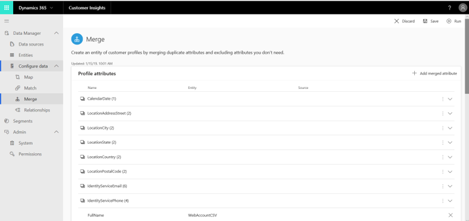
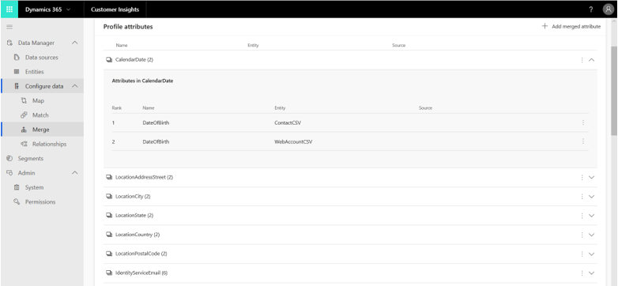
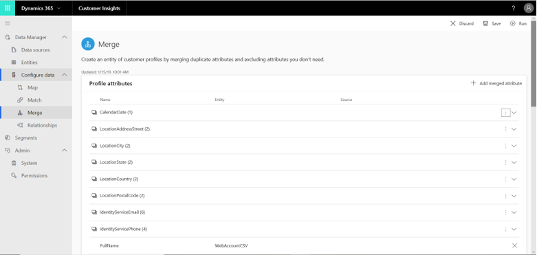
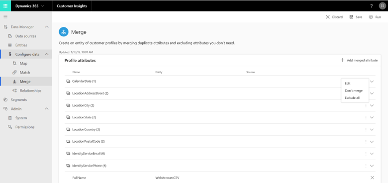
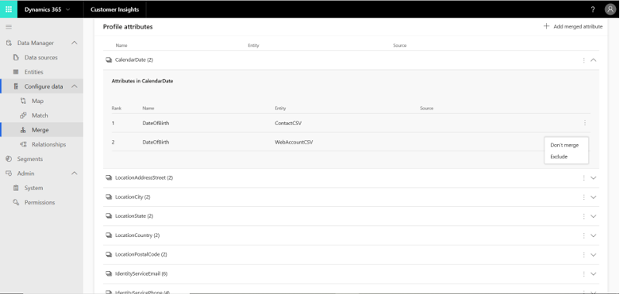
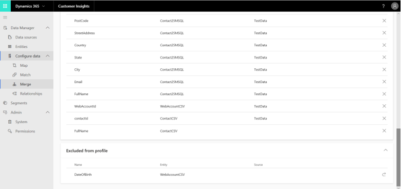
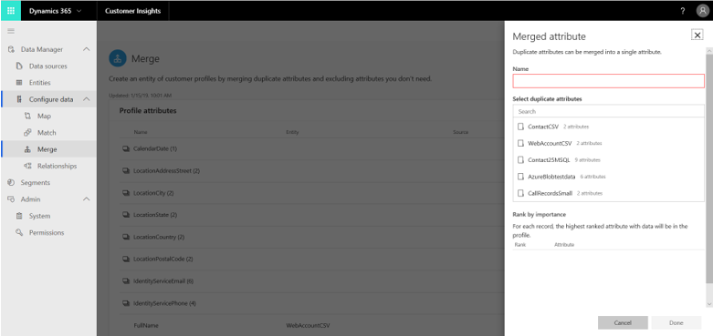
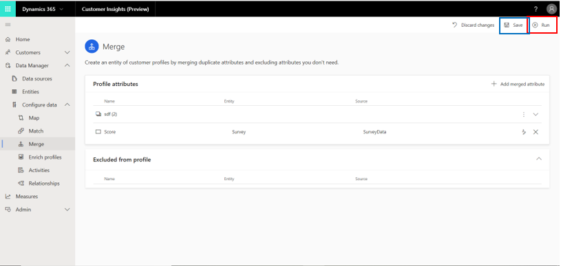

# Merge

[!INCLUDE [cc-beta-prerelease-disclaimer](../includes/cc-beta-prerelease-disclaimer.md)]

The merge phase is the last phase in the data unification process. Its purpose is reconciling conflicting data. Examples of conflicting data might be a customer name that resides in two of your datasets but shows up a little bit differently in each (“Grant Marshall” versus “Grant,” for example), or a phone number format that differs slightly (617-8030-91X versus 617803091X). Merging those conflicting data points is done on an attribute-by-attribute basis. 

Once you've completed the match phase, you can start the merge phase by selecting the **Merge** tile on the **Unify** page.

## Step One: Review system recommendations

After you select the **Merge** tile, you see the **Merge** page.

> [!div class="mx-imgBorder"] 
> 

On this page, you can choose and exclude attributes:

- Choose all the attributes that should be merged within your unified customer profile entity (the end result of the configuration process). Notice that some attributes were already auto-merged by the system.

   The following attribute information is shown on the **Merge** page:

   - The attribute's name appears in the first column.
   - The attribute's entity is specified in the second column.
   - The attribute's data source is specified in the third column.
   - If you wish to view the attributes that are included in one of your auto-merged attributes, select that merged attribute. The two attributes that compose that merged attribute will show up in two new rows beneath the merged attribute.

     > [!div class="mx-imgBorder"] 
     > 

   - If you wish to unmerge any of the auto-merged attributes, use the button shown in the following example:

     > [!div class="mx-imgBorder"] 
     > 
   
     In the drop-down menu, select **Don't merge**.
   
     > [!div class="mx-imgBorder"] 
     > 

- Exclude attributes from the customer profile entity. If you think that some attributes should be excluded from the final customer profile entity, select the  **Exclude** option from the same drop-down menu.

   > [!div class="mx-imgBorder"] 
   > 

   Attributes will move to the **Excluded from profile** section.

   > [!div class="mx-imgBorder"] 
   > 

## Step Two: Manually add a merged attribute

Add a merged attribute with **Add Merged Attribute**, as shown in this example.

// replace 1
> [!div class="mx-imgBorder"] 
> 

We will perform the manual merge process within the **Merged attribute** pane.

// replace 2
> [!div class="mx-imgBorder"] 
> 

This pane consists of four parts:

**Name**: Type an attribute name. You can identify it on the **Merge** page later.

**Display name**: Give your merged attribute a more friendly name that will appear in the unified Customer Profile entity. 

**Select duplicate attributes**: Within this menu, select the attributes that you want to merge from the matched entities. You can also use Search to locate the attributes. 

**Rank by importance:** Prioritize one attribute above the others—the values for your merged attribute will come only from that source. In the example below, since we think that the *WebAccountCSV* entity includes the most accurate data about the *Full Names* attribute, we will prioritize this entity over *ContactCSV* by selecting the arrow next to *WebAccountCSV*. As a result, *WebAccountCSV* moves to first priority, while *ContactCSV* moves to second priority when pulling values for the *Full Name* attribute:

> [!div class="mx-imgBorder"] 
> 

## Step Three: Run your merge

Whether you manually merge attributes or let the system merge for you, at this point you can run your merge. Select **Save** and then **Run** at the top of the screen.

> [!div class="mx-imgBorder"] 
> 

Note that if **Run** is disabled at this point, you should try two things:

- First, refresh your page and see if the button becomes active.

  > [!div class="mx-imgBorder"] 
  > 

- Second, go back to the **Match** page and re-select **Run**. Then, go back to the **Merge** page and see if that resolved the problem.

Once the **Merge is running** message disappears, merge has completed and resolved contradictions in your data according to the policies that you have defined. Both your merged and unmerged attributes will be included in your unified profile entity, while your excluded attributes will not.

> [!div class="mx-imgBorder"] 
> 

> [!div class="mx-imgBorder"] 
> 

### Next Step

Congratulations! You have completed both the data ingestion and data unification phases. Now you are ready to do one of the following:

- Complete more data configurations (Activities, Relationships, or Enrich Profiles). Although they are  optional, they can help you unlock richer insights into your customers. 

- Continue to insight exploration via the **Segments**, **Customer Card** and **Connectors** sections. Note that **Segments** will equip you with aggregate-level insights on your customer base, while **Customer Card** and **Connectors** will enable you to unlock insights on each of your customers.
 
