# Merge

[!INCLUDE [cc-beta-prerelease-disclaimer](../includes/cc-beta-prerelease-disclaimer.md)]

Once completing Match, you can access Merge via the **Merge** tile within the **Configure Data** page.

> [!div class="mx-imgBorder"] 
> 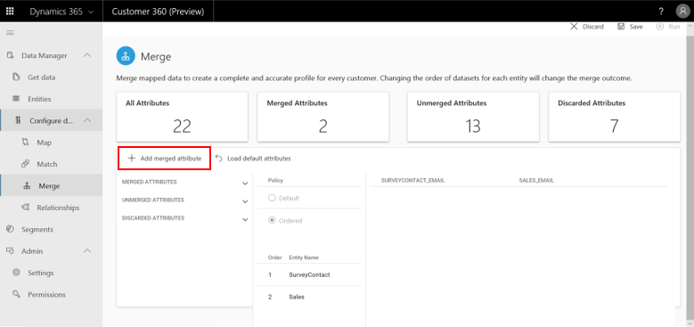

This is the last phase within the data configuration process and it's all about reconciling conflicting data. Examples for such a conflicting data might be the customer name which resides in two of your datasets but shows a little bit different (Grant Marshall versus Grant for instance), or a phone number format that slightly differs (617-8030-91X versus 617803091X for instance). Merging those conflicting data points is done on an attribute-by-attribute basis as we will see in this section.

## Step One: Deciding Between a System Merge and a Manual Merge

The first screen that you will see is the following screen:

> [!div class="mx-imgBorder"] 
> 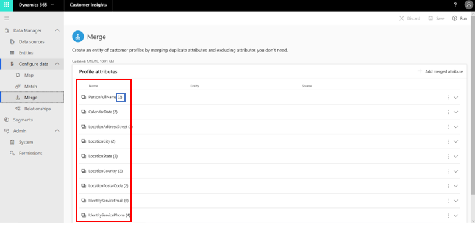

The tiles at the top of the screen (highlighted in green above) show that you haven't tried to merge any attributes yet. **All Attributes** shows how many attributes your matched entities include **in total prior to Merge**. You can revisit your Match policies if you suspect that this number is too low or high. **Discarded Attributes** are attributes that were not included in the merge process and at this point their number equals the **All Attributes** number since no merge process has started yet.

The goal behind this screen is to equip you, the user, with two approaches to the merge process: 
  - **Option One: Letting the system auto-identify attributes among your entities that should be merged**. For choosing that option, click **System Merge** as highlighted in blue above. Note that you can always manually select more attributes to Merge.
  - **Option Two: Manually defining all the attributes that, among your matched entities, should be merged**.
  
> [!IMPORTANT]
> - If you chose option one, then you should continue through the following steps: 2, 3, optionally 4 if you wish to manually merge additional attributes, and then 5.
> - If you chose option two however, you should start from step 4, and then continue through steps 2, 3 and 5.

## Step Two: Understanding the Merge page

> [!div class="mx-imgBorder"] 
> 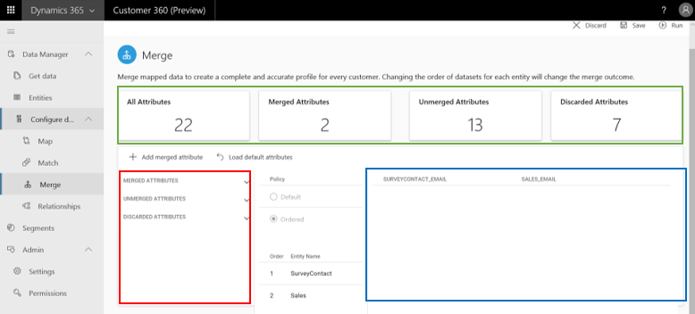

The **Merge** page that is shown above includes several components, regardless of your choice in step one. We will explore them below.

**Four validation tiles** (shown above in green): By tracking those tiles as you work with the Merge screen you can keep validating the quality of your merge selections. Beyond the **All Attributes** and **Discarded Attributes** tiles that we discussed earlier, there are two more important tiles:
  - **Merged Attributes** tile shows how many attributes were successfully merged from multiple (matched) entities. It should answer the expectations that you have around your specific data. 
  - **Unmerged Attributes** tile shows how many attributes were not successfully merged by the system.

**Left Attributes Menu**: This menu (shown above in blue) includes three expendable tabs.
     
  - **Merged Attributes**: Upon clicking it you can view the attributes that were merged at this point as exemplified below in red.
     
  > [!div class="mx-imgBorder"] 
  > 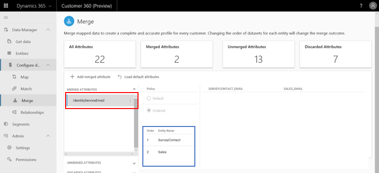
     
Note that within the blue part above, you can also see what entity was used as the main source for that merged attribute. In the example above, the values of the merged attribute **IdentityServiceEmail** were taken in most cases from the **SurveyContact** entity (reflected by a value of 1 in the **order** column) and in less cases from the **Sales** entity (reflected by an **order** value of 2).
     
  - **Unmerged Attributes**: Upon clicking it you can view what attributes were not merged by the system (shown in red below). Again, you can also see from which entity the values of this entity come from (but since it's an unmerged attribute its values come from only one entity).
    
  > [!div class="mx-imgBorder"] 
  > 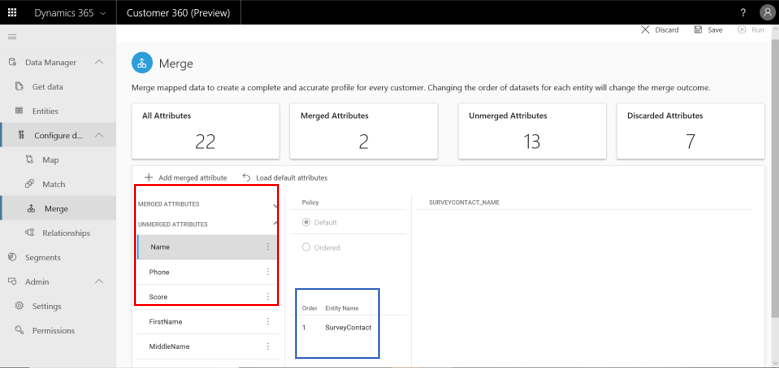

  - **Discarded Attributes**: Same options exist for this tab as for the **Unmerged Attributes** tab.
    
  > [!div class="mx-imgBorder"] 
  > 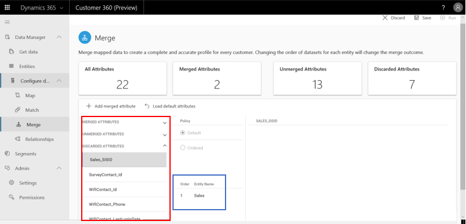
    
At this point, if you suspect that some important attributes were not matched, you can manually add them through the **Add Merged Attribute** button. We will expand on adding merged attributes in the step four. 
    
**Right attribute values table**: Upon clicking each of the attributes in the **left attributes menu** a corresponding attribute values table will appear to the right (shown in blue below):

> [!div class="mx-imgBorder"] 
> 

This table's fields represent the different entities in which this selected attribute exists. **//Not working as for 11/2//**

## Step Three: Changing merging policies for merged attributes

**Prioritizing sources for pre-identified merged attributes**: Using the merged attribute *IdentityServiceEmail* as an example, in this section we will learn how to prioritize contradicting values for that attribute as part of the merging process. We start by selecting the **three dots icon** next to this attribut's name (shown in blue) and then **Edit** (as shown in red).

> [!div class="mx-imgBorder"] 
> 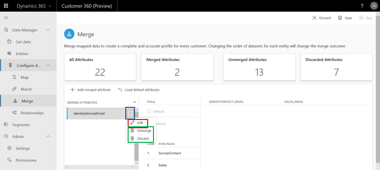

Note: This attribute menu also includes the options to **Unmerge** the merged attribute or **Delete** it (both shown in green above).

We will conduct the prioritization process within the **Edit Attribute Panel** as shown below. This panel consists of three parts: **Attribute Name** (shown in green below), **Attribute Source** (shown in blue) and **Merge Policy** (not highlighted):

> [!div class="mx-imgBorder"] 
> 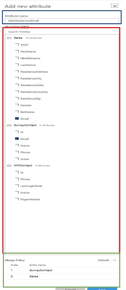

**First** we will consider to edit the **Attribute Source** part. This part specifies all the attributes that possibly include values for our attribute. we can see that the system identified two attributes with the name **Email** within the **Sales** and **SurveyContact** entities and those are checked in (blue part below). Moreover, the system couldn't find an attribute within the **WifiContact** entity that corresponds to our **IdentityServiceEmail** attribute (nothing is checked within the WifiContact entity). At this point we can manually change those automatic selections - either deselect the **Email** attribute or select new attributes.
  
> [!div class="mx-imgBorder"] 
> 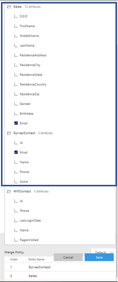
  
**Second**, we will consider editing the **Merge Policy** part. This part specifies only the sources that were selected within **Attribute Source**. Here we will prioritize those sources: If we think for example that *Sales* includes the most accurate data about *Names*, than in the panel shown above, we will first change the policy from **default** to **ordered** (shown in blue below) and then click the arrow sign next to *SurveyContact*. As a result *Sales* will move to first priority while *SurveyContact* will move to second priority when pulling values for our merged attribute.
  
> [!div class="mx-imgBorder"] 
> 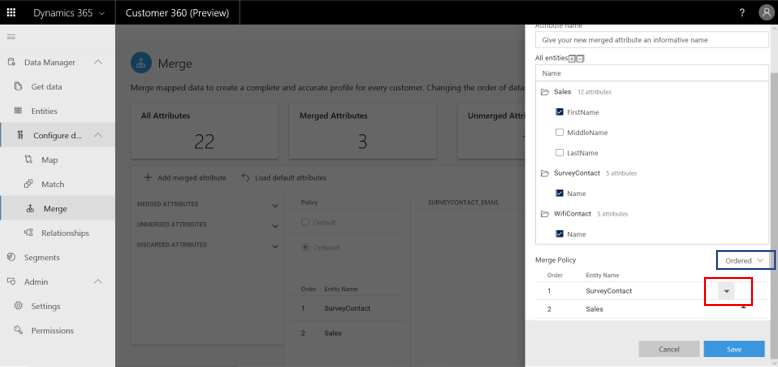

**Lastly**, select **Save** at the top right corner of this panel.

## Step Four: Manually adding a merged attribute
Adding a merged attribute is available via the **Add Attribute** button as shown below:

> [!div class="mx-imgBorder"] 
> 

We will perform the attribute addition process within the **Add Attribute** panel as shown below. This panel consists of three parts: **Attribute Name** (shown in red), **Select Attributes** (shown in blue) and **Merge Policy** (highlighted in green): 

> [!div class="mx-imgBorder"] 
> 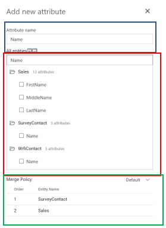

First we will type an attribute name in the **Attribute Name** field. For exemplification, we will define the merged attribute **Name**.
 
Then we will search for attributes that might correspond to that attribute within our matched entities by typing **Name** in the **Search Field** as shown below:

> [!div class="mx-imgBorder"] 
> 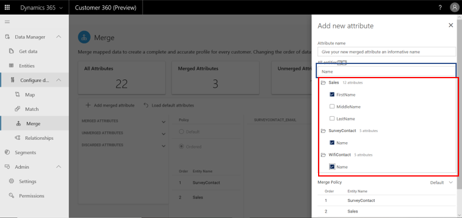

Third, within the **Select Attributes** menu highlighted in red above, we will select all the attributes that we want to merge from our matched entities. As shown above, we have selected **First Name** from **Sales**, **Name** from **SurveyContact** and **Name** from **WifiContact**.

**Lastly, we will define the Merge Policy:** This part specifies only the sources that were selected within **Attribute Source**. Here we will prioritize those sources: If we think for example that **Sales** includes the most accurate data about **Names**, than in the panel shown below, we will first change the policy from **default** to **ordered** (as highlighted in blue) and then click the arrow sign next to **SurveyContact**. As a result **Sales** will move to first priority while **SurveyContact** will move to second priority when pulling values for the **Name** attribute.
  
> [!div class="mx-imgBorder"] 
> 

## Step Five: Running your merge
Whether you manually merged attributes or let the system merge for you, you can run your merge at this point. Simply click **Save** and then **Run** as shown below. Note that **if the *Run* button is disabled at this point, you should try to do two things.

**First,** try to refresh your page and see if this button turned active:

> [!div class="mx-imgBorder"] 
> 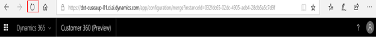

**Second**, try to go back to the **Match** screen and hit the **Run** button in this screen again. Go back to the **Merge** screen and see if that resolved the problem.

Once the message below disappears, Merge has completed and resolved contradictions in your data according to the policies that you have defined.

> [!div class="mx-imgBorder"] 
> 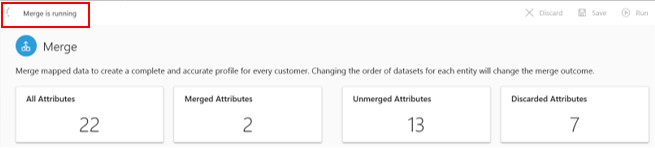
  
## Next Step
**Congratulations!** You have completed both the **Data Manager** and the **Configure Data** phases. Now you are ready to unlock unique insights on your customers via the **Segmentation**, **Connectors** sections as well as the **APIs** section if you are a technical user. Note that **Segmentation** will equip you with aggregate-level insights, while **Connectors** will enable you to unlock insights on specific customers.
 
