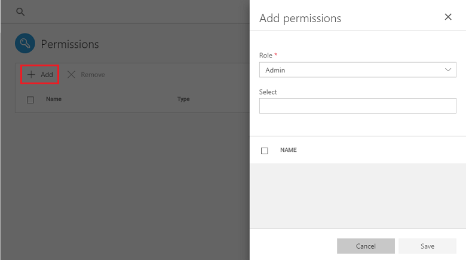
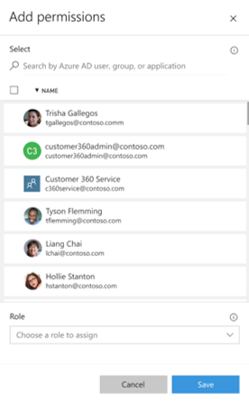
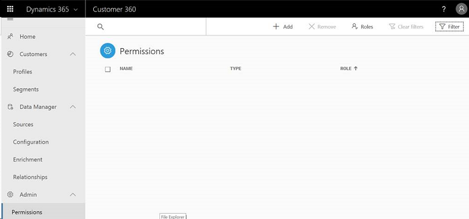
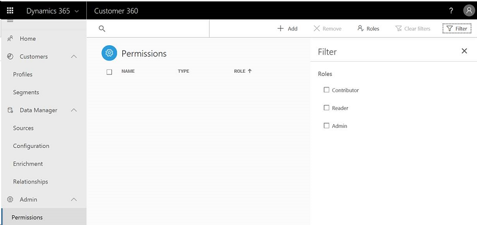
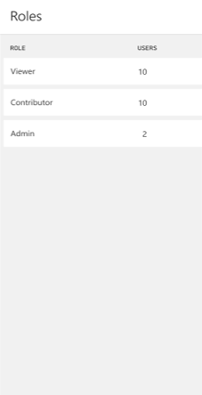

# Permissions

[!INCLUDE [cc-beta-prerelease-disclaimer](../includes/cc-beta-prerelease-disclaimer.md)]

The **Permissions** page is where you, as a user, can set up roles and permissions for using Customer 360 across the organization. Customer 360 includes three types of roles, and those are the options that available to each of them:

|Role  |Options available under this role  |
|---------|---------|
|Viewer     | <ul><li>View **Segments** page </li></ul>       |
|Contributor     | <ul><li>Complete **Data Manager**: **Get Data** </li><li>Complete **Configure Data** sections: **Map**, **Match**, **Merge** </li><li>View **Segments** page </li><li>Create segments in the **Segment Creation** page  </li></ul> |
|Administrator     | <ul><li>All that is available to the Contributor</li></ul>AND<ul><li>Change settings in the **Settings** page</li><li>View and add permissions in the **Permissions** page   </li></ul>     |
 
### Adding Roles and Permissions
On the **Permissions** page, select **Add** to add permissions and roles to users.

> [!div class="mx-imgBorder"] 
> 
 
- First, find the person to whom you want to give a permission. **Type this person's name in the *Select* field**:

> [!div class="mx-imgBorder"] 
> 

- Then, **choose a role** for that person as shown above.

- Lastly, select **Save** in the bottom right corner of the panel. The instance that you are using will be automatically shared with the user for whom you have defined the permission. This user will be able to enter the Customer 360 app and perform actions according to the role that you have specified (as specified earlier).
 
### Viewing current permissions
After selecting **Save**, you can utilize the following screen to explore all the permissions that were given to date:

> [!div class="mx-imgBorder"] 
> 

Let's explore this screen:

- The **Type** column specifies whether it's a single member, a group, or an application. At this point, Customer 360 supports only individual users but in the future it will also support groups and applications that will connect to Customer 360 via our APIs.
- The Roles are specified under the **Roles** column
- You can also look for a specific person by typing a name in the search field.
- Lastly, you can sort the results by each of the columns   

### Filtering Permissions by a Role
At the top of the **Permissions** page, select **Filter** to open the **Filter** panel. Then, choose whether to filter the permissions by the ***Administrator***, ***Contributor***, or ***Reader*** roles.

> [!div class="mx-imgBorder"] 
> 

### Viewing current number of users per role
At the top of the **Permissions** page, select **Roles** to open the **Roles** panel to view the number of users per role.

> [!div class="mx-imgBorder"] 
> 
