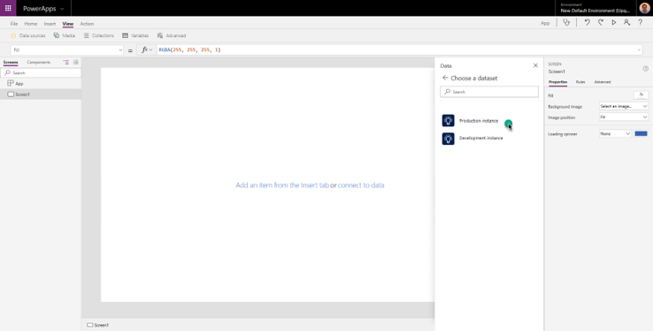
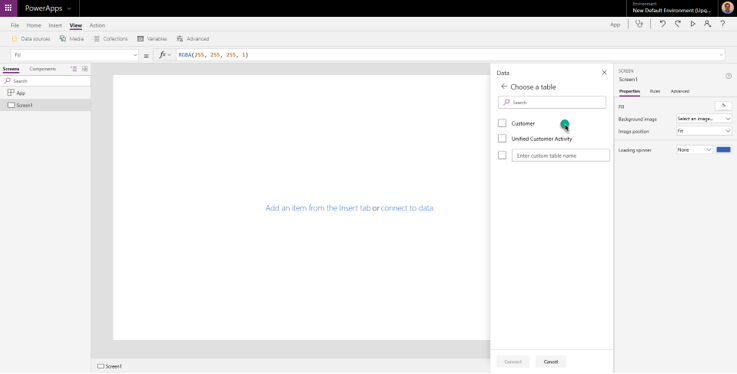
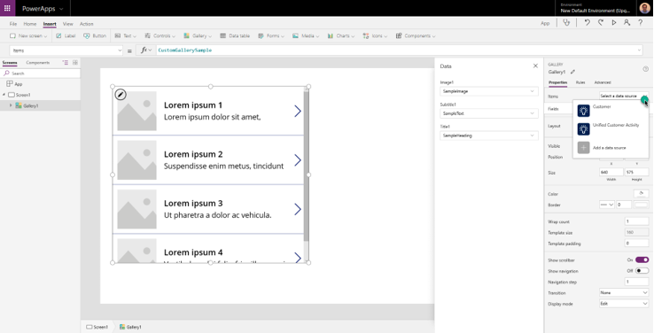
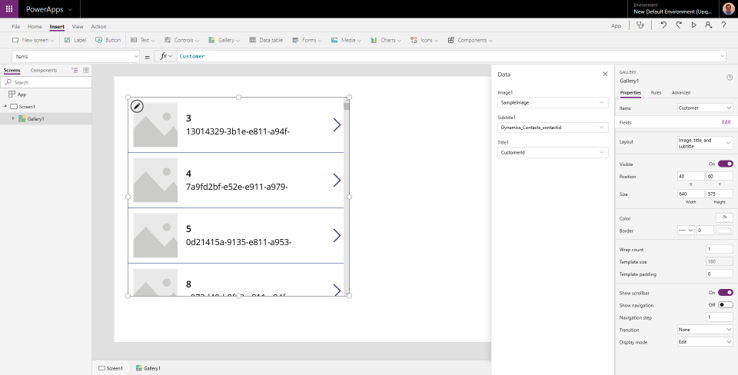

# Microsoft connector

Use the Microsoft connector to connect your Power Apps to Dynamics 365 Customer Insights, or to automate workflows with Power Automate.

## Using the connector in Power Apps

Follow these steps to connect your app to Customer Insights:

1. Go to [https://powerapps.microsoft.com/](https://powerapps.microsoft.com/).

2. Select **New** and then create a **Blank app**. Choose **Phone layout** or **Tablet layout**. Tablet layout gives you more workspace.
   
3. Add the Customer Insights connector by going to **View** > **Data Sources**.

   > [!div class="mx-imgBorder"]
   > 

4. In the side pane, select **Add data source**.

5. Select **New connection**.

6. Search for "Customer Insights" and select the **Dynamics 365 Customer Insights** connector.

7. Select **Create** to establish the connection and sign in with the account you use for Customer Insights.

8. Select the Customer Insights instance you want to fetch data from.

   > [!div class="mx-imgBorder"]
   > 

9. Choose one or both of the following entities:

   - Customer: to use data from the unified customer profile.
   - Unified Customer Activity: to display the unified timeline on the app.

   > [!div class="mx-imgBorder"] 
   > 

10. You are now ready to start building an app with Customer Insights data. For example, let's add a gallery element to list the customers we have ingested on Customer Insights.

    > [!div class="mx-imgBorder"] 
    > 

11. Select **Customer** as the data source for items.

    > [!div class="mx-imgBorder"] 
    > 

    > [!div class="mx-imgBorder"] 
    > 

12.	You can change the data panel on the right to select which field for the Customer entity to show on the gallery.

13.	If you want to show any field from the selected customer on the gallery, fill in the Text property of a label:  **{Name_of_the_gallery}.Selected.{property_name}**

    Example: Gallery1.Selected.address1_city

14.	To display the unified timeline for a customer, add a Gallery element, and add the Items property: **Filter('Unified Customer Activity', CustomerId = {Customer_Id})**

    Example: Filter('Unified Customer Activity', CustomerId = Gallery1.Selected.CustomerId)

## Automate workflows with Power Automate

You can automate your business processes involving Dynamics 365 Customer Insights through [Power Automate](https://flow.microsoft.com/). For more information, see the [Dynamics 365 Customer Insights connector reference](https://docs.microsoft.com/connectors/customerinsights/) and [Power Automate documentation](https://docs.microsoft.com/power-automate/).
