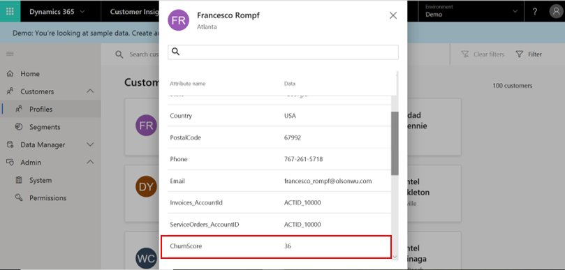

# Profiles

[!INCLUDE [cc-beta-prerelease-disclaimer](../includes/cc-beta-prerelease-disclaimer.md)]

// replace 1
The **Profiles** page presents consolidated data on each of your customers. Each customer profile is represented by a **Customer Card** tile as shown below.

In order to view more customers profiles, move to the next profiles page using the button shown below in red:

// add 1

**Note**: The data that is available in this page is based on the unified Customer Profile entity you have created during the data configuration process. If you didn’t complete the data configuration process yet, your customer profile tiles might present only partial information on your customers:

> [!div class="mx-imgBorder"] 
> 

Make sure to complete the **Data Configuration** process in order to unlock richer view on your customers (visit the **Configure Data** section to learn more).

After selecting a customer tile, you will see additional information on that specific customer. As shown below, that information may include attributes such as **Country**, **Email**, **Address**, and **Phone** that exist in one or more of your data sources.

> [!div class="mx-imgBorder"] 
> 

You can also create custom attributes using the **Measures** page. The following example is the customer **Churn Score** information marked in red below.

> [!div class="mx-imgBorder"] 
> 

## Search for customers

Searching for customers can be done using the **Search** field. Simply type one of the attributes' names to search for customers. This is enabled by the administrator in the **Search, sort & filter** page. Note that the search will be executed only within the Customer Profile entity created during the data configuration process.

> [!div class="mx-imgBorder"] 
> 

You can also utilize this capability to search for a specific type of information (specific attribute) for a given customer.

> [!div class="mx-imgBorder"] 
> 

## Filter customers

Filtering customers can be done via a menu that includes your Customer Profile entity fields as filters. 

First, select **Filter**.

> [!div class="mx-imgBorder"] 
> 

Then, simply check the boxes next to the filters with which to search customers by as shown below. Same as for the **Search** field, you will be able to filter only by attributes that exist in your Customer Profile entity and that were defined by the administrator in the **Search, sort & filter** page.

// add 2

You can remove your saved filters using **Clear filters**.

> [!div class="mx-imgBorder"] 
> 
