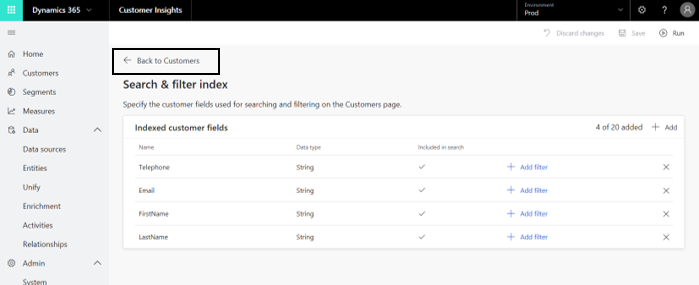

# Customers

The **Customers** page presents a consolidated view of each customer based on profile data you gathered from all of your data sources. The page also lets you search for customers. Each customer profile is represented by a Customer Card tile as shown here:

> [!div class="mx-imgBorder"] 
> 

**Note:** If the following screen appears when you select **Customers** in the left-side navigation pane, your administrator needs to define at least one searchable attribute on the **Search & Filter Index** screen:

> [!div class="mx-imgBorder"] 
> 

If that is the case, your administrator can use the **Search & Filter Index** section to learn how to use the **Search & Filter Index** screen. Once at least one attribute is defined as searchable, you should be able to see the **Customers**page. 

On the **Customers** page, you can start viewing your customers' profiles. You can always go to the next **Customers** page and view more customers profiles using the buttons in the lower-right corner of the 

page.
<!-- v-dehaas: I recommend removing this image. It shows a prominent navigation element that is very common and widely understood by our audience -->

> [!div class="mx-imgBorder"] 
> 

>[!NOTE]
> Customer profiles are available once you create the unified Customer entity. Make sure you complete the data unification process in order to unlock richer views of your customers. Visit the **Unify** section to learn more. 
<!-- v-dehaas: I recommend removing this image. It shows a prominent navigation element that is very common and widely understood by our audience -->
> [!div class="mx-imgBorder"] 
> 

Select a customer tile to see additional information on that specific customer. As shown here, that information might include attributes, such as **Country**, **Email**, **Street address**, and **Phone**, that exist in one or more of your data sources:

> [!div class="mx-imgBorder"] 
> 

## Search for customers

Search for customers by entering an attribute name (for example, the customer’s name) in the search box. As an admin, you can always re-select and re-configure your searchable attributes using the **Search & filter index** page that is accessible via the **Search & Filter Index** button:

> [!div class="mx-imgBorder"] 
> 

Note that the search will be executed only within the Customer Profile entity created during the data unification process.

> [!div class="mx-imgBorder"] 
> 

After selecting one of the customer tiles, you can also search for a specific attribute within this customer's information.

> [!div class="mx-imgBorder"] 
> 

## Filter customers

Filtering customers can be done via a menu that includes your Customer Profile entity fields as filters. Same as for search, your admin will first need to define those fields as filterable using the **Search & filter index** page. 

First, select **Filter** on the top right corner of the **Customers** screen.
<!-- v-dehaas: I recommend removing this image. It shows a prominent navigation element that is very common and widely understood by our audience -->

> [!div class="mx-imgBorder"] 
> 

Then, check the boxes next to the attributes you want to filter customers by. As with Search, you will be able to filter only by attributes that exist in your Customer Profile entity and that were defined by the administrator on the **Search & filter index** page.

> [!div class="mx-imgBorder"] 
> 

To remove your saved filters, select **Clear filters** on the top right corner of of the **Customers** screen.

> [!div class="mx-imgBorder"] 
> 

### Next Step
Review both the **Data Sources** and **Unify** sections, where you will learn to ingest and unify your data.
