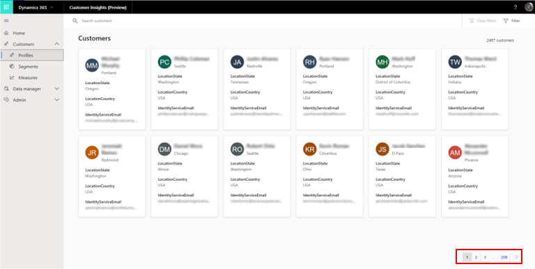
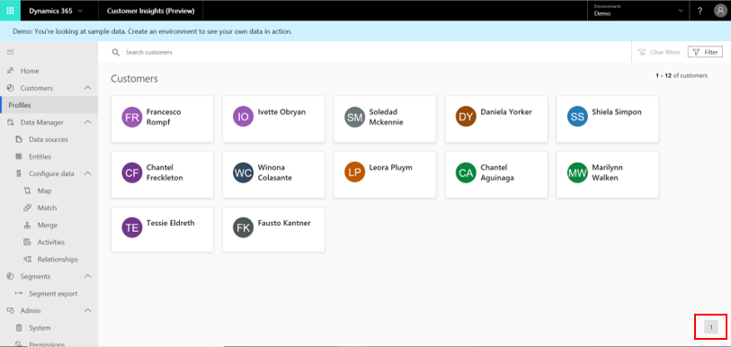
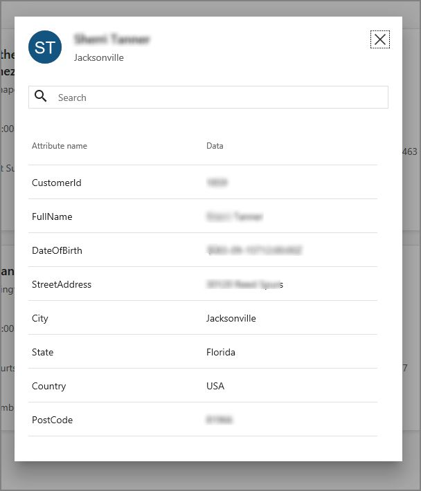
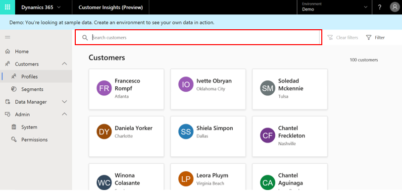
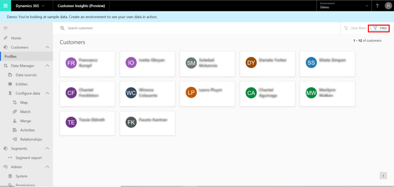
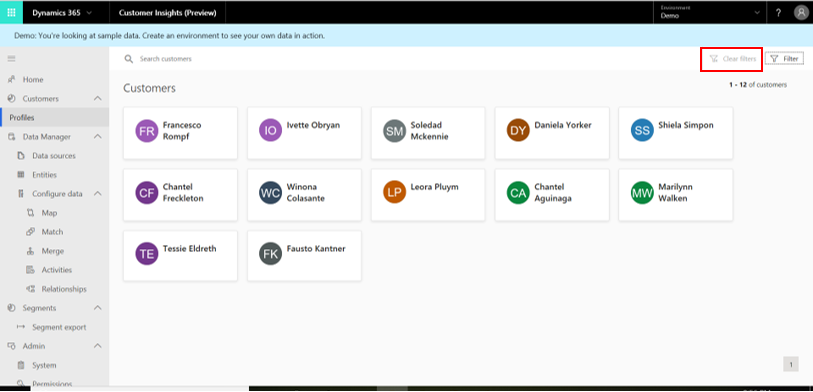

# Customers

[!INCLUDE [cc-beta-prerelease-disclaimer](../includes/cc-beta-prerelease-disclaimer.md)]

The **Profiles** page presents a consolidated view of each customer based on profile data you gathered from all of your data sources. The page also lets you search for customers. Each customer profile is represented by a Customer Card tile as shown here:

> [!div class="mx-imgBorder"] 
> 

To view more customers profiles, go to the next **Profiles** page by using the buttons in the lower-right corner of the page.

> [!div class="mx-imgBorder"] 
> 

<!--RE: the phrase "unified Customer entity" in Note below: Is this a part of the UI? Is there an entity called "Unified Customer"? If so, suggest changing below to **Unified Customer** entity. -->

>[!NOTE]
> Customer profiles are available once you create the unified Customer entity. Make sure you complete the data configuration process in order to unlock richer views of your customers. Visit the **Configure Data** section to learn more. 

> [!div class="mx-imgBorder"] 
> 

Select a customer tile to see additional information on that specific customer. As shown here, that information might include attributes, such as **Country**, **Email**, **StreetAddress**, and **Phone**, that exist in one or more of your data sources:

> [!div class="mx-imgBorder"] 
> 

## Search for customers

Search for customers by using the search box. You can simply type a value for one of the profile attribute names (for example, the customer’s name). To enable search, an admin needs to configure the searchable attributes on the **Search, sort & filter** page. Note that the search will be executed only within the Customer Profile entity created during the data configuration process.

> [!div class="mx-imgBorder"] 
> 

After selecting one of the customer tiles, you can also search for a specific attribute within this customer's information.

> [!div class="mx-imgBorder"] 
> 

## Filter customers

Filtering customers can be done via a menu that includes your Customer Profile entity fields as filters. 

First, select **Filter**.

> [!div class="mx-imgBorder"] 
> 

Then, simply check the boxes next to the filters with which to search customers by. As with the **Search** field, you will be able to filter only by attributes that exist in your Customer Profile entity and that were defined by the administrator on the **Search, sort & filter** page.

> [!div class="mx-imgBorder"] 
> 

You can remove your saved filters using **Clear filters**.

> [!div class="mx-imgBorder"] 
> 

## Next Step
Make sure to review both the **Data Sources** and **Configure Data** sections, where you will learn to ingest and configure your data.
