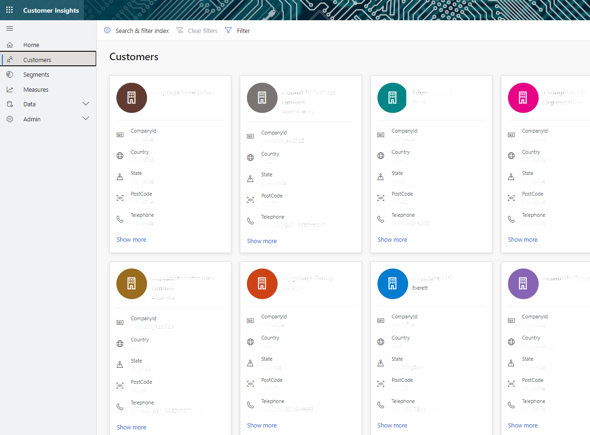

# Customers

The **Customers** page presents a consolidated view of your customers based on profile data gathered from all data sources. Customer profiles are available once you [create the unified Customer entity](pm-configure-data.md). Make sure you complete the data unification process in order to get richer views of your customers. The page also let you search for customers. Customers can be individuals or organizations (preview). Each customer or organization profile is represented by a tile. Select a tile to see additional information on that specific customer or organization. Use the pagination controls at the bottom of the page to see additional records.

> [!div class="mx-imgBorder"] 
> 

Organizations (Preview)
> [!div class="mx-imgBorder"] 
> 

> [!NOTE]
> If can't see the tiles when you select **Customers** in navigation, your administrator needs to [define at least one searchable attribute](pm-manage-search.md) on the **Search & filter index**.

## Search for customers

Search for customers by entering a name or some other attribute in the search box. The search only works within the Customer Profile entity created during the data unification process.

As an admin, you can configure the searchable attributes using the **Search & filter index** page. For more information, see [Manage search & filter index](pm-manage-search.md).

## Filter customers

You can filter customers by the Customer Profile entity fields. Similar to search, your admin will first need to define the fields as filterable using the **Search & filter index** page.

1. Select **Filter** on the top right corner of the **Customers** page.

2. Check the boxes next to the attributes you want to filter customers by.

   > [!div class="mx-imgBorder"] 
   > 

3. Remove your filters by selecting **Clear filters** on the top right corner of the **Customers** screen.

## Next steps

[Add more data sources](pm-data-sources.md) and [unify your customer profiles](pm-configure-data.md).
