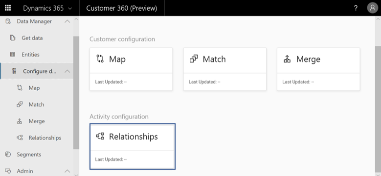
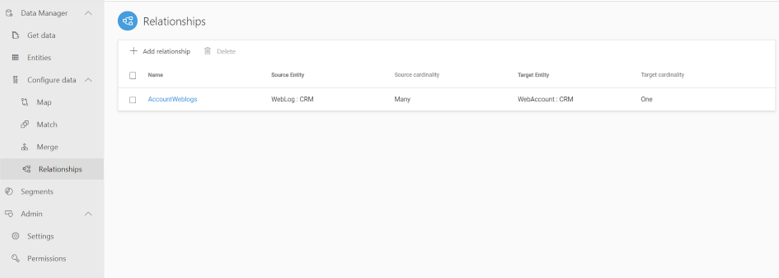
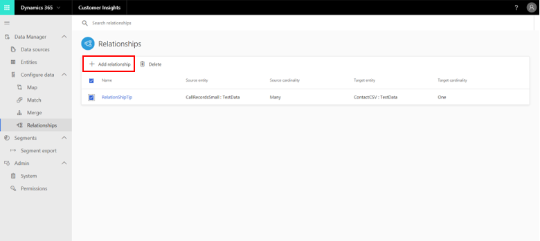
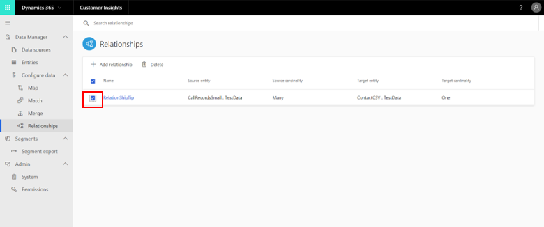
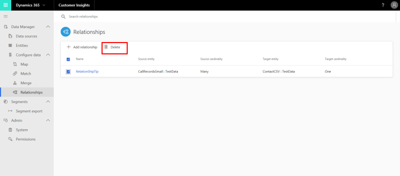

# Relationships

[!INCLUDE [cc-beta-prerelease-disclaimer](../includes/cc-beta-prerelease-disclaimer.md)]

## What are relationships useful for?

Relationships help you connect between entities and generate the graph of your data. Relationships are used when entities share a common identifier (foreign key) that can be referenced from one entity to another. Connected entities enable you to define segments and measures based on multiple data sources.

> [!div class="mx-imgBorder"] 
> 

There are two types of relationships:

- **System relationships**: These are created by the system automatically and cannot be edited.
- **Custom relationships**: These are created by the user during configuration and can be edited.

During the match and merge processes, system relationships are created behind the scenes based on intelligent matching. These relationships help relate the Customer Profile records with other corresponding entities' records. The following diagram exemplifies the creation of three system relationships when the customer entity is matched with additional entities to produce the final *Customer Profile* entity.

> [!div class="mx-imgBorder"] 
> 

- ***CustomerToContact* relationship** was created between the Customer entity and the Contact entity. The Customer entity gets the key field **Contact_contactId** to relate to the Contact entity key field **contactId**.
- ***CustomerToAccount* relationship** was created between the Customer entity and the Account entity. The Customer entity gets the key field **Account_accountId** to relate to the Account entity key field **accountId**.
- ***CustomerToWebAccount* relationship** was created between the Customer entity and the WebAccount entity. The Customer entity gets the key field **WebAccount_webaccountId** to relate to the WebAccount entity key field **webaccountId**.

## Using the Relationships page

In addition, you can use the **Relationships** page to define custom relationships as shown below.

> [!div class="mx-imgBorder"] 
> 

Each relationship has two key parts:

- **Source Entity**: Represents the entity that holds the foreign key.
- **Target Entity**: Represents the entity that the source entity’s foreign key points to.

To create a relationship, first select **Add Relationship**.

> [!div class="mx-imgBorder"] 
> 

Next, provide the following information in the **Relationship** panel.

> [!div class="mx-imgBorder"] 
> 

- **Relationship Name**: You can provide a meaningful name that reflects the purpose of the relationship (for example, *AccountWebLogs*).
- **Description**: Friendly description of the relationship.
- **Source Entity**: The name of the entity that is used as a source in the relationship (for example, *WebLog*).
- **Cardinality**: This represents the cardinality of the source entity records. For example, many means that multiple *Weblog records* are related to one *WebAccount*.
- **Source lookup/link field**: This field represent the foreign key field in source entity. For example, *WebLog* has the *accountId* foreign key field.
- **Target Entity**: The name of the entity that is used as a target in the relationship (for example, *WebAccount*).
- **Target Cardinality**: This represents the cardinality of the target entity records. For example, one means that multiple *Weblog records* are related to one *WebAccount*.
- **Target key field**: This field represents the key field of target entity. For example, *WebAccount* has the *accountId* key field.

> [!NOTE]
> For now, only *many-to-one* and *one-to-one* types of relationships are supported. *Many-to-many* relationships can be created using two *many-to-one* relationships and a link entity—an entity that is used to connect the source entity and the target entity.

## How to delete a relationship

This can be done by:

1. Selecting the check box of the relationships you want to delete.

   > [!div class="mx-imgBorder"] 
   > 

2. Select **Delete** at the top of the **Relationships** table.

   > [!div class="mx-imgBorder"] 
   > 

## Next step
System and custom relationships are used in the **Segment Editor page** to create segments based on multiple data sources that are no longer siloed. Visit the **Segments section** to learn more. Alternatively, you might want to define activities in your data. Visit the **Activities section**.

