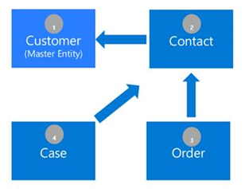
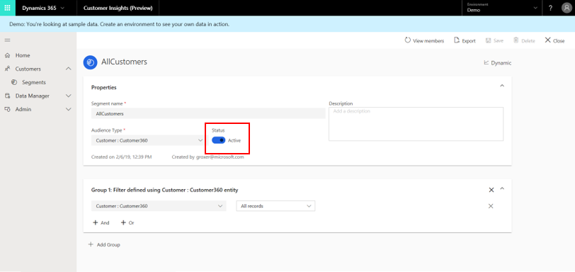
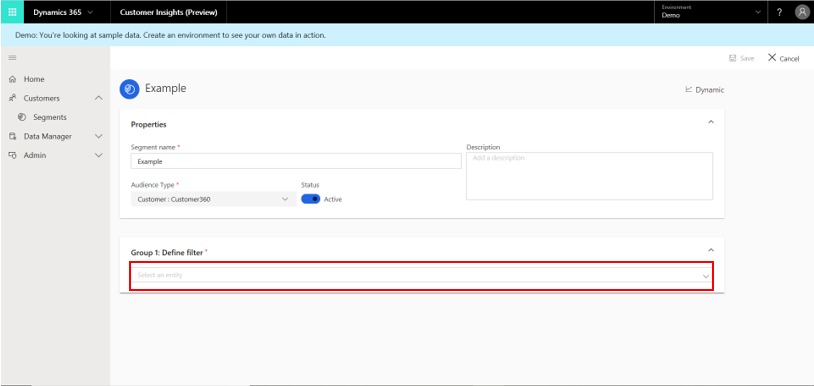
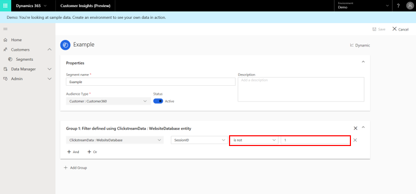
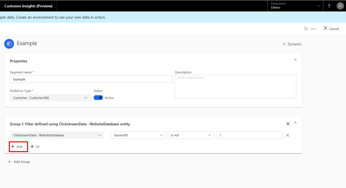
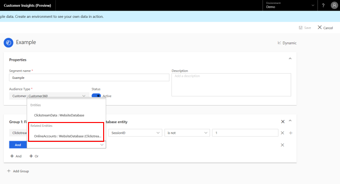
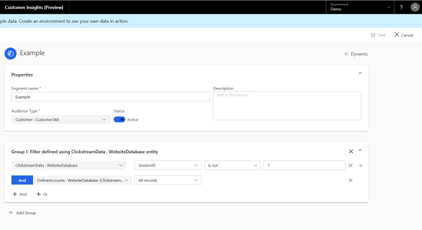
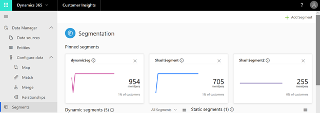
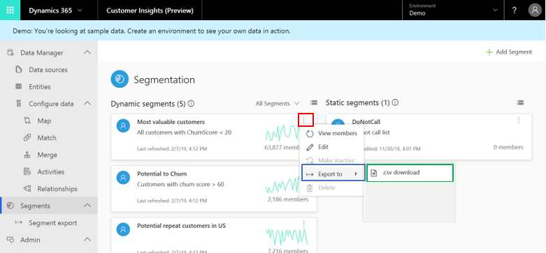

# Segments 

[!INCLUDE [cc-beta-prerelease-disclaimer](../includes/cc-beta-prerelease-disclaimer.md)]

## Introduction to Segmentation

The *Segments* capability enables you to group your customers into cohorts based on demographic, transactional, or behavioral customer attributes. Using segmentation, you can achieve more targeted actions such as promotional campaigns, sales activities, or customer support actions to achieve desired business goals. You can define complex filters around the Customer Profile entity and its graph of related entities. Each segment, after processing, outputs a set of customer entity records that you can export and take actions upon.

There are two types of segments:

- **Static**: A segment that is processed only once—either upon the creation or update of any of its filters. Such segments are especially useful for cases when properties are not expected to change over time or that are expected to be used only once. Example use case: Customers who attended an expo event. 
- **Dynamic**: A segment that is processed according to a recurring schedule. These segments are especially useful when customers' attributes change over time. Example use case: Customers who have bought products worth more than $500 in the last three months. The current dynamic segment refresh schedule is every 12 hours.

The following example illustrates the depth of the Customer Insights segmentation capability. Within this complex segmentation scenario, we aim to define a segment for customers who have placed orders of more than $500 in the last 90 days **and** had an escalated case in the last 30 days, so they can be followed up with a satisfaction survey. Later, we will learn how to produce such segments. 

> [!div class="mx-imgBorder"] 
> 

- Group 1 uses *Order* as the starting entity in order to find customers who have placed an order for more than $500 in the last 90 days.
- Group 2 uses *Case* as the starting entity in order to find customers who have had an escalated case in the last 30 days.

<!--
> [!div class="mx-imgBorder"] 
> 

The preceding example data graph reflects system and custom relationships created during configuration. The data graph helps dictate the sequence by which segmentation filter criteria are defined within the **Segment Editor** page.
-->

The following two sections cover segment creation followed by segment exploration.

## Creating segments from the Segment page

In order to start creating a segment, you can either select **Add Segment** at the upper-right corner of the screen, or select **Get Started**.

> [!div class="mx-imgBorder"] 
> 

If you selected **Add Segment**, you will need to select whether you want to create a static segment or a dynamic segment.

The rest of the segment creation process is done in the **Segment Editor** page.

> [!div class="mx-imgBorder"] 
> 

### Step One: Defining the segment's properties

- We will give our segment an informative name and description that will help us identify it in the future, when we'll have multiple segments. 
- Solely for a dynamic segment, we can also choose to activate it at this point through the slider as shown in blue in the following example. An active (dynamic) segment will automatically incorporate changes that are made to your data with time, while an inactive segment will not incorporate any changes that are made to your data. 

> [!div class="mx-imgBorder"] 
> 
   
### Step Two: Creating a first group 

In Customer Insights, a group is a set of customers. First, we will explain how a group can be defined. We will provide an example right after this explanation.

**For each group's definition:**

1. Choose the entity that includes the specific attribute you wish to segment by. For example, choose an Orders entity, since it includes an **Order Value** field by which we want to segment. In order to choose your entity of interest, select the field shown here.

   > [!div class="mx-imgBorder"] 
   > 

2. Choose the attribute by which you wish to segment. Our attribute can have one of four value types: numerical, string, date, or Boolean. In the following example, an attribute with a numerical value is used as a filter.
3. Choose an operator and a value for the attribute we chose in Step 2. In the following example, an operator **Equals** and value *2* were chosen.

   > [!div class="mx-imgBorder"] 
   > 

   |Number |Definition  |
   |---------|---------|
   |1     |Entity          |
   |2     |Attribute          |
   |3    |Operator         |
   |4    |Value         |

Note that one of the segmentation strengths of Customer Insights is the rich variety of operators it supports. 

4. Add entities that are related to that entity until getting to the Customer Profile entity. That can be done using the **ADD** operator. If not already done, we can define the required relationships between our entities using the **Relationships** page (see the “Relationships” section for more information). For these additional entities, we should choose the *All Records* attribute.

### Example - Group Creation
Let's explore a case in which we want to segment our customers by a specific clickstream activity attribute. In our example, it will be a session ID that is not equal to 1 (since this session was done on an older, outdated website version that is irrelevant for our current targeting efforts). This is the series of steps we should complete.

1. Select the **Select an entity** field.

   > [!div class="mx-imgBorder"] 
   > 

2. Choose our entity of interest, ClickStreamData: WebsiteDatabase and the attribute by which we wish to segment (SessionID).

   > [!div class="mx-imgBorder"] 
   > 

3. Select *Operator* and *Value* as was explained earlier.

   > [!div class="mx-imgBorder"] 
   > 

4. Select the **ADD** operator.

   > [!div class="mx-imgBorder"] 
   > 

5. We need to create a path to the Customer Profile entity but currently our entity (ClickstreamData: WebsiteDatabase) doesn't have a relationship with the Customer Profile entity. The only entity that has a relationship with our entity is OnlineAccount: WebsiteDatabase (shown below), and so we will choose it.

   > [!div class="mx-imgBorder"] 
   > 

6. Select **All Records** as an operator.

   > [!div class="mx-imgBorder"] 
   > 

7. Select again the **ADD** operator. This time, we do have relationship to the Customer Profile entity (which we will select), as shown here.

   > [!div class="mx-imgBorder"] 
   > 

8. Select **All Records** as an operator, also for the Customer Profile entity.

   > [!div class="mx-imgBorder"] 
   > 

At this point, we have completed the mandatory path definition. We recommend that you save your first group's definitions, as shown here.

> [!div class="mx-imgBorder"] 
> 

### Step Three (optional): Add more conditions to your group 

The following two logical operators can be used for that purpose:

- **AND**: Under this option, both conditions must be met as part of the segmentation process. This option is most useful when you define conditions across different entities (one condition per entity) as shown here.
    
  > [!div class="mx-imgBorder"] 
  > 
    
- **OR**: Under this option, either one of the conditions needs to be met as part of the segmentation process. This option is most useful when you define multiple conditions for the same entity, as shown here.
    
   > [!div class="mx-imgBorder"] 
   > 

**Note**: Currently, it's possible to nest an OR operator under an AND operator but not vice versa.

### Step Four (optional): Combine multiple groups via set operators

Each group produces a specific set of customers. Start by selecting **Add Group**.

> [!div class="mx-imgBorder"] 
> 

Then three set operators will show up: **Union**, **Intersect**, and **Exclude**.

> [!div class="mx-imgBorder"] 
> 
  
Selecting each of these set operators enables you to define a new group. At the same time, saving each of these will lead to a different result.

- **Union** will unite the new group you have created in Step Four with the group you have created in Steps Two and Three. Under this option, data that is common to both groups is maintained, as well as data that is not common to both groups.

- **Intersect** will intersect the two groups. Only data that is common to both groups is maintained in the unified group.

- **Exclude** will exclude the two groups. Only data that is not common to both groups is maintained.
   
## Explore segments from the Segments page

> [!div class="mx-imgBorder"] 
> 

Here, you can view all your saved segments and perform certain actions.

- Dynamic segments appear to the left, and static segments appear to the right.
- Each segment is represented by a tile that includes the segment's name, description, last date of data refresh, and historical trend (if it exists). Hover over the trendline to see last week's growth in this segment's members count. If you prefer to view all of your segments in a table format, select one of the following:

  > [!div class="mx-imgBorder"] 
  > 

You can also perform certain actions with each segment. First, select the following button on the segment's tile:

> [!div class="mx-imgBorder"] 
> 

Then, choose one of the following options from the drop-down menu:
- Editing the segment
- Viewing segment's members
- Exporting the segment to either a CSV file or to a Customer Engagement location
- Turning the segment to inactive/active (depends on its baseline state)
- Deleting the segment 
- Pin the segment, which will move it to the top of the screen for better accessibility. The pinned segment will show up under **Pinned Segments** as shown in the following example. To unpin a segment, select **Unpin** (shown in red).

> [!div class="mx-imgBorder"] 
> 
   
## Explore a segment: View processing history and segment members

Select a segment's name in the **Segments** page to get to the page that is shown in the following example. This page consolidates data at the segment level. The upper part of the page includes a trend graph that specifies changes in this segment's members count. In addition, hovering over each data point shows the member count for that point. Lastly, above the graph, you can find the current member count as well as last week's growth. 

As highlighted in red in this example, you can adjust the trend's time scope as well (last 30 days, last 60 days, and so on).

> [!div class="mx-imgBorder"] 
> 

The lower part includes a table with all your segment's members.

- Note that the specific fields that appear in this table are based on the attributes of your segment’s entities. The preceding example (highlighted in blue) is typical for a **Customer** entity, but it is only one of many possible representations.

- Also note that this table shows only a preview of your records. It presents the first 100 records of your segment so that you can quickly evaluate your segment and go back to the segment editor screen to change its definitions. As we will see in the next section, exporting your segment produces a file that includes all your records.
 
## Act on your data

Now that you have created one ore more segments using the **segment builder** screen, you are ready to start acting on your data. 

You can export any of your segments to a CSV file from the next two locations.

- The **Segments** page.

   > [!div class="mx-imgBorder"] 
   > 
      
- The **Segment Details** page.  

   > [!div class="mx-imgBorder"] 
   > 
   
## Next step
At this point, explore the “Customer Card” and “Connectors” sections, where you will learn to extract insights on the individual customer level.

    

