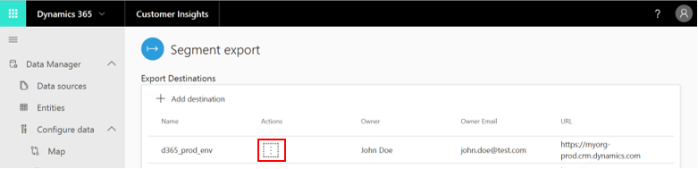

# Segments 

[!INCLUDE [cc-beta-prerelease-disclaimer](../includes/cc-beta-prerelease-disclaimer.md)]

## Introduction to Segmentation
**Note**: If you are familiar with segmentation, you might want to skip this introduction and continue to the **Segment Creation** sub-section below.

Segments provides the ability to group your customers into cohorts based on demographic, transactional or behavioral customer attributes. Using segmentation you can achieve more targeted actions such as promotional campaigns, sales activites or customer support actions to achieve desired business goals. Segments allows defining complex filters around the Customer Profile entity and its graph of related entities. Each segment, after processing, outputs a set of customer entity records which you can export and take actions upon.

There are two types of segments:

- **Static**: Segment that is processed only once - either upon the creation or update of any of its filter conditions. Such segments are especially useful for cases when properties are not expected to change over time or that are expected to be used only once. Example use case: Customers who attended an expo event. 
- **Dynamic**: Segment that is processed according to a recurring schedule. These segments are especially useful when customers attributes change over time. Example use case: customers who have bought products worth more than $500 in the last 3 months. The current dynamics segment refreshing schedule is every 12 hours.

The example below illustrates the depth of the customer 360 segmentation capability. Within this complex segmentation scenario, we aim to define a segment for customers who have placed order of more than $500 in last 90 days **and** had an escalated case in last 30 days so they can be followed up for satisfaction survey. Later we will learn how to produce such segments. 

<!-- 
{final1:Example of complex segment with multiple groups}

{final2:Insert segment definition diagram created by Nimrod, highlighting Group 1 and Group 2}
-->

> [!div class="mx-imgBorder"] 
> 

- Group 1 uses Order as starting entity to define filter criteria to find customers who placed order for more $500 in the last 90 days
- Group 2 uses Case as starting entity to define filter criteria to find customer who have an escalated case in last 30 days

<!--
> [!div class="mx-imgBorder"] 
> 

The example data graph above reflects system and custom relationships created during configuration. The data graph helps dictate the sequence by which segmentation filter criteria are defined within the Segment Editor page.
-->

The two sub-sections below will cover segment creation followed by segment exploration.

## Creating segments from the segment page
In order to start creating a segment, you can either click **Add Segment** at the top right corner of the screen (shown in red below), or click the **Get Started** button (shown in blue below).

<!-- [replace with segments 1]: -->

> [!div class="mx-imgBorder"] 
> 

If you clicked **Add Segment** then you will also need to select whether you want to create a **Static Segment** or a **Dynamic Segment** at this point.

- **Segment creation process**:
  The segment creation process is executed within the **Segment Editor Page**:

  > [!div class="mx-imgBorder"] 
  > 

- **We start by defining the segment's properties**: 
   - We will give our segment informative name and description that will help us identifying it in the future when we will have multiple segments. 
   - Moreover, solely for a dynamic segment, we can also choose to **activate** it at this point through the slider as shown in blue below. **An active (dynamic) segment will automatically incorporate changes** that are made to your data with time while **inactive segment will not incorporate changes** that are made to your data. 

  > [!div class="mx-imgBorder"] 
  > 
   
- **In step two, we will create our first group**: Use the *Group 1 Define Filer Field* that is shown below to select an entity.

//

**Note**: In customer 360, a **group** is a set of customers. Each group can be defined by:
- 1.Choosing the entity that includes the specific field you wish to segment by (for example choosing the *Orders* entity since it include the *Order Value* field by which we want to segment)
- 2. Selecting the **Add** operator
- 3.Adding entities that are related to that entity until getting to the Customer Profile entity. If wasn't done yet, you can define those relationships using the **Relationships** screen. 

For example, if we have three datasets shown above and we wish to segment by a specific filed in the *Account* entity:
- First we will choose the Account entity
- Then we will select the **Add** operator
- And lastly, we will select the *Customer Profile* entity since it's directly related to our Account entity through the *CustomerToAccount* relatiionship. 

Following the selection of our entities
- For the first entity, we need to choose the specific attribute by which we wish to segment.Our attribute can have one of four value types: A numerical, a string, a date, or a Boolean. In the example below, an attribute with a numerical value is used as a filter:
     
> [!div class="mx-imgBorder"] 
> 

|Number |Definition  |
|---------|---------|
|1     |Entity          |
|2     |Attribute          |
|3    |Operator         |
|4    |Value         |

Note that **one of the segmentation strengths of Customer 360 is the rich variety of operators it supports.** Here is a table that summarizes all the operators that are currently supported for the four different value types. It also specifies which operators can be combined to produce complex segmentations. Lastly, it encapsulates some examples:

<!-- [operators table - Shashi still needs to provide me an updated one] -->

- For the rest of the entities, we should choose the **All Records** attribute:

//

- **In step three, which is optional, we will add more conditions to our group.** The following two logical operators can be used for that purpose:

   - ***AND:*** Under this option, both conditions must be met as part of the segmentation process. This option is most useful when you define conditions across different entities (one condition per entity) as exemplified below: 
    
> [!div class="mx-imgBorder"] 
> 
    
   - ***OR:*** Under this option, either one of the conditions need to be met as part of the segmentation process. This option is most useful when you define multiple conditions for the same entity as exemplified below: 
    
> [!div class="mx-imgBorder"] 
> 
Note: At this point it is recommended to save your first group's definitions as shown below:

> [!div class="mx-imgBorder"] 
> 

- **In step four which is also optional, we will show how to combine multiple groups via Set Operators**
As mentioned earlier, each group **produces a specific set of customers**. Start by selecting **Add Group**:

> [!div class="mx-imgBorder"] 
> 

Then three set operators will show up: ***Union, Intersect and Exclude***:

> [!div class="mx-imgBorder"] 
> 
  
Clicking each of these will enable you to define a new group. However, upon clicking **Save**, each of these Set Operators will lead to a different result:

- **Union** will unite the new group you have created in step 4, with the group you have created in steps 2-3. Under this option, **data that is common** to both groups will be maintained, as well as data **that is not common** to both groups.

- **Intersect** will intersect the two groups. **Only data that is common** to both groups will be maintained in the unified group.

- Lastly, **Exclude** will exclude the two groups. **Only data that is not common** to both groups will be maintained.
   
## Exploring segments from the Segments page
Here you can view all your saved segments and perform certain actions.
- **Dynamic Segments appear to the left and Static Segments appear to the right.**
- **Each segment is represented by a tile** that includes the segment's name, description, last date of data refresh, historical trend (if exists). Moreover, upon hovering over the trendline, you can view the last week growth in this segment's members count. If, alternatively, you prefer to view all of your segments in a table format, simply click one of the following buttons:

> [!div class="mx-imgBorder"] 
> 

- **You can also perform certain actions with each segment (highlighted in red below)**. These actions can be accessed via the **three dots** button as highlighted in blue below:

// Fix 
> [!div class="mx-imgBorder"] 
> 

Let's explore those segment-level actions:

- Editing the segment
- Viewing segment's members
- Exporting the segment to either a .csv file, or to a Dynamics 365 location
- Turning the segment to inactive/active (depends on it's baseline state)
- Deleting the segment 
- Pin the segment, which will move it to the top of the screen for better accessability (the pinned segment will show up under **Pinned Segments** as shown below. To unpin a segment click the **unpin** button (shown in red):

> [!div class="mx-imgBorder"] 
> 
   
## Exploring a segment: Viewing processing history and segment members
Once selected a segment's name within the *Segments page*, you will get to the page that is shown below. This page consolidates data at the segment-level. The upper part of the page includes a trend graph that presents historical changes in this segment. In addition, hovering over each data point will show the member count for that point. Lastly, above the graph you can find the current member count and last week's growth. 

As highlighted in red below, you can adjust the trend's time scope as well (30 last days, 60 last days, etc.):

> [!div class="mx-imgBorder"] 
> 

The lower part includes a table with all your segment's members.

- **Note** that the specific fields that appear in this table are based on the attributes of your segment’s entities. The example that is shown above (highlighted in blue) is typical to a **Customer** entity but it is only one of many possible representations.

- **Also note** that this table only shows a preview of your records: It presents the first 100 records of your segment so you can quickly evaluate your segment and consider to go back to the segment editor screen and change its definitions. As we will see in the next section, **exporting** your segment will produce a file that includes **all** your records.

## Acting upon the Data

- **Exporting a Segment:** That can be done both to a csv. file and to a Dynamics 365 location.
    1. Both options are available within the *Segments page*: 
      - First click the **three dots icon** within a specific segment's tile
      - Then select the **Export** button as shown earlier
      - Lastly, choose between a csv. format and a specific Dynamics 365 destination. To add a destination, use the **Export Screen** as explained below (this screen is accessable via the **Export Segment** tab on the left side menu).
    2. Both options are also available within the specific segment's page by clicking **Export** at the top-right corner of the page:

    > [!div class="mx-imgBorder"] 
    > 

- **Adding an Export Segment Destination**:
    1. Within the Segment Export screen, click **Add Destination:**

    > [!div class="mx-imgBorder"] 
    > 

    2. Give your destination a recognizable name, define it's URL, and select a Dynamics 365 account:

    > [!div class="mx-imgBorder"] 
    > 

    3. Upon the completion of step 3, your destination should appear in the **Destinations** table as shown in the example below:

    > [!div class="mx-imgBorder"] 
    > 

 - **Viewing Segments you have Exported**:
    That can be done also in the Export Segmnet screen. Below the Destinations table you can find another table, called **Exported Segments** which specifies important information around the segments you have exported. 
    
## Next Step
While segmentation provides you with aggregate-level insights, you can also explore the Customer 360 Dashboard to unlock variety of customer-level insights. If you wish to produce those, visit the **Connectors** section.
