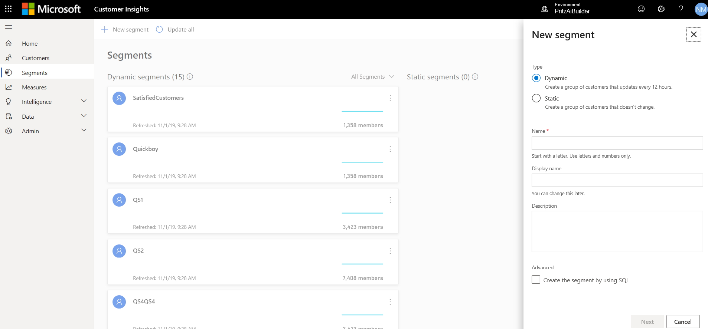

# Segments

The segmentation capability in Dynamics 365 Customer Insights enables you to group your customers based on demographic, transactional, or behavioral attributes. You can use segmentation to target promotional campaigns, sales activities, and customer support actions to achieve your business goals.

You can define complex filters around the Customer Profile entity and its related entities. Each segment, after processing, creates a set of customer entity records that you can export and take action on.

There are two types of segments:

- **Static segments**: Segments that are processed only once — either after the creation or update of any of its filters. Use static segments when properties are not expected to change over time or when they are expected to be used only once. For example, customers who attended a specific event.
- **Dynamic segments**: Segments that are processed according to a recurring schedule. Use dynamic segments when customers' attributes change over time. For example, customers who have bought products worth more than $500 in the last three months. Currently, dynamic segments are refreshed 12 hours.

The following example illustrates the depth of the Customer Insights segmentation capability. We have defined a segment for customers who ordered goods for more than $500 in the last 90 days *and* who were involved in a customer service call that got escalated.

> [!div class="mx-imgBorder"] 
> 

## Manage existing segments

On the **Segments** page, you can view all your saved segments and manage them.

Each segment is represented by a tile that includes the segment's name, description, last date of data refresh, and historical trend (if it exists). Hover over the trend line to see how the customer count in the segement evolved over time. 

To see your segments in a table format, select the table format icon.

> [!div class="mx-imgBorder"] 
> 

To manage a segment, select the ellipses on the segment's tile.

> [!div class="mx-imgBorder"]
> 

The following options are available:

- Edit the segment
- View the segment's members
- [Export](export-destinations.md). the segment
- Change a state of a dynamic segment to inactive or active
- Run the processing of a static segment
- Delete the segment

## Create a new segment

Segments are managed on the **Segments** page in Customer Insights.

1. Go to the **Segments** page in Customer Insights.

2. Select **New segment**.

3. In the **New segment** pane, choose a segment type and provide a **Name**.

  > [!div class="mx-imgBorder"] 
  > 

  Optionally, provide a display name, and a description that helps identifying the segment. 

4. Select **Next** to get to the **Segment builder** page where you define a group. A group is a set of customers.

5. Choose the entity that includes the attribute you want to segment by.

6. Choose the attribute by which you want to segment. The attribute can have one of four value types: numerical, string, date, or Boolean. 

7. Choose an operator and a value for the selected attribute.

   > [!div class="mx-imgBorder"] 
   > 

   |Number |Definition  |
   |---------|---------|
   |1     |Entity          |
   |2     |Attribute          |
   |3    |Operator         |
   |4    |Value         |

8. Add entities that are related to that entity until getting to the Customer Profile entity. To this step, you might need to first [define relationships between entities](pm-relationships.md) on the **Relationships** page.

9. Select **Save** to save your segment. Your segment will be saved and processed if all requirements are validated. Otherwise, it will be [saved as a draft](#draft-mode).

10. Select **Back to segments** to go back to the **Segments** page and view the segment you just created.

## Draft mode for segments

If not all requirements to process a segment are met, you can safe the segment as a draft and access it from the **Segments** page.

- For a Dynamic segment, it will be saved as a draft.

- For a Static segment, it will be saved as an inactive segment.

You can't run or activate the segment until it's a valid segment. You'll see a message in the app if you try to run or activate a segment that isn't valid.

## Add more conditions to a group

To add more conditions to a group, you can use two logical operators:

- **AND** operator: UBoth conditions must be met as part of the segmentation process. This option is most useful when you define conditions across different entities.

- **OR** operator: Either one of the conditions needs to be met as part of the segmentation process. This option is most useful when you define multiple conditions for the same entity.

   > [!div class="mx-imgBorder"]
   > 

Note that currently, it's possible to nest an **OR** operator under an **AND** operator but not vice versa.

## Combine multiple groups

Each group produces a specific set of customers and you combine these groups to get include the customers you need for your business case.

1. Open a segement on the **Segments** page.

2. Select **Add Group**.

   > [!div class="mx-imgBorder"]
   > 

3. Select one of the following set operators: **Union**, **Intersect**, or **Exclude**.

   > [!div class="mx-imgBorder"] 
   > 

   Selecting a set operator enables you to define a new group. Saving different groups determines what data gets maintained:

   - **Union** unites the two groups. In general, this creates a larger group in total.

   - **Intersect** overlaps the two groups. Only data that *is common* to both groups is maintained in the unified group.

   - **Exclude** combines the two groups. Only data that is *not common* to both groups is maintained.

## View processing history and segment members

You can see consolidated data about a segment by reviewing it's details.

On the **Segments** page, select the segment you want to review.

The upper part of the page includes a trend graph that visualizes changes in of member count. Hover over data points to see the member count on a specific date.

You can update the the time frame of the visualization.

> [!div class="mx-imgBorder"] 
> 

The lower part contains a list of the segment members.

> [!NOTE]
> Fields that appear in this list are based on the attributes of your segment’s entities.
>
>The list is a preview of the matching segment members and shows the first 100 records of your segment so that you can quickly evaluate it and review its definitions if needed. To see all matching records, you need to [export the segment](export-destinations.md).

## Recommended segments

In addition to the segment builder, there is another path for creating segments in Customer Insights. Recommended segments lets you build simple segments (with a single operator) quickly.

1. Select one of the tiles on the **Segments** page to get started.

    > [!div class="mx-imgBorder"] 
    > 
 
    - Select the **Profiles** option to build a segment that is based on the unified Customer entity. 
    - Select the **Measures** option to build a segment around each of the Customer Attribute type of measures you have previously created on the **Measures** page. 
 
2. In the **New quick segment** dialog box, select an attribute from the **Field** drop-down.

3. The system will provide some additional insights that help you create better segments of your customers. 
   - For categorial fields we will show 10 top customer counts. Choose a **Value** and select **Review**.

   - For a numerical attribute the system will show what attribute value falls under each customer's percentile. Choose an **Operator** and a **Value**, then select **Review**.

4.	The system will provide you with an **Estimated segment size** so you can choose whether to actually generate the segment you have defined or first revisit it get a different segment size.

    > [!div class="mx-imgBorder"] 
    > 

5. Provide a **Name** for your segment. Optionally, provide a **Display name**.

6. Select **Save** to create your segment. 

7. After segment finished processing, you can view your segment like any other segment you have created.

For the following scenarios,we advise to use the segment builder rather than the recommended segments capability:

- Creating segments with filters on categorial fields where the operator is different than the **Is** operator
- Creating segments with filters on numerical fields where the operator is different than the **Between**, **Greater then** and **Less then** operators
- Creating segments with filters on date type of fields

## Next steps

[Export a segment](export-destinations.md) and explore the [Customer Card](pm-customer-card-addin.md) and [Connectors](pm-connectors.md) to get insights on the customer level.