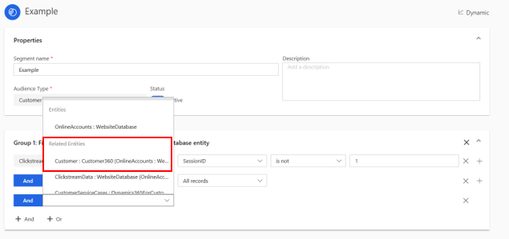
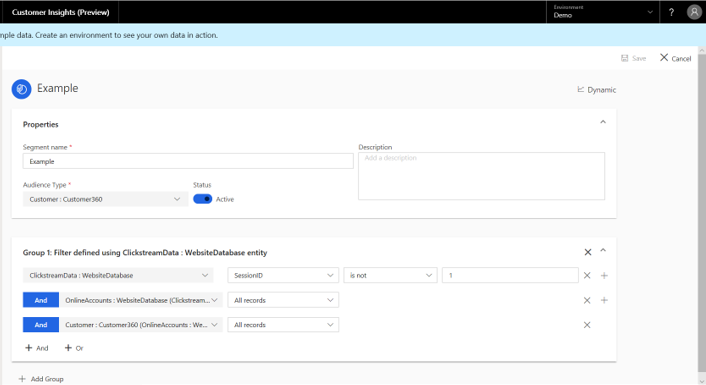
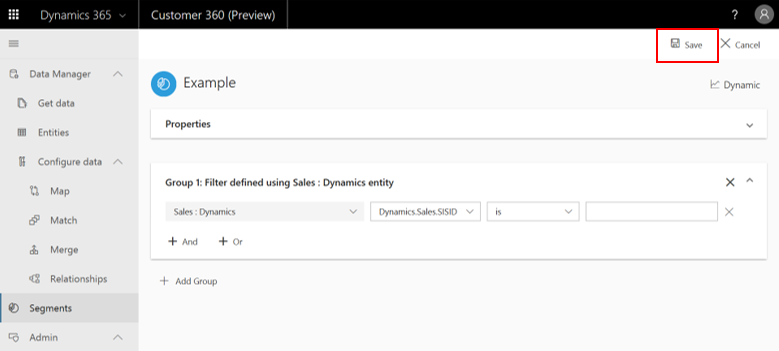
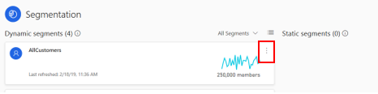
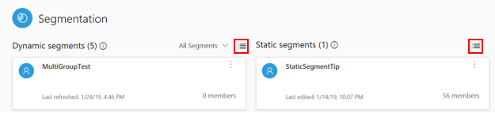
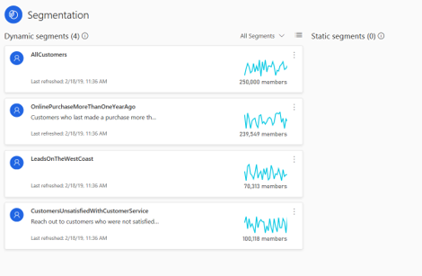

# Segments

The segmentation capability of Customer Insights enables you to group your customers into cohorts based on demographic, transactional, or behavioral customer attributes. Using segmentation, you can target promotional campaigns, sales activities, and customer support actions to achieve your business goals. 

You can define complex filters around the Customer Profile entity and its graph of related entities. Each segment, after processing, outputs a set of customer entity records that you can export and take action on.

There are two types of segments:

- **Static**: A segment that is processed only once—either upon the creation or update of any of its filters. These segments are especially useful when properties are not expected to change over time or when they are expected to be used only once. Example use case: Customers who attended an expo event. 
- **Dynamic**: A segment that is processed according to a recurring schedule. These segments are especially useful when customers' attributes change over time. Example use case: Customers who have bought products worth more than $500 in the last three months. The current refresh schedule for dynamic segments is every 12 hours.

The following example illustrates the depth of the Customer Insights segmentation capability. We have defined a segment for customers who have placed orders of more than $500 in the last 90 days **and** who have been involved in a customer service call that got escalated in the last 30 days

Later, we will learn how to produce such segments. 

> [!div class="mx-imgBorder"] 
> 

- Group 1 uses **Order** as the starting entity in order to find customers who have placed an order for more than $500 in the last 90 days.
- Group 2 uses **Case** as the starting entity in order to find customers who have had an escalated case in the last 30 days.

The following two sections cover segment creation followed by segment exploration.

## Creating your first segment

To create a segment, you can either select **Add Segment** at the upper-right corner of the page, or select **Get Started**.

> [!div class="mx-imgBorder"] 
> 

### Step 1: Define the segment's properties using the **New Segment** panel

- Choose between a **Dynamic** and a **Static** segment.
- Give your segment an informative name, a display name, and a description that will help us identify it in the future, when we have multiple segments. There are no limitations on display name but there are some limitations on name (a space is not allowed, for example).
- Select **Next**. You will go to the **Segment builder** page.

### Step 2: Create a first group 

In Customer Insights, a group is a set of customers.

**Define a group**

1. Choose the entity that includes the specific attribute you want to segment by. For example, choose an Orders entity, since it includes an Order Value field by which we want to segment. In order to choose your entity of interest, select the field shown here.

2. Choose the attribute by which you want to segment. Our attribute can have one of four value types: numerical, string, date, or Boolean. In the following example, an attribute with a numerical value is used as a filter.

3. Choose an operator and a value for the attribute we chose in step 2. In the following example, an operator (**Equals**) and value (**2**) were chosen.

   > [!div class="mx-imgBorder"] 
   > 

   |Number |Definition  |
   |---------|---------|
   |1     |Entity          |
   |2     |Attribute          |
   |3    |Operator         |
   |4    |Value         |

    Note that one of the segmentation strengths of Customer Insights is the variety of operators it supports. 

4. Add entities that are related to that entity until getting to the Customer Profile entity. Note that for the completion of this step, you might need to first define relationships between entities using the **Relationships** page (see the “Relationships” section for more information). Next we will present an example that illustrates this requirement. 

5. **Save** your segment. Your segment will be saved and if valid, processed. If some requirements were not met, it will be saved as a **draft**. Later we will describe in further detail the draft mode. Select **Back to segments** to go back to the **Segments** page and view the segment you just created.

#### Example – group creation

Let's explore a case in which we want to segment our customers by a specific clickstream activity attribute. In our example, it will be a session ID that is not equal to 1 (since this session was done on an older, outdated website version that is irrelevant for our current targeting efforts). This is the series of steps we should complete.

1. Select the **Select an entity** field.
   
2. Choose your entity of interest (**ClickStreamData: WebsiteDatabase**) and the attribute by which you want to segment (**SessionID**).

3. Select an operator and a value as described earlier.

4. Select the **ADD** operator.

5. We need to create a path to the Customer Profile entity, but currently our entity (**ClickstreamData: WebsiteDatabase**) doesn't have a relationship with the Customer Profile entity. The only entity that has a relationship with our entity is **OnlineAccount: WebsiteDatabase** (shown in the following example), and so we will choose it.

6. Select **All Records** as an operator. No value is needed under this operator.

7. Select the **ADD** operator again. This time, our entity does have a relationship to the Customer Profile entity (which we will select), as shown here.

   > [!div class="mx-imgBorder"] 
   > 

8. Select **All Records** as an operator, also for the Customer Profile entity.

   > [!div class="mx-imgBorder"] 
   > 

At this point, we have completed the mandatory path definition. We recommend that you save your first group's definitions.

> [!div class="mx-imgBorder"] 
> 

#### Draft mode

As you can see, there are certain requirements that should be met in order for a segment to be processed. However, at any point of time you can save your segment as a **draft**. Upon saving, if your segment definition is missing one or more mandatory selections.

- For a Dynamic segment, it will be saved as a draft on the **Segments** page.

- For a Static segment, it will be saved as an inactive segment on the **Segments** page.

Note that you will not be able to run or activate the segment (for a Static or Dynamic segment respectively) until it's a valid segment. You will see the following message if you try to run or activate it without meeting all the requirements.

### Step 3 (optional): Add more conditions to your group 

The following two logical operators can be used for that purpose:

- **AND**: Under this option, both conditions must be met as part of the segmentation process. This option is most useful when you define conditions across different entities (one condition per entity) as shown here.
    
  > [!div class="mx-imgBorder"] 
  > 
    
- **OR**: Under this option, either one of the conditions needs to be met as part of the segmentation process. This option is most useful when you define multiple conditions for the same entity, as shown here.
    
   > [!div class="mx-imgBorder"] 
   > 

Note that currently, it's possible to nest an **OR** operator under an **AND** operator but not vice versa.

### Step 4 (optional): Combine multiple groups via set operators

Each group produces a specific set of customers. Start by selecting **Add Group**.

> [!div class="mx-imgBorder"] 
> 

Three set operators are displayed: **Union**, **Intersect**, and **Exclude**.

> [!div class="mx-imgBorder"] 
> 
 
Selecting a set operator enables you to define a new group. Saving different groups determines what data gets maintained:

- **Union** unites the new group you have created in Step 4 with the group you have created in Steps 2 and 3. With this option, data that is common to both groups is maintained, as well as data that is not common to both groups.

- **Intersect** intersects the two groups. Only data that is common to both groups is maintained in the unified group.

- **Exclude** excludes the two groups. Only data that is not common to both groups is maintained.
   
## Explore segments from the Segments page

> [!div class="mx-imgBorder"] 
> 

On the Segments page, you can view all your saved segments and perform certain actions.

- Dynamic segments appear to the left, and Static segments appear to the right.
- Each segment is represented by a tile that includes the segment's name, description, last date of data refresh, and historical trend (if it exists). Hover over the trendline to see last week's growth in this segment's members count. If you prefer to view all of your segments in a table format, select one of the following:
  > [!div class="mx-imgBorder"] 
  > 

You can also perform certain actions with each segment. First, select the following button on the segment's tile:

> [!div class="mx-imgBorder"] 
> 

Then, choose one of the following options from the drop-down menu:
- Editing the segment.
- Viewing the segment's members.
- Exporting the segment to either a CSV file or to a Dynamics 365 Sales location. For more information on how to export to a Dynamics 365 location, visit the **Export destinations** section.
- Turning a Dynamic segment to inactive or active (depending on its baseline state).
- Running a Static segment.
- Deleting the segment. 
   
## Explore a segment: View processing history and segment members

Select a segment's name in the **Segments** page to get to the page shown in the following example. This page consolidates data at the segment level. The upper part of the page includes a trend graph that specifies changes in this segment's member count. In addition, hovering over each data point shows the member count for that point. Above the graph, you can find the current member count and last week's growth. 

As highlighted in this example, you can adjust the trend's time scope as well (last 30 days, last 60 days, and so on).

> [!div class="mx-imgBorder"] 
> 

The lower part includes a table with all your segment's members.

- Note that the specific fields that appear in this table are based on the attributes of your segment’s entities. The preceding example is typical for a **Customer** entity, but it is only one of many possible representations.

- Also note that this table shows only a preview of your records. It presents the first 100 records of your segment so that you can quickly evaluate your segment and go back to the segment editor page to change its definitions. As we will see in the next section, exporting your segment produces a file that includes all your records.
    
## Next step
Visit the **Export destinations** section to learn how to export your segment to a Dynamics 365 location. 
You can also explore the **Customer Card** and **Connectors** sections to get insights on the customer level.