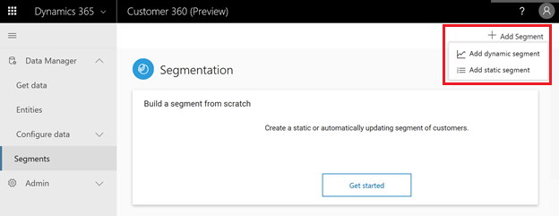
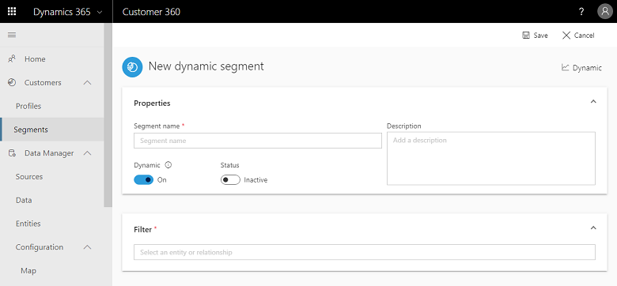
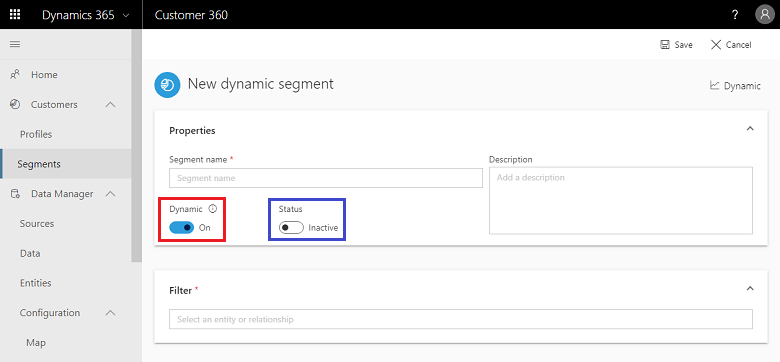
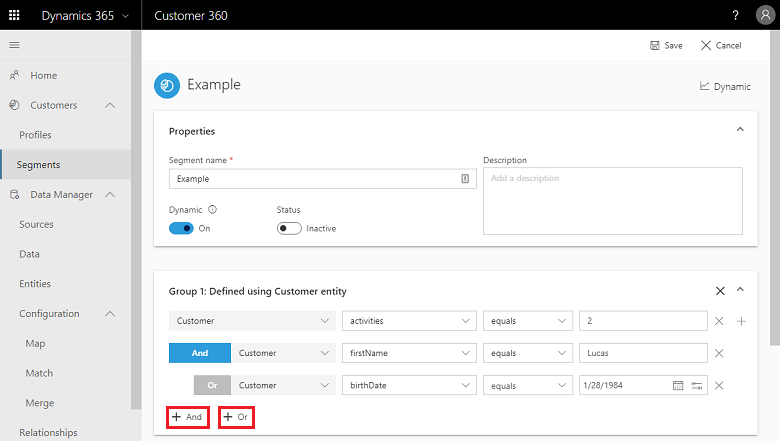
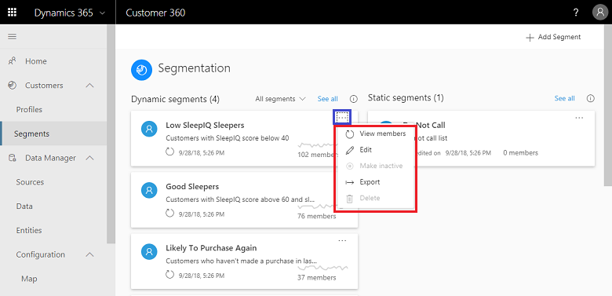
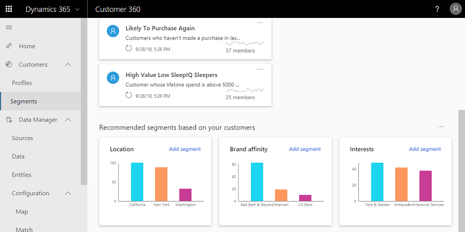
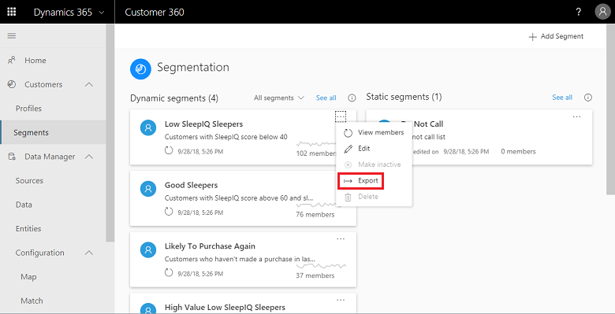

# Segments

[!INCLUDE [cc-beta-prerelease-disclaimer](../includes/cc-beta-prerelease-disclaimer.md)]

Segmentation provides ability segment your customers into cohorts that match a filter criteria based on various customer attributes such as their demographic, transactional or behavioral attributes to target specific actions such promotional campaigns or surveys to achieve desired business goals. Segments allows defining complex filter conditions based on the conflated customer entity and its data graph of related entities matched and populated with data ingested from various data sources. 

There are two types of segments:

- **Static**: Segment with filter conditions that are processed once either upon the creation or update any of its filter conditions. Such segments are especially useful for cases when properties are not expected to change over time or that are expected to used ony once. Example use case: Customers who attended an expo event. 
- **Dynamic**: Segment with filter conditions that are processed according to a recurring schedule. These segments are especially useful when customers attributes change over time to continuosly update segment and keep targeting newly added customers   Example use case: customers who have bought products worth more than $500 in the last 3 months. The current dynamics segment resfreshing schedule is every 12 hours.

This section will cover segment creation followed by segment exploration.

## Creating segments from the segment page
In order to start creating a segment, you can either click **Add Segment** at the top right corenr of the screen (shown in red below), or click the **Get Started** button (shown in blue below).

[replace with segments 1]:
> [!div class="mx-imgBorder"] 
> 

If you clicked **Add Segment** then you will need to select whether you want to create a **Static Segment** or a **Dynamic Segment*. ***Dynamic segments*** change with time as data updates, while ***Static segments*** are fixed. An example for a case that fits Static segment might be exploring the properties of a specific group of customers (for example from a specific location), properties that are not expected to change with time. Segments that are automatically updated with time. A case that fits Dynamic segments is for example tracking the impact of a marketing/sales/service activity on a specific group of customers with time (tracking a lift in those KPIs).

- **Segment creation process**:
The segment creation process is executed within the **Segment Creation** page:

> [!div class="mx-imgBorder"] 
> 

- **We start by defining the segment's properties**: We will give our segment a name and description, click the first slider (highlighted in blue below) if we wish to change from Dynamic segment to Static segment or vice versa, and click the second slider (highlighted in red below) to activate our segment if it's a dynamic segment (otherwise it will not incorporate new information on our customers as our data is refreshed):
     
> [!div class="mx-imgBorder"] 
> 
     
- **In step two, we will start creating our first filter**. Use the "filter" bar to select an entity. Once we selected an entity type, we need to choose the specific attributes we want to group by our customers. Note that attributes can have one of three value types: A numerical, a string, or a date. In the example below, an attribute with a numerical value is used as a filter:
     
> [!div class="mx-imgBorder"] 
> 

|Number |Definition  |
|---------|---------|
|1     |Entity type         |
|2     |Attribute type         |
|3    |Operator         |
|4    |Value         |

     
- **In step three, which is optional, we will add more rules to our filter**. Two rules are available on the entity level: 
     ***AND*** and ***OR***. In the example below, we added to our first rule two additional rules. The middle row demonstrates the 
     creation of an "AND" rule (this time with a string attribute), while the lower row demonstrates an "OR" rule (created for a time 
     attribute):
     
> [!div class="mx-imgBorder"] 
> 

Note that as you add rules around more entities, **those entities are linked in a predefined manner**. As described in the Relationships section, **System Relationships** were created during the *Merge* phase and it's also possible that you created additional **Customized Relationships** through the *Relationships Screen*. As shown in the example below, based on the relationships that were created prior to segmentation, a specific path was created. That path dictates that as part of the rule definition, you can choose the operatior **All Records** for the *(Master) Customer* entity and the *Contact* entity, but not for the *Orders* entity:

[segmentation 2]

- **In step four, we will show how to combine multiple filters that are created for multiple entities**. Upon selecting **Add Group**, three options will show up: ***Union***, ***Intersect*** and ***Exclude***. Clicking each of these options will result in the creation of a new filter for a new entity and the consolidation of this new filter with the filter we created in steps 2-3. 
   
> [!div class="mx-imgBorder"] 
> 
   
  - Choosing ***Union*** will dictate that the new segment will be fully added to the older segment - no data will be excluded:
       
  > [!div class="mx-imgBorder"] 
  > 

  - Choosing ***Intersect*** will dictate that the new segment will be combined with the older segment but if there are missing values among one of the segments, those values will be excluded.

  - Lastly, choosing ***Exclude*** will dictate that the new segment will be combined with the older segment but if there are missing values among one of the segments, those values' columns will be excluded including all their values (both missing and existing values).

## Exploring segments from the Segments page
Here you can view all your segments as well as suggested segments. These are the page components:
- **Your saved Segments:** Dynamic Segments appear to the left and Static Segments appear to the right. Each segment is represented by a tile that includes the segment name, segment description, last date of data refresh, trend (if exist), the possibility to refresh the data for that segment, and several other possibilities (highlighted in red below) that can be accessed via  <b>...</b> as highlighted in blue below:

> [!div class="mx-imgBorder"] 
> 

Those other options include:
    - Editing this particular segment
    - Viewing it's members
    - Exporting the segment to a .csv file
    - Turning the segment to inactive/active (depends on it's current state)
    - Deleting the segment
    
- **Recommended segments**: Those appear at the lower part of the page as shown below. Those are suggestions that are curated based on your specific customers base. Clicking *Add Segment* in each of the tiles will enable you to build segments for that specific suggestion

> [!div class="mx-imgBorder"] 
> 

## Exploring a particular segment from the Segments page
Once you selected a segment within the *Segments page*, you will get to this page that consolidates everything around that particular segment. As shown below, the upper part includes a trend graph with the possibility to adjust the trend time scope (30 last days, 60 last days, etc.) with the button at the upper-right corner of the tile:

> [!div class="mx-imgBorder"] 
> 

The lower part includes a table with all your segment members properties. Those include: 
- Members Names
- Members Addresses
- Members Job Titles
- Members Telephone Numbers
- Members Cities
- Members States
- Members Locations

## Acting upon the data: Exporting a segment
Exporting a segment to .csv file is possible either through the *Segments page* by selecting <b>...</b> within a specific segment's tile (shown below, upper image), or by entering the specific segment page and selecting **Export** at the top-right corner of the page (shown below, lower image):

> [!div class="mx-imgBorder"] 
> 

> [!div class="mx-imgBorder"] 
> 

Once exported, you can expect to find all the information on that particular segment within the .csv file. An example is shown below:

> [!div class="mx-imgBorder"] 
> 
