# System

[!INCLUDE [cc-beta-prerelease-disclaimer](../includes/cc-beta-prerelease-disclaimer.md)]

The **System** screen encapsulates everything that you, as an administrator, needs to have in order to closely monitor the various processes that run behind the scenes of Customer 360. As shown below, it includes three major parts: **Status, Schedule** and **About** that are accessible through three corresponding tabs at the top of the screen:

> [!div class="mx-imgBorder"] 
> 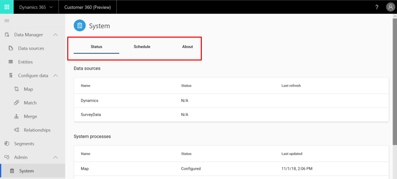

**Prelminary note**: It is highly recommended to use the **Schedule tab** in case some of your data sources are updated on regular basis

### Status Tab

> [!div class="mx-imgBorder"] 
> 

The status tab enables you to track the progress of data ingestion as well as several important product processes. That way you can ensure the completeness of any major process you define in Customer 360. This tab includes three tables:

- **Data Sources**: This table lists all the data sources from which you are ingesting your data (left column as shown below). It also presents the status of ingestion (middle column): Whether it didn't start yet, in progress, or already completed. Lastly, date of last data refresh is specified per data source (right side column)

> [!div class="mx-imgBorder"] 
> 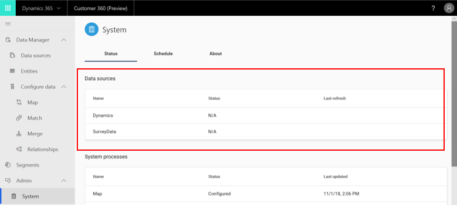

- **System Processes**: This table lists all the processes that should be executed in customer 360 as part of a full user journey (left column as shown below). It also presents the status of these processes (middle column): Whether it wasn't configured yet by the user, configured by the user but still in progress, or completed. Lastly, date of last data refresh is specified per data source (right side column)

- **In addition**, you can view the details of each refresh a given datasource or process went through by clicking that datasource or process. 

### Schedule Tab

The Schedule tab is used to refresh all of your ingested Customer 360 data. You should utilize this tab to schedule the frequency and timing of the refreshes. As data is constantly updated in your data sources, you may want the Customer 360 processes and insights to reflect those changes and the schedule tab enables you do achieve that in an automated way.

> [!div class="mx-imgBorder"] 
> 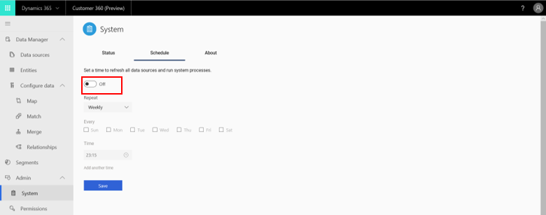

- In Customer 360, the default state for data refresh is **Off**, reflecting no scheduled refreshes. To change it click the slider at the top of the screen (changing it to an **On** status):

> [!div class="mx-imgBorder"] 
> 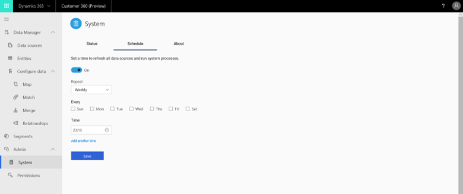

- The next step is to decide between **weekly** (default) and **daily** refresh. You can switch between the two:

> [!div class="mx-imgBorder"] 
> 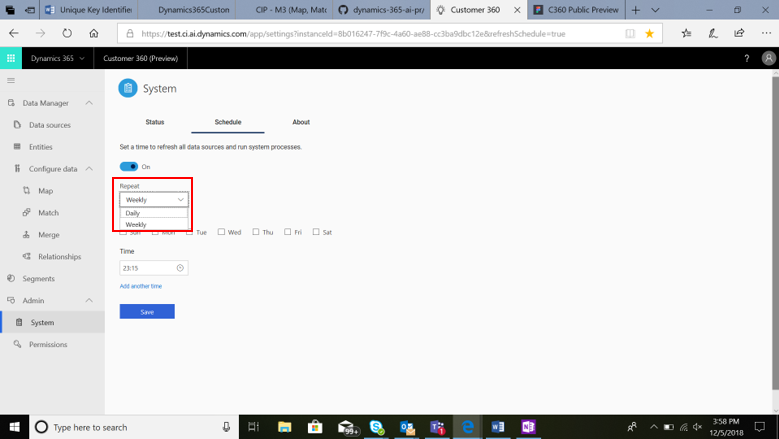

First we will demonstrate the definition of a daily refresh, and then we will continue with the case of a weekly refresh.

- **First step in scheduling a daily refresh** is to click the **time** field:

> [!div class="mx-imgBorder"] 
> 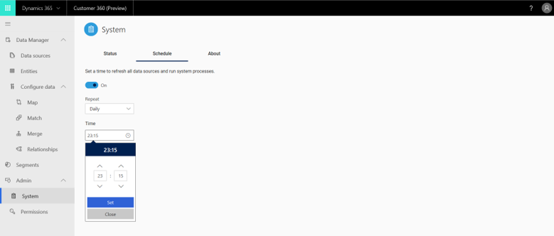

- In the timer shown above, click the four arrows to set your refresh timing. When finished, click the **Set** button. You can also close the timer without saving your selections by clicking the **Close** button.

- You can also set multiple daily refreshes by clicking the **add another time** button:

> [!div class="mx-imgBorder"] 
> 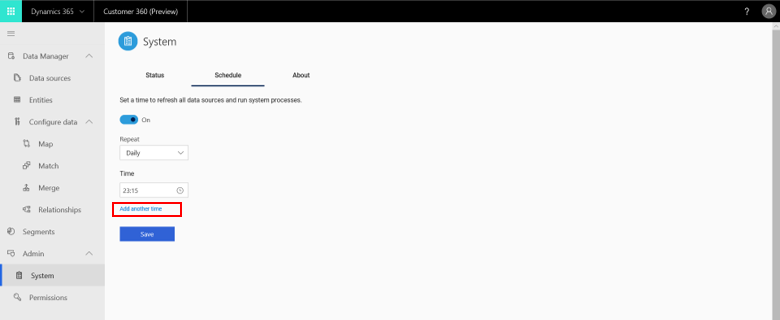

- If you wish to discard any of your saved timings, click the following button:

> [!div class="mx-imgBorder"] 
> 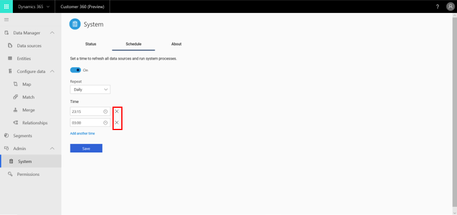

- **First step in scheduling a weekly refresh** is to check the boxes for the days in which you want to execute your refreshs:

> [!div class="mx-imgBorder"] 
> 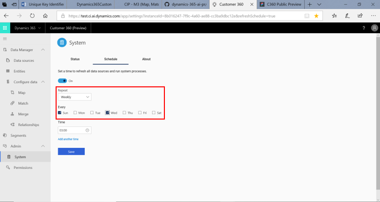

- Then follow the steps specified above for daily refresh setting.

- Whatever refresh schedule you have defined, make sure to save it by clicking the **Save** button:

> [!div class="mx-imgBorder"] 
> 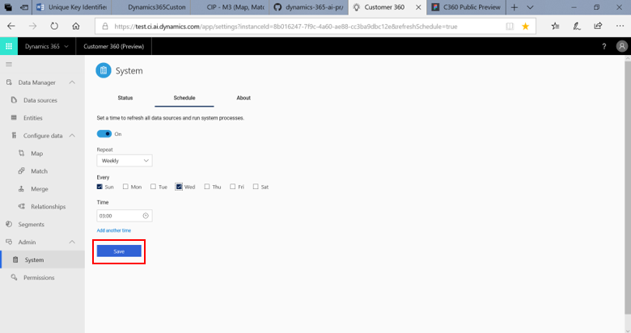

### About Tab

> [!div class="mx-imgBorder"] 
> 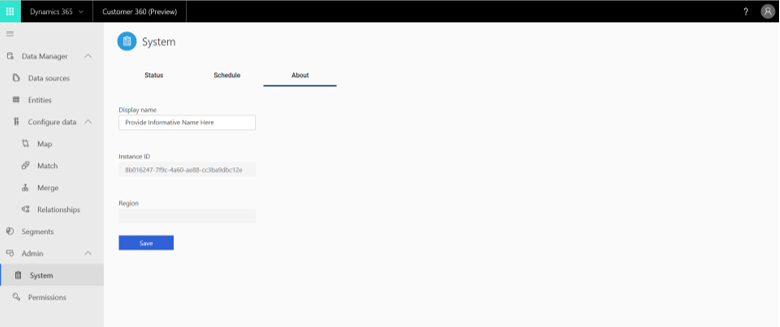

Within this screen, several options are available as shown below. Those options can serve important business requirements such as using Customer 360 from different regions or distinguishing between multiple work instances.

> [!div class="mx-imgBorder"] 
> 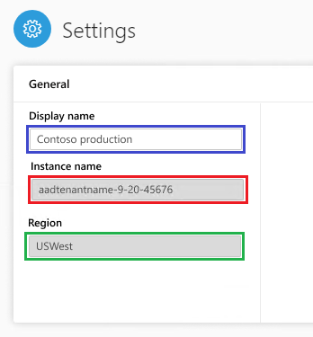

- **Display Name**: Determines how your user name will be shown
- **Instance Name**: Here you can give your work instances identifiable names. Highly recommended if you have more than one instance 
- **Region**: Determines your organization's region 
