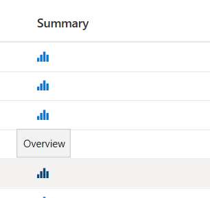
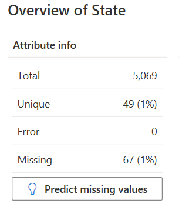
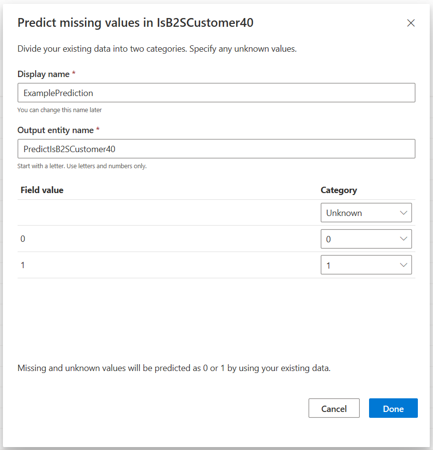

# Complete your partial data with predictions

Predictions lets you easily create predicted values that can enhance your understanding of a customer. On the **Intelligence** > **Predictions** page, you can select **My predictions** to see predictions that you've configured in other parts of Customer Insights, and allow you to further customize them.

> [!NOTE]
> You can't use this feature if your environment uses Azure Data Lake Gen 2 storage.
>
> The predictions feature uses automated means to evaluate data and make predictions based on that data, and therefore has the capability to be used as a method of profiling, as that term is defined by the General Data Protection Regulation ("GDPR"). Customer's use of this feature to process data may be subject to GDPR or other laws or regulations. You are responsible for ensuring that your use of Customer Insights, including predictions, complies with all applicable laws and regulations, including laws related to privacy, personal data, biometric data, data protection, and confidentiality of communications.

## Prerequisites

Before your organization can use the predictions feature, the following prerequisites must be met:

1. Your organization has an instance [set up in the Common Data Service](https://docs.microsoft.com/ai-builder/build-model#prerequisites). The credentials (user name and password) that you use in Common Data Service and in Dynamics 365 Customer Insights should match.

2. Your Customer Insights environment is attached to your Common Data Service instance.

If you're [creating a new environment](manage-environments.md), configure it in the **Create an environment** dialog and select **Advanced**. If you've already created an environment, go to its settings and select **Advanced**. Either way, in the **Use predictions** section, enter the Common Data Service instance URL to which you want to attach your Customer Insights instance.

## Create a prediction in the Customer Entity

1. In Customer Insights, go to **Data** > **Entities**.

2. Select the **Customer** entity.

3. In the **Customer: CustomerInsights** entity, select on the **Fields** tab.

4. Find the attribute name you wish to predict values for, then select the **Overview** icon in the **Summary** column.
   > [!div class="mx-imgBorder"]
   > 

5. If there's a high rate of missing values for your attribute, select **Predict missing values** to continue with your prediction.
   > [!div class="mx-imgBorder"]
   > 

6. Provide a **Display name** and an **Output entity name** for the results of the prediction.

7. A pre-populated list of options will show where you can map the values to a predicted category. In this case, your only category options will be 0 or 1, as they map to the true/false or binary nature of the prediction. In the Category column, map the field values you'd like to be classified as "0" in the final prediction to "0", and the items you'd like to be classified as "1" in the final prediction to "1".
   > [!div class="mx-imgBorder"]
   > 

8. Select **Done** and the prediction will be processed. The processing will take some time, depending on the size and complexity of data. Results will be available in a new entity based on the **Output entity name** of the prediction you created.

## Create a prediction while creating a segment

Predicting missing values for a specific attribute of choice is also possible when creating a segment. Specifically, when you quickly create a segment based on either your unified Customer entity or Customer_Measure entity.

As part of this flow, you'll choose a specific attribute to base your segment on, such as Customer Satisfaction or Purchase Amount. Upon segment creation, the system will suggest a method for predicting any missing values for this attribute.

1. In Customer Insights, go to **Segments** and select the **Profiles** tile.

2. Choose a **Field** to create a segment on and select an **Operator**, then select **Review**.

3. Provide a **Name** and a **Display name** for the segment.

4. Select **Save**.

5. If the segment you created has incomplete data in the source field, you can choose to predict the missing values.
   > [!div class="mx-imgBorder"]
   > 

6. Provide a **Display name** and an **Output entity name** for the results of the prediction.

7. Select **Done**. Your prediction will be generated shortly in a new entity with the name you provided for the **Output entity name**.

## View a prediction

> [!NOTE]
> You can only find these predictions in Customer Insights, and will not be able to find these predictions in the AI Builder model list page.

1. In Customer Insights, go to **Intelligence** > **Predictions** > **My predictions**.

2. Select the prediction you want to review.

3. Select the ellipsis in the **Actions** column and choose **View**.

4. You'll see a number of data points in the view of your prediction.
   > [!div class="mx-imgBorder"]
   > 

   - **Predicted values** shows the mapping you created during the Field value to Category mapping phase. These are the values in your dataset that have been mapped to a specific category.
   -**Top influencers** are the factors within your dataset that were most likely to influence the prediction's confidence of your Field value being mapped to a specific category.
   - **Performance** indicates how the predictions are doing. Select the link to learn more.
   - **Preview** shows samples of the output dataset from your prediction and the likelihood, or our confidence, of the predicted value where 0 is uncertain, and 1 is certain.

## Update a prediction

1. In Customer Insights, go to **Intelligence** > **Predictions** > **My predictions**.

2. Select the prediction you want to update and select the **Update** icon.

3. The prediction will be scheduled for processing. You can see the time it was last updated in the **Updated** column of the **Predictions** page.

## Edit a prediction

After you've created a prediction, you can customize the model in the AI Builder to increase the effectiveness of your model.  

1. In Customer Insights, go to **Intelligence** > **Predictions** > **My predictions**.

2. Select the prediction you want to edit.

3. Select the ellipsis in the **Actions** column and choose **View**.

4. Select **Customize in AI Builder**.

5. Update your model in the AI Builder. [Learn more about managing models in the AI builder](https://docs.microsoft.com/ai-builder/manage-model#retrain-and-republish-existing-models).

The next run of your prediction will use the updated model you've created.

> [!NOTE]
> New models created in AI Builder will not be displayed in Customer Insights unless the model was created from within Customer Insights experiences listed above.

## Remove a prediction

1. In Customer Insights, go to **Intelligence** > **Predictions** > **My predictions**.

2. Select the prediction you want to delete.

3. Select the ellipsis in the **Actions** column and choose **Delete**.

4. Confirm the deletion.

## Troubleshooting

If you can't complete the attach Common Data Service process due to an error, you can try to complete the process manually. There are two known issues that can occur in the attach process:

- The Customer Insights Customer Card Add-in solution is not installed.
    1. Complete the instructions to [install and configure the solution](customer-card-add-in.md).

- Customer Insights Application Permissions aren't granted.
    1. Go to [https://admin.powerplatform.microsoft.com](https://admin.powerplatform.microsoft.com).
    1. Select **Environments**.
    1. Select the ellipsis next to the environment you want to add the permission to and select **Settings**.
    1. Expand **Users + permissions** and select **Users**.
    1. Select **+ New** and select **User**.
    1. Select **Application User** if it's not already selected and enter the following information:
        - **User Name:** cihelp@microsoft.com
        - **Application ID:** 38c77d00-5fcb-4cce-9d93-af4738258e3c
        - **First Name:** Customer
        - **Last Name:** Insights
        - **Primary Email:** cihelp@microsoft.com
    1. Select **Save & Close**.
    1. Select the Customer Insights user you just created.
    1. Select **Manage Roles** in the top menu bar.
    1. Select **System Administrator**, then select **OK**.
