# Quick Start: Dynamics 365 AI for Customer Insights 

[!INCLUDE [cc-beta-prerelease-disclaimer](../includes/cc-beta-prerelease-disclaimer.md)]

> [!IMPORTANT]
> - This feature currently has limited availability.
> - [!INCLUDE[cc_preview_features_definition](../includes/cc-preview-features-definition.md)]  
> - [!INCLUDE[cc_preview_features_expect_changes](../includes/cc-preview-features-expect-changes.md)]  
> - [!INCLUDE[cc_preview_features_no_MS_support](../includes/cc-preview-features-no-ms-support.md)]  

Dynamics 365 AI for Customer Insights is a cloud-based SaaS service that enables organizations of all sizes to bring together data from multiple sources and generate knowledge and insights to build a holistic 360° view of their customers. AI for Customer Insights delivers the ability to connect to transactional data sources and model profiles of customers and their interactions. It enables organizations to generate insights through key performance indicators (KPIs) about their business. Customer Insights transforms profiles, interactions, and KPIs into rich visuals that you can customize and organize to focus on what matters to you.

Use this guide to get a quick introduction to the basic features of AI for Customer Insights and come away equipped to use this tool with your data to create actionable insights.

## Select a business category
Once you've installed AI for Customer Insights, the first thing you do is select a business category that matches your industry.

> [!div class="mx-imgBorder"] 
> 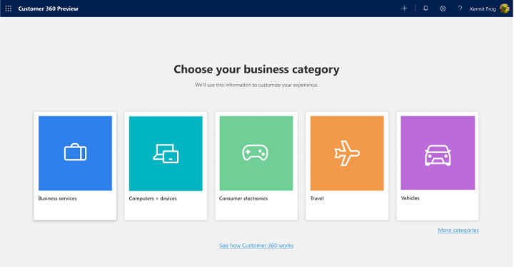

Select **More categories** to choose from more industries or business functions. 

[insert image]

Sample customer data based on your selection appears on the opening dashboard. Insights are built from the sample data automatically. Explore these insights to get an idea of what AI for Customer Insights can provide.

> [!div class="mx-imgBorder"] 
> 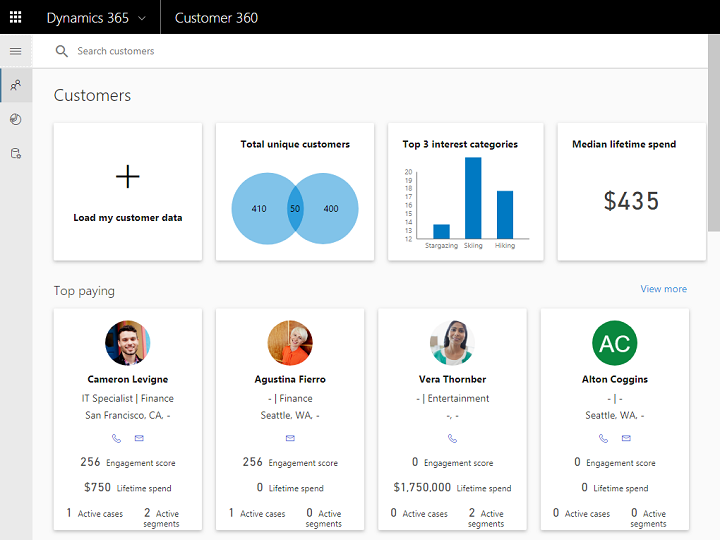

## Workflow
Present an overview of the workflow process.

> [!div class="mx-imgBorder"] 
> 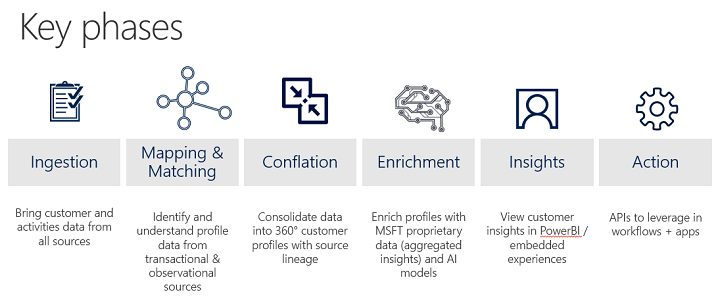

This will need to be revised for the following.

## Ingest
To bring in your company's data, select **Load my customer data** on the Customers dashboard page.

> [!div class="mx-imgBorder"] 
> 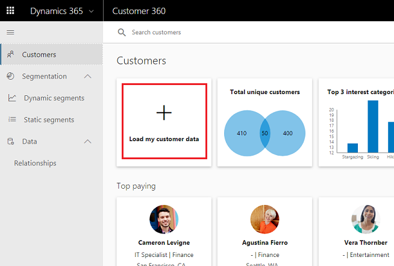

Select a data source. 

> [!div class="mx-imgBorder"] 
> 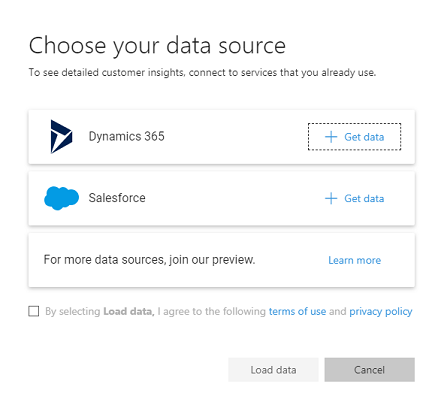

you can also bring in even more data to build a richer customer profile
Show how a user can bring in transactional from a data source that does not have a data integration template to bring it into CDM (e.g. custom database for survey responses)
Show how user can bring in data from website clickstream data

## Search and browse customer
Once you've connected to a data source, AI for Customer Insights creates some customer profiles based on your industry type.

> [!div class="mx-imgBorder"] 
> 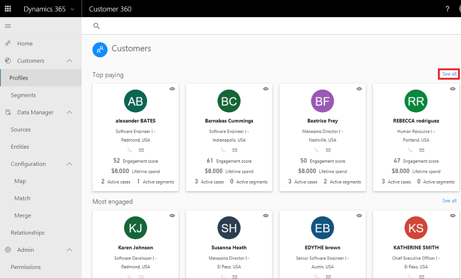

Select **View more** to see more customers sorted by the profile type. In this example, **Top paying** is the profile type.

> [!div class="mx-imgBorder"] 
> 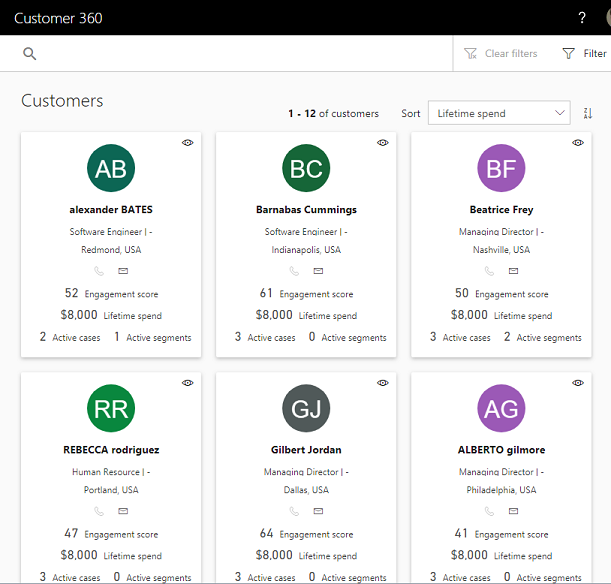

You can use the customer profiles page to filter and sort the profiles.

> [!div class="mx-imgBorder"] 
> 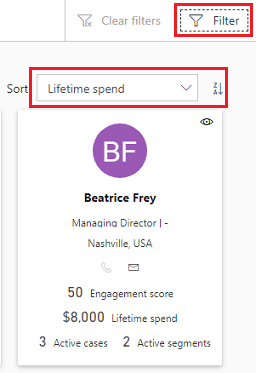

What's in the sort list depends on the category you selected earlier and the profile type. This example is xyz category with **Top paying** as the profile type.

> [!div class="mx-imgBorder"] 
> 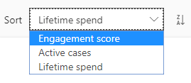

C360 analyzes and builds unified customer profilesShow how Customer360 “automagically” (ML algos + incremental learning from what user has taught the system) does identity conflation and maps customer data streams into customer profiles in CDS-A

## Enrichment
due to OOB rules automatically happens but we can:
- link it to the chosen category and mention that the data was enriched with info on preferred brands, interests, etc
- Talk about unlocking more insights by enriching with Microsoft Graph data
- Let go on this part for the 5*5

## Insights
top paying/engaged/etc customers, KPIs, other details
User can view insights through C360 app + APIs
Show how a user can access the Customer360 PowerBI app with as close as a 5x5 experience we can make it / quick time to value.

Possibly: OOB Business AI templates – e.g. Churn, Customer lifetime value, Predictive Score, etc or custom ML models

> [!div class="mx-imgBorder"] 
> 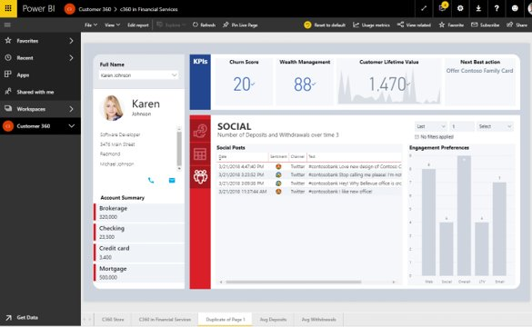

## Segmentation
There are three available segmentation types: *Static Segments*, *Dynamic Segments*, and *Customized Segments*. First we will discuss **segment creation** and learn two ways to perforam that task. Then we will move to discuss **segment exploration**. Lastly we will discuss **segment exportation**.  

### Creating Segments from the Left Menu Bar
This menu includes three tabs. The tabs that are used for segment creation are the *Dynamics Segment* and *Static Segment*.

- **Static Segment Page:** Clicking the Static Segment tab will open this page. Here one can create sophisticated segments of customers   with minimum effort. 

   - We start by defining the segment's properties: We will give our segment a name and description, choose whether it's a segment that
     is created for accounts (---) or contacts (---), and ensure to leave the Dynamic switch in "off" state since it is a static 
     segment: 
     
   - In step two, we will add our first filter. Upon clicking the "filter" bar an entity can be selected. Once we selected an entity 
     type, we need to choose the specific attributes we want to group by our customers. Note that attributes can have one of three value
     types: A numerical, a string or a date. In the example below, an attribute with a numerical value is used as a filter:
     
   - In step three, which is optional, we will add more rules to our filter. Two roles are available on the entity level: **And** and
     **Or**.   

[picS1]

 
   

[picS2]

- Dynamic Segments Page:

- Static segments Page:

### Creating from the Customers Page

### Exploring the Segment Page

o	Work with operators to produce segments (both static and dynamic segments)
o	Act (export segments)

User is able do segmentation atop CDS-A profiles
Show how a user can analyze CDS-A customer profiles/relationships/interactions and export the results as segments to other apps (e.g. CSV file)
Show how we enable developers to query customer profiles from CDS-A and build into app experience (e.g. a Dynamics 365 for Marketing)

> [!div class="mx-imgBorder"] 
> 

### Static segments
Content.

### Dynamic segments
Content.

### Create a segment
Content.

## Extensibilities
User can drive insights in Customer360 to action
Show how a user can setup triggers to drive actions (e.g. use Flow to ! mail to account manager when churn score increases by 10+%)
Show how a user can setup triggers on events detected in profile to drive relevant actions (e.g. if a customer tweets a complaint, notify customer service department to reach out and resolve)

### APIs
Content.

### Power BI
Content.

### Custom apps
Content.

> [!div class="mx-imgBorder"] 
> 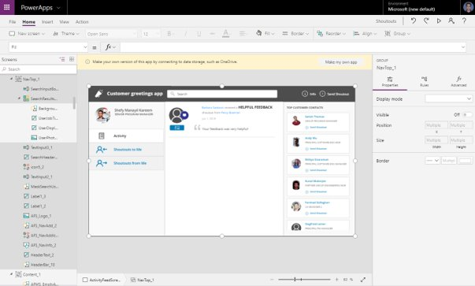

### PowerApps and Flow
Content.

> [!div class="mx-imgBorder"] 
> 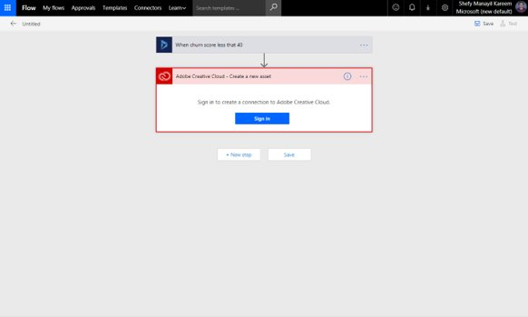

## Administration
Content.
