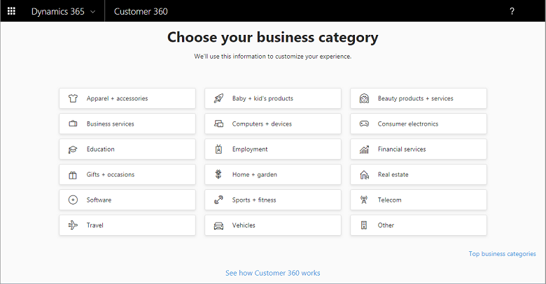
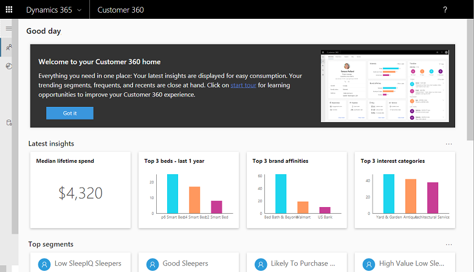
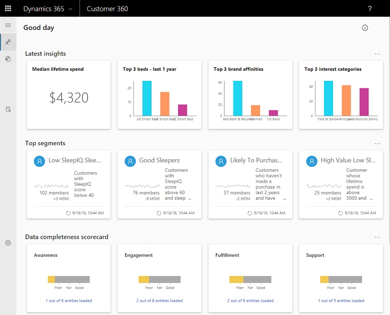
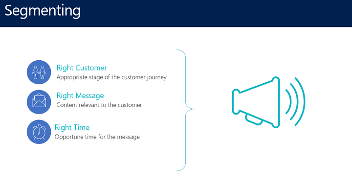
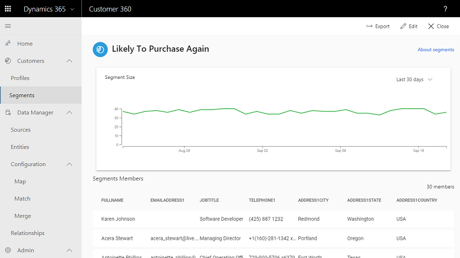
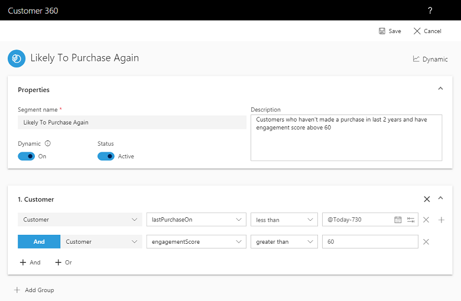
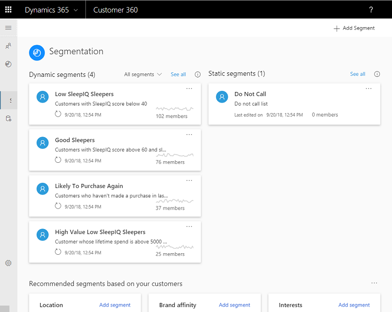
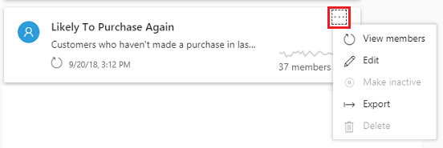
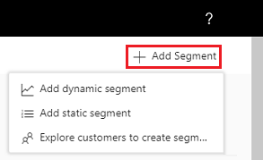
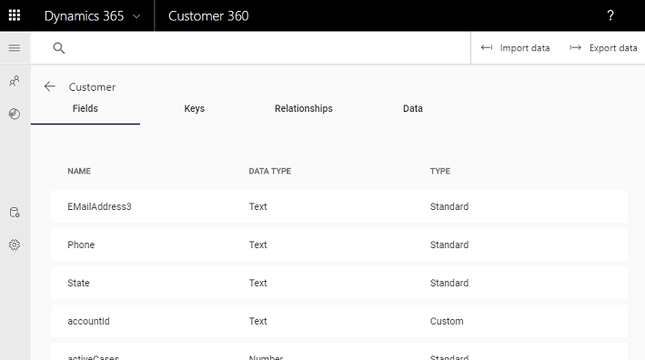

# Quick Start: Dynamics 365 AI for Customer Insights 

[!INCLUDE [cc-beta-prerelease-disclaimer](../includes/cc-beta-prerelease-disclaimer.md)]

> [!IMPORTANT]
> - This feature currently has limited availability.
> - [!INCLUDE[cc_preview_features_definition](../includes/cc-preview-features-definition.md)]  
> - [!INCLUDE[cc_preview_features_expect_changes](../includes/cc-preview-features-expect-changes.md)]  
> - [!INCLUDE[cc_preview_features_no_MS_support](../includes/cc-preview-features-no-ms-support.md)]  

Dynamics 365 AI for Customer Insights is a cloud-based SaaS service that enables organizations of all sizes to bring together data from multiple sources and generate knowledge and insights to build a holistic 360° view of their customers. AI for Customer Insights delivers the ability to connect to transactional data sources and model profiles of customers and their interactions. It enables organizations to generate unique insights about their customers which they can tune to clear actions from day one. Customer Insights transforms profiles, interactions, and KPIs into rich visuals that you can customize and organize to focus on what matters to you.

Use this guide to get a quick introduction to the basic features of AI for Customer Insights and come away equipped to use this tool with your data to create actionable insights.

## Select a business category
Once you've installed AI for Customer Insights, the first thing you do is select a business category that most closely matches your industry.

> [!div class="mx-imgBorder"] 
> 

Select **More categories** to choose from more industries or business functions. 

> [!div class="mx-imgBorder"] 
> 

Once you select a category, the Home page appears with insights built from sample data.

> [!div class="mx-imgBorder"] 
> 

## About sample data
Once you've selected a business category, the Home page opens populated with sample data. Insights are built from the sample data automatically. You can explore these insights to get an idea of what AI for Customer Insights can provide when you bring in your data.

If you want to right away bring in your company's data, under **Data Manager**, select **Sources** from the left-side menu.

Then, select a data source. 

> [!div class="mx-imgBorder"] 
> 

Your data will be brought in to AI for Customer Insights and the sample data will be removed. 

If you keep the sample data for now, this topic will walk you through the getting started experience with that data.

## Home page

Based on your ingested data or, in this case our sample data, you'll see automatically configured insights into your company's data.

> [!div class="mx-imgBorder"] 
> 

### Latest insights
  - **Top Selling Products**: Shows your three top selling products by monetary value or by unit volume. 
  - **Median Lifetime Spend (ML-powered)**: Whether it’s marketing, sales, support or other function, customer lifetime spend is one of the most comprehensive and actionable indicators of your business viability as it captures the customer value across all it’s journey phases.
  - **Highest Interests and most preferred Brands of your Customer Base (ML-powered)**: These unique insights can add a significant value to your customer-targeting and revenue-optimizing efforts as it lights up the specific things that really matters to them.

### Top segments
On your Home page, you'll see top segments - segments with the most members and [need content].

Segmentation is the process of slicing and dicing your data by attributes that are of interest to you like last purchase date and customer engagement score.

> [!div class="mx-imgBorder"] 
> 

For example, you want to know which of your customers are most likely to make another purchase so you can target some ads. 

> [!div class="mx-imgBorder"] 
> 

Select a segment either from your Homepage or the Segments screen and select **Edit** to see it's details.

> [!div class="mx-imgBorder"] 
> 

In this example, the segment finds customers who haven't made a purchase in two years and have a high engagement score.

### Data completeness scorecard
Dynamics 365 AI for Customer Insights equip you with a range of insights across the customer lifetime journey. However, how confident can you be in regard to these insights? By viewing the Data Completeness Scorecard you can get a sense for the phases for which you have wide entity representation versus the phases for which you should incorporate more data and entities. Going left to right, you can view how complete is your data for the ***Awereness, Engagement, Buying and Service*** customer journey stages.

For each of these tiles, green represents good entity coverage, yellow represents medium entity coverage, and red represents poor entity coverage.

Select a scorecard to see details on the entities used. In Dynamics 365 for customer insights, Entities are the datasets you ingest from your various data sources. 

> [!div class="mx-imgBorder"] 
> 

|Item  |Description  |
|---------|---------|
|**Name**     |The names of your data entities. Those may range from Account to Activity to many other categories. Moreover, note that if there is a warning sign next to one of the entities names, it implies that the data for that entity didn't load successfully.|
|**Last Updated**    |When this entity's data was last updated.         |
|**Lifecycle Phase**    |A typical customer journey goes from Awareness, to Engagement, to Fulfillement (or Conversion), to Service (or Support) , to Advocacy. Within this column each entity is mapped to a specific phase within this journey so your future ability to act upon the data becomes more targeted and ROI-optimized.         |
|**Type**     |The types of your data entities. In some cases, this will be the same as your entity name.    |

## Customers
The Customers section contains information about your customers organized by Profiles and Segments.

### Profiles
Once you've connected to a data source, AI for Customer Insights creates some customer profiles and categories based on your industry type. Under **Customers**, select **Profiles**.

> [!div class="mx-imgBorder"] 
> 

Select **See all** to see more customers sorted by the profile type. In this example, **Lifetime spend** is the profile type.

> [!div class="mx-imgBorder"] 
> 

### Segments
You can create segments of your data to filter on certain elements such as a time range and customer satisfaction to create focused, actionable steps.

There are two types of segments:

- **Static**: An aggragated profile data that is not automatically refreshed. Example use case: Exploring the properties of a specific group of customers, from a specific location - properties that are not expected to change with time. 
- **Dynamic**: An aggragated profile data that is automatically refreshed. Example use case: Tracking the impact of a marketing/sales/service activity on a specific group of customers over time.

> [!div class="mx-imgBorder"] 
> 

In addition to the segments you have created, AI for Customer Insights will light up segments that are recommended for you. Those are derived based on your specific data and industry types.

#### Edit a segment
To edit, export, view members, and more for a segment, select <b>...</b> in the segment.

> [!div class="mx-imgBorder"] 
> 

Here you can modify the criteria used to segment the data.

> [!div class="mx-imgBorder"] 
> 

To add a group select **Add Group**. there are multiple selections available for how you want to combine your original and new segments: Either unifying, intersecting or x them (for more information on these options please refer to the **Advanced Guide**).

#### Add a segment

To add a segment, select **Add Segment**.

> [!div class="mx-imgBorder"] 
> 

### Sources

To bring in your company's data, select **Sources** then select a data source. 

> [!div class="mx-imgBorder"] 
> 

Your data will be brought in to AI for Customer Insights and the sample data will be removed. 

### Entities
In AI for Customer Insights **Entities** represent your various data sets (taken from diverse data sources such as your CRM, transactional data system, etc).

After ingesting the data, you can quickly evaluate how complete and useful it is using the Entities screen. If you suspect that your ingested data is not complete or useful enough, you can import more data using **Import Data**. You can also export the entities table as a csv file by selecting the **Export Data**.

> [!div class="mx-imgBorder"] 
> 

Select an entity to see information about it.

> [!div class="mx-imgBorder"] 
> 

|Item  |Description  |
|---------|---------|
|**Fields**     |need content |
|**Keys**    |need content         |
|**Relationships**    |need content |
|**Data**     |need content  |

## Data Configuration, Relationships
These other data management settings are covered in the ***Advanced Guide*** documentation.

### Administration
Use the forms in the **Permissions** section to add or remove role permissions to AI for Customer Insights.

**Roles**

|Role  |Description  |
|---------|---------|
|Contributor    |This user type can ingest data, configure it's entities and export segments and insights but not perform more complex configurations such as the mao, match and merge |
|Reader  |This user type can view all the insights the app has to offer but can not ingest data, export segments and insights, or configure it with any of the Data Manager modules |
|Admin   |This user type can ingest data, fully configure it using the Data Manager modules, utilise APIs for additional configurations,  export segments and insights, and view insights|

More in-depth overview of the Administration module is provided within the Advanced Guide as well.

Now that you explored some of the capabilities that Dynamics 365 AI for Customer Insights has to offer, you are ready to start ingesting your data and unlocking meaningful insights around your customers. Make sure to check out the Advanced Guide for step-by-step guidance around working with your company data.
