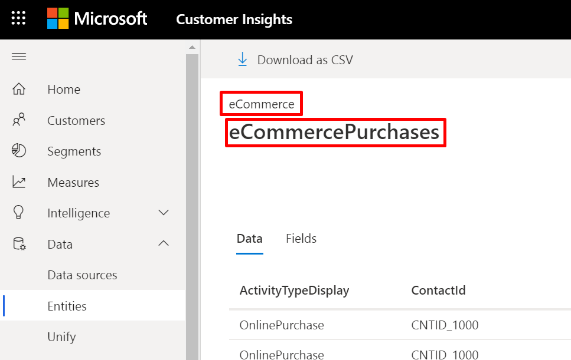
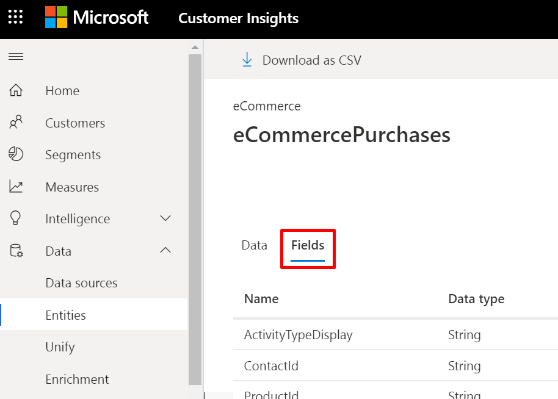

# Real-time data ingestion

The near real-time functionality let you see the latest interactions that your customers have made with your products or company services.

**In this articleas**
- [Real-time creation of activities](#Real-time-creation-of-activities-on-the-unified-customer-profile)
- [Connecting to the real-time API](#How-to-connect-directly-to-the-real-time-API?)

## Real-time creation of activities

This service lets you publish a new [activity](#pm-activities) from your source system to a [unified customer profile](#pm-profiles) in Customer Insights, without having to wait for the next scheduled CI update.

You can achieve this by building your own pipeline and connect directly to the Customer Insights real-time API.

> [!NOTE]
>
> Activities do not change once created. They are only deleted when the profile is deleted.

> Activities ingested through the real-time API are only kept for 30 days. If you want them to be included in Customer Insights for longer you should ensure that they also get added to the data source.
  
> At the moment the unified profile, including segments and enrichments, will not be updated based on the new activity. The same goes for the Customer Card.

> Activities added only through real-time are not part of exports, and do not show up in PowerBI.

## How to connect directly to the real-time API?

Details of this API, including parameters and responses, can be found on the [How to use the Customer Insights Swagger webpage](https://global.api.ci.ai.dynamics.com/swagger/index.html). Read more about Swagger under [How to use the Customer Insights Swagger webpage](https://docs.microsoft.com/en-us/dynamics365/ai/customer-insights/pm-apis#how-to-use-the-customer-insights-swagger-webpage).
For further explanations around the real-time functionality, see this section of our API documentation page.

**Step by step example of a call to the API**

Prerequisites: have an instance with activities (only activities set up in the **activities screen** can be received by Customer Insights in real-time). In order to be able to add an activity, an entity with date/time base fields should be available.

1.	Navigate to the online API tool [Swagger](https://global.api.ci.ai.dynamics.com/swagger/index.html).

2.	On that page, find **POST** /api/instances/{instanceId}/data/{entityName}

3. In the field **instanceId**, enter your instance ID (it can either be found in your url, after **instanceId=**, or under **settings**, **environments**).

4.	Under relative path, enter the name of the entity you chose, following this format: **datasourcename_entityname**
In order to find this specific entity name format navigate to **data** then **Entities** and click on the chosen entity (e.g. in CIIAD you could click on “eCommercePurchases” and use the title “eCommerce” and the subtitle “eCommercePurchase”s, separated by underscore, like this: eCommerce_eCommercePurchases).

   > [!div class="mx-imgBorder"]
   > 

5.	Under entity (request body) enter the new activity as a json object.

> [!NOTE]
>
> The format of the entity sent in the request body is the same as the one received when doing a GET on this resource.

> All the fields of the json object sent in the request body to the POST can be seen in the Fields tab on the selected entity page.*

   > [!div class="mx-imgBorder"]
   > 
