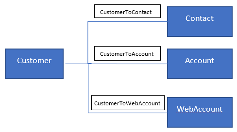

# Relationships between entities

Relationships help you connect entities and generate a graph of your data when entities share a common identifier (foreign key) that can be referenced from one entity to another. Connected entities enable you to define segments and measures based on multiple data sources.

There are two types of relationships. Non-editable system relationships, which are created automatically, and custom relationships created and configured by users.

During the match and merge processes, system relationships are created behind the scenes based on intelligent matching. These relationships help relate the Customer Profile records with other corresponding entities' records. The following diagram illustrates the creation of three system relationships when the customer entity is matched with additional entities to produce the final Customer Profile entity.

> [!div class="mx-imgBorder"]
> 

- ***CustomerToContact* relationship** was created between the Customer entity and the Contact entity. The Customer entity gets the key field **Contact_contactId** to relate to the Contact entity key field **contactId**.
- ***CustomerToAccount* relationship** was created between the Customer entity and the Account entity. The Customer entity gets the key field **Account_accountId** to relate to the Account entity key field **accountId**.
- ***CustomerToWebAccount* relationship** was created between the Customer entity and the WebAccount entity. The Customer entity gets the key field **WebAccount_webaccountId** to relate to the WebAccount entity key field **webaccountId**.

## Create a relationship

Define custom relationships on the **Relationships** page. Each relationship consists of a Source entity (the entity that holds the foreign key) and a Target entity (the entity that the source entity's foreign key points to).

1. In Customer Insights, go to **Data** > **Relationships**.

2. Select **New relationship**.

3. In the **Add relationship** pane, provide the following information:

   > [!div class="mx-imgBorder"]
   > 

   - **Relationship name**: Name that reflects the purpose of the relationship (for example, **AccountWebLogs**).
   - **Description**: Description of the relationship.
   - **Source entity**: Select the entity that is used as a source in the relationship (for example, WebLog).
   - **Cardinality**: Select the cardinality of the source entity records. For example, "many" means that multiple Weblog records are related to one WebAccount.
   - **Source key field**: This represents the foreign key field in the source entity. For example, WebLog has the **accountId** foreign key field.
   - **Target entity**: Select the entity that is used as a target in the relationship (for example, WebAccount).
   - **Target cardinality**: Select the cardinality of the target entity records. For example, "one" means that multiple Weblog records are related to one WebAccount.
   - **Target key field**: This field represents the key field of target entity. For example, WebAccount has the **accountId** key field.

> [!NOTE]
> Only many-to-one and one-to-one relationships are supported. Many-to-many relationships can be created using two many-to-one relationships and a link entity (an entity that is used to connect the source entity and the target entity).

## Delete a relationship

1. In Customer Insights, go to **Data** > **Relationships**.

2. Select check boxes for the relationships you want to delete.

3. Select **Delete** at the top of the **Relationships** table.

4. Confirm your deletion.

## Next step

System and custom relationships are used to create segments based on multiple data sources that are no longer siloed. For more information, see [Segments](segments.md).
