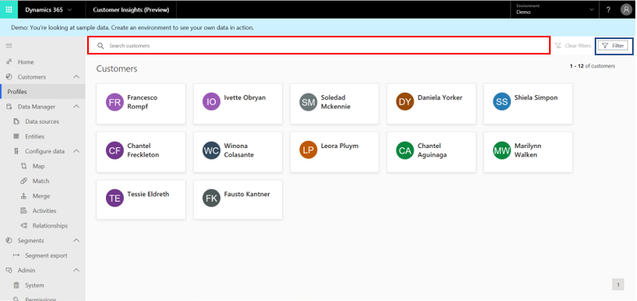

# Customer profiles: Search & filter index

The result of unifying your customer data is a Customer Profile entity that provides a unified view into your total customer base. To quickly [find information on a specific customer or group of customers](customer-profiles.md), you can configure the **Search** and **Filter** capabilities on the **Customers** page. Read on to learn how admins can edit the attributes on the **Search & filter index** page, which are available to users for searching and filtering.

> [!div class="mx-imgBorder"]
> 

## Add fields and specify attributes

If it's the first time you define searchable attributes as an administrator, you need to define indexed fields first. We suggest you choose all the attributes by which users can search and filter customers on the **Customers** page. You can only specify attributes that exist in the Customer Profile entity that you created during the data unification process.

1. Open the **Customers** page and select **Search & filter index**.

> [!NOTE]
> We create a default search index configuration on the available attributes in the Customer entity from the following semantic types as defined on the Map page.
> - Person First name, Last name, Middle name, Full Name
> - Organization Name
> - Email address
> - Phone number
> - Location information

2. Select **+ Add** to specify the indexed fields.

3. Select the attributes in the list you want to add as indexed fields. You can always add more attributes by selecting **Add**. You can also remove any selected attributes by selecting the **Remove** symbol.

## Explore the Indexed customer fields table

The following information is presented in the table.

- **Name**: Represents the attribute's name as it appears in the Customer Profile entity.
- **Data type**: Specifies whether the data type is a string, a number, or a date.
- **Included in search**: Specifies whether this attribute can be used for searching customers on the **Customers** page using the **Search** field.
- **Add Filter**: Control to define how this attribute can be used for filtering on the **Customers** page.

## Editing filtering options for a given attribute

The **Filter** menu on the **Customers** page can include a varying number of attribute levels (for example, different age groups to filter customers by).

1. Select **Add Filter** for a given attribute on the **Search & filter index** page. You can define the number of results and the order in which they'll be organized. Depending on the attribute's data type, one of the following panes appears.

- String-type attributes: Specify the number of desired results on the **String filter options** pane and the order policy by which they'll be organized.

- Numerical-type attributes: Specify the intervals included on the **Number filter options** pane and the order policy by which they'll be organized.

- Date-type attributes:  Specify the intervals included on the **Date filter options** pane and the order policy by which they'll be organized.

2. Select **Save** to apply your changes.

3. Select **Run** once you're ready to apply your settings.
