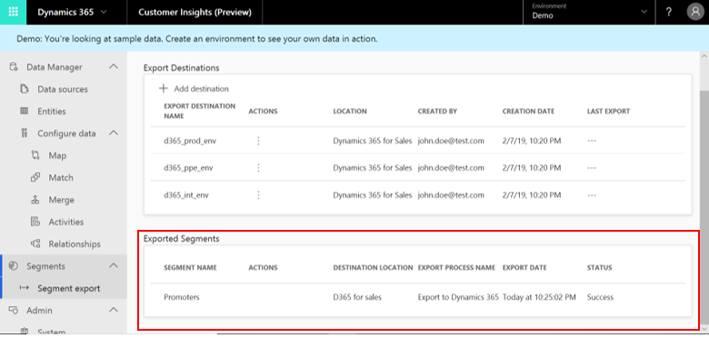

# Export a segment

[!INCLUDE [cc-beta-prerelease-disclaimer](../includes/cc-beta-prerelease-disclaimer.md)]

After [creating segments](pm-segments.md), you can start acting upon your data.

You can export your segments to a CSV file or a Dynamics 365 Sales location. we plan to add more export options soon, so stay tuned.

## Export to a CSV file

1. Go to the **Segments** page.

2. Select the ellipses in a specific segment's tile.

3. Select **Download as CSV** from the actions drop-down list.

## Export to Dynamics 365 Sales

Export options for Dynamics 365 are available from the [Export destinations](export-destinations.md) page.

> [!NOTE]
> You won't see options to export segments to Dynamics 365 apps unless an admin adds the destinations from **Admin** > **Export destinations**.

## View segments you have exported

On the **Segment Export** page, under the **Destinations** table you can find another table, called **Exported Segments**, which lists  information around the segments you have exported.

> [!div class="mx-imgBorder"] 
> 
