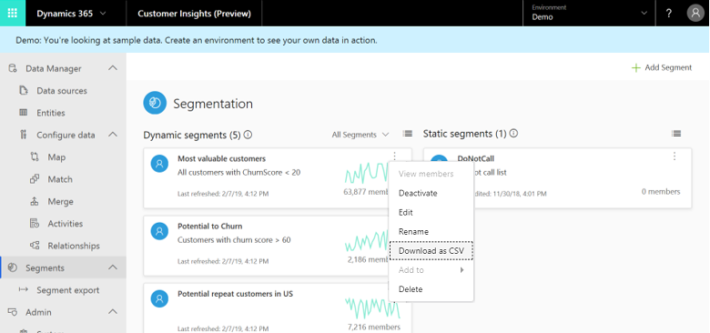
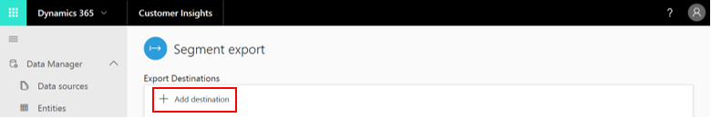
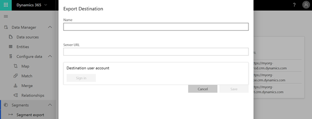
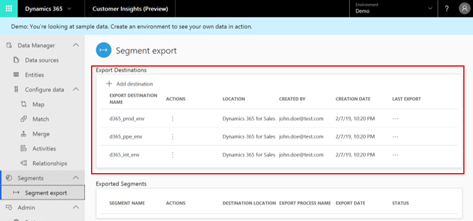
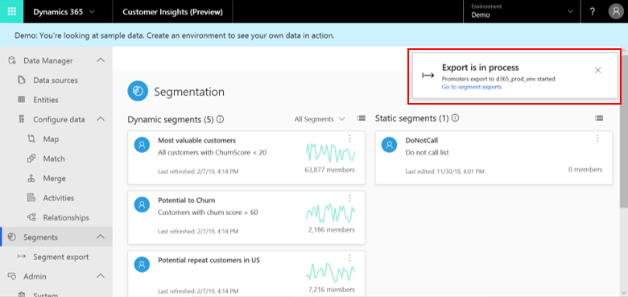

# Export a segment

[!INCLUDE [cc-beta-prerelease-disclaimer](../includes/cc-beta-prerelease-disclaimer.md)]

Now that you have created one or more segments using the **Segment builder** screen, you are ready to start acting upon your data. Make sure to first visit the [**Segments** section](pm-segments.md) if you haven't done so. 

At present, you can export any of your segments to both a CSV file and a Dynamics 365 Sales location. In the future, we will add additional segment export options.

1. The csv. option is available within  the **Segments** page.
      
   - First, select (...) within a specific segment's tile.
   - Then, select **Download as CSV** from the actions menu.
      
   > [!div class="mx-imgBorder"] 
   > 
      
   Note that you will not see any Dynamics 365 destinations until you add them using the **Export Screen** as explained in the subsection below. This screen is accessible via the **Export Segment** tab on the left-side menu (under **Admin**).
      
2. The Dynamics 365 options are available via the [Export destinations](export-destinations.md) page. 

   > [!div class="mx-imgBorder"] 
   > 
    

## Adding a segment export destination

1. Within the **Segment Export** page, select **Add destination**.

   > [!div class="mx-imgBorder"] 
   > 

2. Give your destination a recognizable name, define its URL, and then select a Dynamics 365 Sales account.

   > [!div class="mx-imgBorder"] 
   > 

3. Upon the completion of Step 2, your destination should appear in the **Destinations** table. Below you can see an example with three created destinations. Beyond the details completed in Step 2, this table also specifies the creation date and time for your destinations.

   > [!div class="mx-imgBorder"] 
   > 
    
   Your saved destination will also appear in the **Segments** page under the export option we explored earlier.
   
   > [!div class="mx-imgBorder"] 
   > 
    
   Upon clicking your Dynamics 365 Sales destination, you should wait until the exporting process has completed. As long as it's in progress you can expect to see the following message:
  
   > [!div class="mx-imgBorder"] 
   > 

## View segments you have exported

That can be done in the **Segment Export** page. Below the **Destinations** table you can find another table, called **Exported Segments**, which specifies important information around the segments you have exported.
    
> [!div class="mx-imgBorder"] 
> 

## Delete a destination

That can be done via **Delete** in the **Segment Export** page.
