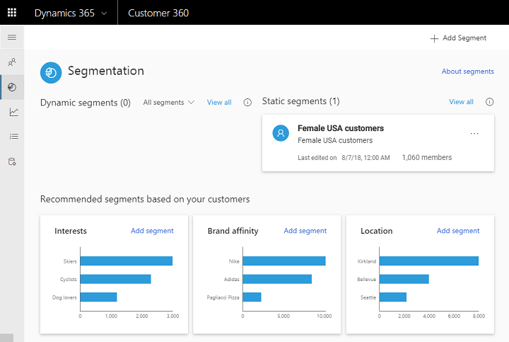

# Segments

[!INCLUDE [cc-beta-prerelease-disclaimer](../includes/cc-beta-prerelease-disclaimer.md)]

> [!IMPORTANT]
> - This feature currently has limited availability.
> - [!INCLUDE[cc_preview_features_definition](../includes/cc-preview-features-definition.md)]  
> - [!INCLUDE[cc_preview_features_expect_changes](../includes/cc-preview-features-expect-changes.md)]  
> - [!INCLUDE[cc_preview_features_no_MS_support](../includes/cc-preview-features-no-ms-support.md)]  

We will explore two ways to create segments. We will also show how to best explore your customer segments.

## Creating segments from the segment page
Within the segments page, select **Add Segment** as shown below to start the segment creation process. You can choose either to create a  ***Static segment***, to create a ***Dynamic segment***, or to go to the *Profile* page and create a segment through the filter tab (explained later):

[]

***Dynamic segments*** change with time as data updates, while ***Static segments*** are fixed. An example for a case that fits Static segment might be exploring the properties of a specific group of customers (for example from a specific location), properties that are not expected to change with time. Segments that are automatically updated with time. A case that fits Dynamic segments is for example tracking the impact of a marketing/sales/service activity on a specific group of customers with time (tracking the change/lift in those KPIs).

- **Segment creation process**:
Once you choose **Add Dynamic Segment** or **Add Static Segment** you go to the **Segment Creation** page:

[divS1]

   - **We start by defining the segment's properties**: We will give our segment a name and description, choose the audience of this segment (in the example below two types are shown: Contacts and Accounts), click the first slider (highlighted in blue below) if we wish to change from Static segment to Dynamic segment or vice versa, and click the second slider (highlighted in red below) to activate our segment (otherwise it will not incorporate new information on our customers as our data is refreshed). 
     
     [divS2]
     
   - **In step two, we will start creating our first filter**. Use the "filter" bar to select an entity. Once we selected an entity type, we need to choose the specific attributes we want to group by our customers. Note that attributes can have one of three value types: A numerical, a string, or a date. In the example below, an attribute with a numerical value is used as a filter:
     
     [divS3]
     
   - **In step three, which is optional, we will add two rules to our filter**. Two roles are available on the entity level: 
     ***AND*** and ***OR***. In the example below, we added to our first role two additional roles. The middle row demonstrates the 
     creation of an "AND" role (this time with a string attribute), while the lower row demonstrates an "OR" role (created for a time 
     attribute):
     
     [divS4]
     
   - **In step four, we will show how to combine multiple filters that are created for multiple entities**. Upon selecting **Add Group**, three options will show up: ***Union***, ***Intersect*** and ***Exclude***. Clicking each of these options will result in the creation of a new filter for a new entity and the consolidation of this new filter with the filter we created in steps 2-3. Choosing ***Union*** will dictate that the new segment will be fully added to the older segment - no data will be excluded:
       
     [divS5]

       - Choosing ***Intersect*** will dictate that the new segment will be combined with the older segment but if there are missing values among one of the segments, those values will be excluded.

       - Lastly, choosing ***Exclude*** will dictate that the new segment will be combined with the older segment but if there are missing values among one of the segments, those values' columns will be excluded including all their values (both missing and existing values).

## Creating segments from the Profile page
This can be quickly done by setting filtering selections as described in the *Profile* page section and saving those definitions as a segment:

[]

## Exploring segments from the segments screen
Here you can view all your segments as well as suggested segments. These are the page components:
- **Your saved Segments:** Dynamic Segments appear to the left and Static Segments appear to the right. Each segment is represented by a tile that includes the segment name, segment description, last date of data refresh, trend (if exist), the possibility to refresh the data for that segment (as highlighted in blue below), and several other possibilities that can be accessed via  <b>...</b> as highlighted in red below:

[]

Those other options include:
    - Editing this particular segment
    - Viewing it's members
    - Exporting the segment to a .csv file
    - Turning the segment to inactive/active (depends on it's current state)
    - Deleting the segment
    
- **Recommended segments**: Those appear at the lower part of the page as shown below. Those are suggestions that are curated based on your specific customers base. Clicking *Add Segment* in each of the tiles will enable you to build segments for that specific suggestion

[]

## Exploring a particular segment from the segment Page
Once you selected a segment within the *Segments page*, you will get to this page that consolidates everything around that particular segment. As shown below, the upper part includes a trend graph with the possibility to adjust the trend time scope (30 last days, 60 last days, etc.) with the button at the upper-right corner of the tile:

[]

The lower part includes a table with all your segment members properties. Those include: 
- Members Names
- Members Addresses
- Members Job Titles
- Members Telephone Numbers
- Members Cities
- Members States
- Members Locations

## Acting upon the data: Exporting a segment
Exporting a segment to .csv file is possible either through the *Segments page* by selecting <b>...</b> within a specific segment's tile, or by entering the specific segment page and selecting **Export** at the top-right corner of the page as shown here:

[]

Once exported, you can expect to find all the information on that particular segment within the .csv file. An example is shown below:

[]

> [!div class="mx-imgBorder"] 
> 
