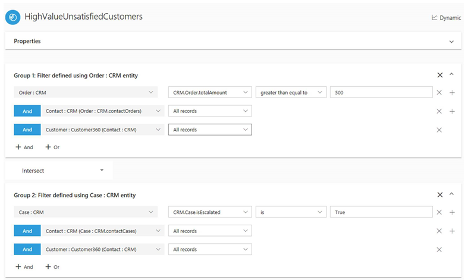
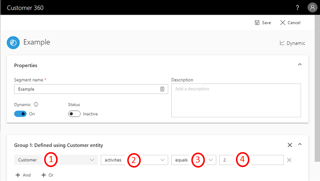
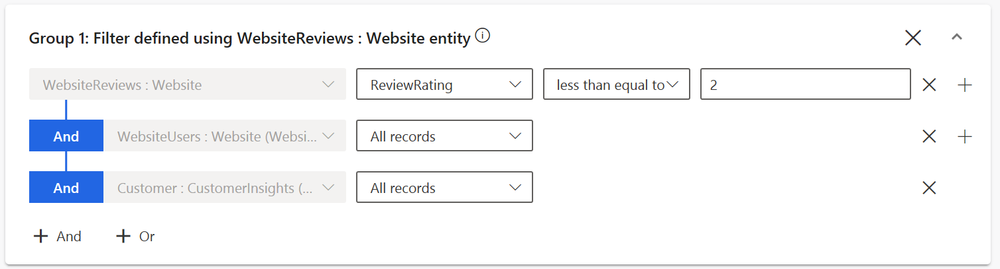
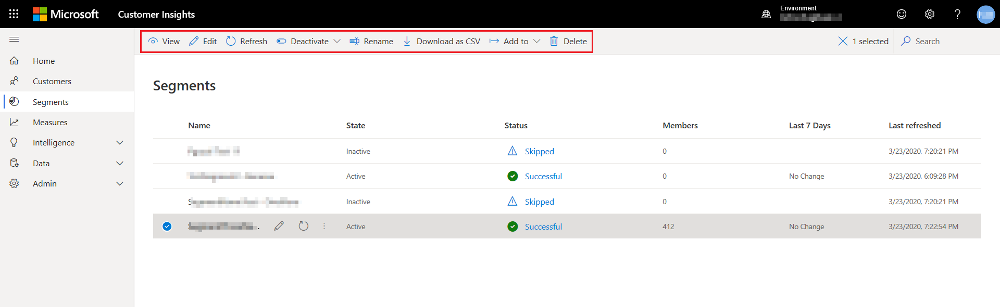
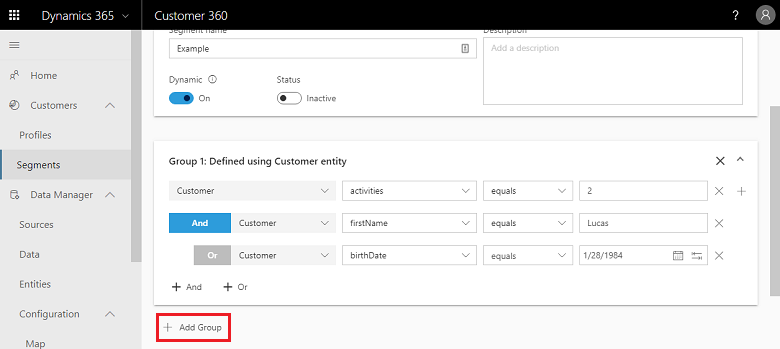
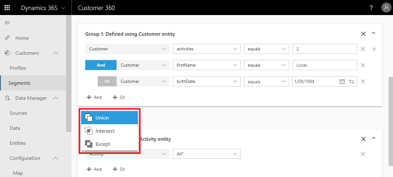
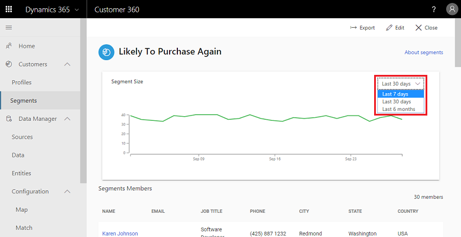

# Create and manage segments

The segmentation capability in Dynamics 365 Customer Insights enables you to group your customers based on demographic, transactional, or behavioral attributes. You can use segments to target promotional campaigns, sales activities, and customer support actions to achieve your business goals.

You can define complex filters around the Customer Profile entity and its related entities. Each segment, after processing, creates a set of customer records that you can export and take action on.

Unless stated otherwise, all segments in Customer Insights are **Dynamic segments**, which are refreshed on a recurring schedule.

The following example illustrates the depth of the Customer Insights segmentation capability. We've defined a segment for customers who ordered at least $500 of goods in the last 90 days *and* who were involved in a customer service call that got escalated.

> [!div class="mx-imgBorder"]
> 

## Create a new segment

Segments are managed on the **Segments** page in Customer Insights.

1. Go to the **Segments** page in Customer Insights.

2. Select **New** > **Blank segment**.

3. In the **New segment** pane, choose a segment type and provide a **Name**.

   Optionally, provide a display name, and a description that helps identifying the segment.

4. Select **Next** to get to the **Segment builder** page where you define a group. A group is a set of customers.

5. Choose the entity that includes the attribute you want to segment by.

6. Choose the attribute to segment by. This attribute can have one of four value types: numerical, string, date, or Boolean.

7. Choose an operator and a value for the selected attribute.

   > [!div class="mx-imgBorder"]
   > 

   |Number |Definition  |
   |---------|---------|
   |1     |Entity          |
   |2     |Attribute          |
   |3    |Operator         |
   |4    |Value         |

8. If the entity is connected to the unified customer entity through [relationships](relationships.md), you need to define the relationship path to create a valid segment. Add the entities from the relationship path until you can select the **Customer:CustomerInsights** entity from the dropdown. Then, choose **All records** for each condition.

   > [!div class="mx-imgBorder"]
   > 

9. Select **Save** to save your segment. Your segment will be saved and processed if all requirements are validated. Otherwise, it will be saved as a draft.

10. Select **Back to segments** to go back to the **Segments** page.

## Manage existing segments

On the **Segments** page, you can view all your saved segments and manage them.

Each segment is represented by a row that includes additional information about the segment.

You can sort the segments in a column by selecting the column heading.

Use the **Search** box in the top-right corner to filter the segments.

> [!div class="mx-imgBorder"]
> 

The following action are available when you select a segment:

- **View** the segment details, including member count trend a preview of segment members.
- **Edit** the segment to change its properties.
- **Refresh** the segment to include the latest data.
- **Activate** or **Deactivate** the segment. Segments have two possible states - active or inactive. These states come in handy when editing a segment. For inactive segments, the segment definition exists but it doesn't contain any customers yet. When you activate a segment, its state changes from 'inactive' to 'active" and it starts looking for customers that match the segment definition. If a [scheduled refresh](system.md#schedule-tab) is configured, inactive segments have the **Status** listed as **Skipped**, indicating that a refresh wasn't even attempted. When an inactive segment is activated, it will refresh and will be included in scheduled refreshes.
  Alternatively, you can use the **Schedule later** functionality in the **Activate/Deactivate** dropdown to specify a future date and time for activation and deactivation of a particular segment.
- **Rename** the segment.
- **Download** the list of members as a .CSV file.
- **Add to** option sends the list of customer IDs in the segment for processing in another application.
- **Delete** the segment.

## Refresh segments

You can refresh all segments at once by selecting **Refresh all** on the **Segments** page or you can refresh one or multiple segments when you select them and choose **Refresh** in from the options. Alternatively, you can configure a recurring refresh on **Admin** > **System** > **Schedule**.

> [!TIP]
> There are [six types of status](system.md#status-types) for tasks/processes in Customer Insights. Additionally, most processes [depend on other downstream processes](system.md#refresh-policies). You can select the status of a process to see details on the progress of the entire job. After selecting **See details** for one of the job's tasks, you find additional information: processing time, the last processing date, and all errors and warnings associated with the task.

## Download and export segments

You can download your segments to a CSV file or export them to Dynamics 365 Sales.

### Download segments to a CSV file

1. Go to the **Segments** page.

2. Select the ellipsis in a specific segment's tile.

3. Select **Download as CSV** from the actions drop-down list.

### Export segments to Dynamics 365 Sales

Before exporting segments to Dynamics 365 Sales, an admin needs to [create the export destination](export-destinations.md) for Dynamics 365 Sales.

1. Go to the **Segments** page.

2. Select the ellipsis in a specific segment's tile.

3. Select **Add to** from the actions drop-down list and select the export destination you want to send the data to.

## Draft mode for segments

If not all requirements to process a segment are met, you can save the segment as a draft and access it from the **Segments** page.

It will be saved as an inactive segment, and can't be activated it until it's valid.

## Add more conditions to a group

To add more conditions to a group, you can use two logical operators:

- **AND** operator: Both conditions must be met as part of the segmentation process. This option is most useful when you define conditions across different entities.

- **OR** operator: Either one of the conditions needs to be met as part of the segmentation process. This option is most useful when you define multiple conditions for the same entity.

   > [!div class="mx-imgBorder"]
   > 

It's currently possible to nest an **OR** operator under an **AND** operator, but not the other way around.

## Combine multiple groups

Each group produces a specific set of customers. You can combine these groups to include the customers required for your business case.

1. Open a segment on the **Segments** page.

2. Select **Add Group**.

   > [!div class="mx-imgBorder"]
   > 

3. Select one of the following set operators: **Union**, **Intersect**, or **Except**.

   > [!div class="mx-imgBorder"]
   > 

   Select a set operator to define a new group. Save different groups to determine what data gets maintained:

   - **Union** unites the two groups.

   - **Intersect** overlaps the two groups. Only data that *is common* to both groups is maintained in the unified group.

   - **Except** combines the two groups. Only data that *is not common* to both groups is maintained.

## View processing history and segment members

You can see consolidated data about a segment by reviewing its details.

On the **Segments** page, select the segment you want to review.

The upper part of the page includes a trend graph that visualizes changes in member count. Hover over data points to see the member count on a specific date.

You can update the time frame of the visualization.

> [!div class="mx-imgBorder"]
> 

The lower part contains a list of the segment members.

> [!NOTE]
> Fields that appear in this list are based on the attributes of your segment's entities.
>
>The list is a preview of the matching segment members and shows the first 100 records of your segment so that you can quickly evaluate it and review its definitions if needed. To see all matching records, you need to [export the segment](export-destinations.md).

## Quick segments

In addition to the segment builder, there's another path for creating segments in Customer Insights. Quick segments let you build simple segments with a single operator quickly and with instant insights.

1. On the **Segments** page, select **New** > **Quickly create from**.

   - Select the **Profiles** option to build a segment that is based on the unified Customer entity.
   - Select the **Measures** option to build a segment around each of the Customer Attribute type of measures you have previously created on the **Measures** page.
   - Select the **Intelligence** option to build a segment around one of the output entities you generated using either the **Predictions** or **Custom Models** capabilities.

2. In the **New quick segment** dialog box, select an attribute from the **Field** dropdown.

3. The system will provide some additional insights that help you create better segments of your customers.
   - For categorical fields, we'll show 10 top customer counts. Choose a **Value** and select **Review**.

   - For a numerical attribute, the system will show what attribute value falls under each customer's percentile. Choose an **Operator** and a **Value**, then select **Review**.

4. The system will provide you with an **Estimated segment size**. You can choose whether to generate the segment you've defined, or first revisit it to get a different segment size.

    > [!div class="mx-imgBorder"]
    > 

5. Provide a **Name** for your segment. Optionally, provide a **Display name**.

6. Select **Save** to create your segment.

7. After the segment has finished processing, you can view it like any other segment you've created.

For the following scenarios, we advise using the segment builder rather than the recommended segments capability:

- Creating segments with filters on categorical fields where the operator is different than the **Is** operator
- Creating segments with filters on numerical fields where the operator is different than the **Between**, **Greater than**, and **Less than** operators
- Creating segments with filters on date type fields

## Next steps

[Export a segment](export-destinations.md) and explore the [Customer Card](customer-card-add-in.md) and [Connectors](export-power-bi.md) to get insights on the customer level.
