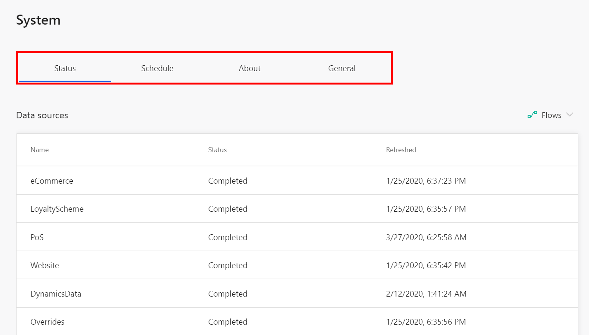

# System configuration

The **System** page contains everything that administrators need to closely monitor the various processes running behind the scenes of Customer Insights. It includes four tabs: **Status**, **Schedule**, **About**, and **General**.

> [!div class="mx-imgBorder"]
> 

> [!NOTE]
> If your data sources are updated on a regular basis, we highly recommend that you use the **Schedule** tab. Make sure to review the "Schedule tab" section later in this topic.

## Status tab

The **Status tab** lets you track the progress of data ingestion, data exports, and several important product processes. Review the information on this tab to ensure the completeness of any major process you've defined in Customer Insights.

This tab includes status tables for **Data sources**, **System processes**, and **Data preparation**. Each table tracks the **Name** of the task and its corresponding entity, the **Status** of its most recent run, and when it was **Last updated**.

View the details of the tasks' last several runs by selecting its name.

### Status types

There are six types of status for tasks in Customer Insights. The following status types also show on the *Match*, *Merge*, *Data sources*, *Segments*, *Measures*, *Enrichment*, *Activities*, and *Predictions* pages:

- **Processing:** Task is in progress. The status can change to Successful or Failure.
- **Successful:** Task completed successfully.
- **Skipped:** Task got skipped. One or more of the downstream processes this task depends on are failing or got skipped.
- **Failure:** Processing  of the task has failed.
- **Canceled:** Processing was canceled by the user before it finished.
- **Queued:** Processing is queued and will start once all the downstream tasks are completed. For more information, see [Refresh policies](#refresh-policies).

### Refresh policies

This list shows the refresh policies for each of the main processes in Customer Insights:

- **Data sources:** Runs according to the [configured schedule](#schedule-tab). Doesn't depend on any other process. Match depends on the successful completion of this process.
- **Match:** Runs according to the [configured schedule](#schedule-tab). Depends on the processing of the data sources used in the match definition. Merge depends on the successful completion of this process.
- **Merge**: Runs according to the [configured schedule](#schedule-tab). Depends on the completion of the match process. Segments, measures, enrichment, search, activities, predictions, and data preparation depend on the successful completion of this process.
- **Segments**: Runs manually (single time refresh) and according to the [configured schedule](#schedule-tab). Depends on Merge. Insights depend on its processing.
- **Measures**: Runs manually (single time refresh) and according to the [configured schedule](#schedule-tab). Depends on Merge.
- **Activities**: Runs manually (single time refresh) and according to the [configured schedule](#schedule-tab). Depends on Merge.
- **Enrichment**: Runs manually (single time refresh) and according to the [configured schedule](#schedule-tab). Depends on Merge.
- **Search**: Runs manually (single time refresh) and according to the [configured schedule](#schedule-tab). Depends on Merge.
- **Data preparation**: Runs according to the [configured schedule](#schedule-tab). Depends on Merge.
- **Insights**: Runs manually (single time refresh) and according to the [configured schedule](#schedule-tab). Depends on Segments.

Select the status of a task to see the progress details of the entire job it was in. The refresh policies above can help to understand what you can do to address a **Skipped** or **Queued** task.

## Schedule tab

Use the **Schedule** tab to schedule automatic refreshes of all your ingested Customer Insights data. Automatic refreshes help ensure that updates from your data sources are reflected in your unified customer profiles.

1. In Customer Insights, go to **Admin** > **System** and select the **Schedule** tab.

2. The default state for the scheduled refresh is **Off**. To enable scheduled refreshes, change the toggle at the top of the screen to **On**.

3. Choose between **Weekly** (default) and **Daily** refreshes. If you intend to schedule weekly refreshes, select one or more days on which you want to run the refresh.

4. Set your **Time zone**, then use the **Time** dropdown to set your refresh timing. When you're finished, select **Set**. If you'd like to schedule multiple refreshes in a single day, select **Add another time**.

5. Select **Save** to apply your changes.

## About tab

The **About** tab contains your organization's **Display name**, the active **Environment ID**, the **Region**, and your **Session ID**. If you have more than one work instance, you should give each an easily identifiable display name.

## General tab

There are two options on the **General** tab, **Language** and **Country/Region format**.

Customer Insights [supports a number of languages](supported-languages.md). To change your preferred language, choose a **Language** from the dropdown.

To change your preferred formatting for dates, time, and numbers, use the **Country/Region format** dropdown. A formatting preview is displayed under this field. Customer Insights will automatically suggest a selection when you choose a new language.

Select **Save** to confirm your selections.

## API usage tab

Find details about the real-time API usage and see which events happened in a given time range. For more information, see [Real-time data ingestion](real-time-data-ingestion.md).
