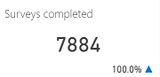
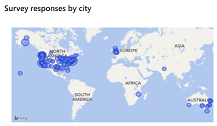

# Customer satisfaction dashboard

The Customer satisfaction dashboard gives you an overview of customer satisfaction (CSAT), including using artificial intelligence (AI) technology to show you topics that are having the greatest impact on CSAT scores.

You can display [KPI summary](ai-csi-dash-kpi-summary.md), [Incoming cases](ai-csi-dash-incoming-cases.md), [Case resolutions](ai-csi-dash-case-resolutions.md), and Customer Satisfaction dashboards by clicking each dashboard's icon in the navigation pane. You can display the [Topic details](ai-csi-dash-topic-details.md) dashboard by right-clicking a topic in one of the AI Insights charts in those dashboards. The KPI summary dashboard is the default Dynamics 365 AI for Customer Service dashboard.

The Customer satisfaction dashboard includes a variety of charts with graphical views of your system's customer satisfaction data. For information about each chart, click on the link for the chart in the following table, or scroll down to the chart's section below.

Chart | Link
----- | ----
 | [Total surveys completed](#total-surveys-completed-chart)
 | [Survey response rate](#survey-response-rate-chart)
 | [Average CSAT](#average-csat-chart)
 | [Survey responses by city](#survey-responses-by-city-chart)
 | [Top CSAT impactors (AI Insights)](#top-csat-impactors-chart)

The *Top CSAT impactors* chart uses natural language understanding artificial intelligence technology to group support cases as *topics* that are a collection of related cases. This chart shows you the customer support topics that are having the most impact on customer satisfaction, helping you identify areas for improvement that can have the greatest impact on improving the customer's experience.

By default, the dashboard shows you key performance indicators for the last week, and for all products, channels, business units, and teams in your system. To change the time period, select a value from the Time Period drop-down list at the top of the dashboard. You can select either last day, last week, or last month.

To filter data by product, channel, business unit, or team, select a value from the Product, Channel, Business Unit, or Team drop-down list. For more information on working with filters, see [Work with dashboards and sample data](ai-csi-use-dash-sample-data.md).

## Total surveys completed chart

The total surveys completed chart shows the total number of customer satisfaction surveys completed during the specified time period, and the percent change over the period.

Description | Details
----------- | -------
Total surveys completed | *[The number of completed customer satisfaction (CSAT) surveys]*

A blue up and down indicator next the value indicates the positive percent change in that direction. A red indicator indicates a negative percent change in that direction.

## Survey response rate chart

The survey response rate chart shows the percentage of customer satisfaction surveys completed during the specified time period, and the percent change over the period.

A blue up and down indicator next the value indicates the positive percent change in that direction. A red indicator indicates a negative percent change in that direction.

Description | Details
----------- | -------
Survey response rate | *[The number of completed customer satisfaction (CSAT) surveys]* / *[The total number of surveys]*

A blue up and down indicator next the value indicates the positive percent change in that direction. A red indicator indicates a negative percent change.

## Average CSAT chart

The Average CSAT chart shows the average customer satisfaction survey score during the specified time period, where it falls on the satisfaction scale used in the survey, and the percent change over the period.

A blue up and down indicator next the value indicates the positive percent change in that direction. A red indicator indicates a negative percent change.

Description | Details
----------- | -------
Average CSAT | *[The sum of CSAT scores}* / *[The count of resolved cases that have CSAT values]*

A blue up and down indicator next the value indicates the positive percent change in that direction. A red indicator indicates a negative percent change.

<!---
## Survey responses by city chart

The survey responses by city chart shows the geographical location of customer satisfaction surveys completed during the specified time period.
-->

## Top CSAT impactors chart (AI Insights)

The top CSAT impactors chart uses artificial intelligence technology to group related support cases as support topics, and then display topics in order of impact the topics are having on customer satisfaction.

Description | Details
----------- | -------
Topic | *[Artificial intelligence clustering of cases based on language understanding applied to case titles]*
Volume | *[The number of cases associated with the topic]* / *[Total cases]*
Number of cases | *[The number of cases associated with the topic]*
Surveys completed | *[The count of resolved cases associated with the topic that have CSAT values]*
Average CSAT | *[The sum of CSAT scores associated with the topic]* / *[The count of resolved cases associated with the topic that have CSAT values]*
Impact | *[The resolved incoming cases associated with this topic]* / *[The total incoming cases associated with this topic]* 1 – (*[Average CSAT score not including the current topic]* / *[Overall average CSAT score for all topics]*)

The chart displays the impact as a red or blue bar. The midpoint is the overall average CSAT score. A red bar indicates that the topic's CSAT score is lower than the average CSAT score. A blue bar indicates that the CSAT score is higher. Improving customer satisfaction for the top CSAT topics in red will have the greatest impact on improving overall customer satisfaction.

To see additional information about each topic, right-click the topic name and select **Drillthrough** to display the Topic Details dashboard. For more information, see [Topic Details Dashboard](ai-csi-topic-details.md).