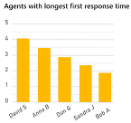
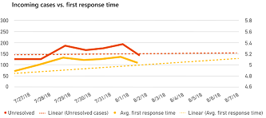

# Case Resolutions dashboard​

The Case Resolutions dashboard gives you an overview of your customer support system's case resolution performance for the specified time period.

You can display [KPI Summary](ai-csi-dash-kpi-summary.md), [Incoming Cases](ai-csi-dash-incoming-cases.md), Case Resolutions, and [Customer Satisfaction](ai-csi-dash-CSAT.md) dashboards by clicking each dashboard's icon in the navigation pane. You can display the [Topic Details](ai-csi-dash-topic-details.md) dashboard by right-clicking a topic in one of the AI Insights charts in those dashboards. The KPI Summary dashboard is the default Dynamics 365 AI for Customer Service dashboard.

The Case Resolutions dashboard provides graphical views of resolved cases, including:

* The customer support agents who are taking the most time to resolve issues.
* The number of incoming customer support cases compared to the average time to resolve them.
* The customer support agents with the longest first response time.
* The number of incoming cases compared to the first response time.

In addition, the dashboard uses artificial intelligence technology to categorize customer support cases by topic and show you the topics that are having the greatest impact on resolution time. This can help you identify areas for improvement that can have the greatest impact on system performance.

By default, the dashboard shows you key performance indicators for the last week, and for all products, channels, business units, and teams in your system. To change the time period, select a value from the Time Period drop-down list at the top of the dashboard. You can select either last day, last week, or last month. To display data for a specific product, channel, business unit, or team, select a value from the Product, Channel, Business Unit, or Team drop-down list.

## Agents with longest resolve time chart

The agents with longest resolve time chart shows the average time, in minutes, that it takes each agent in the specified time period to resolve a customer support case, in reverse order of resolution time.

## Incoming cases versus average resolve time chart

The incoming cases versus average resolve time chart shows the daily trend in the specified time period in the number of incoming support cases and the average resolution time, in minutes.

## Agents with longest first response time chart

The agents with longest first response time chart shows the average time, in minutes, that it takes each agent in the specified time period to respond to a customer support case, in reverse order of response time.

## Incoming cases versus first response time chart

The incoming cases versus average response time chart shows the daily trend in the specified time period in the number of incoming support cases and the average response time, in minutes.

## Top resolution time impactors chart (AI Insights)

The top resolution time impactors chart uses artificial intelligence technology to group related support cases as support topics, and then display topics in order of resolution time over the specified time period, showing:

* The percentage of total case volume for the topic.
* The average resolution time for each topic's support cases.
* The impact that resolution time is having on system performance.

The chart displays the impact as a red or blue bar. The midpoint is the overall average case resolution time. A red bar indicates that the topic's resolution time is longer than the average case resolution time. A blue bar indicates that the resolution time is shorter. Improving case resolution time for the top resolve time topics in red will have the greatest impact on improving overall system performance.

To see additional information about each topic, right-click the topic name and select **Drillthrough** to display the Topic Details dashboard. For more information, see [Topic Details Dashboard](ai-csi-topic-details.md).
