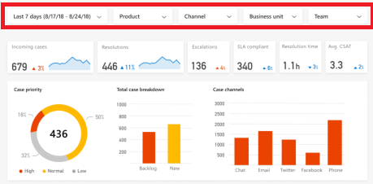
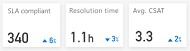

# KPI Summary dashboard

The KPI (Key Performance Indicator) Summary dashboard gives you a broad overview of the performance of your customer support system. The dashboard uses artificial intelligence technology to give you a graphical view of the system's key performance indicators for a specified time period, including:

* The customer support topics that are generating the most volume.
* The customer support topics that are having the most impact on case resolution time.
* The number of incoming, resolved, and escalated cases, along with the percent change.
* The number of SLA (Service Level Agreement) compliant cases, average resolution time, and customer satisfaction (CSAT) score, and percent change.
* The breakdown of case priority, backlog and new cases, and case channels.
* The aggregate trend in new and resolved cases.
* The breakdown of unresolved cases by age.

You can narrow down the data displayed on the dashboard to a specific time period, product, channel, business unit, or team by selecting from the filter drop-down boxes at the top of the dashboard.

## Top case volume impactors chart

The top case volume impactors chart uses artificial intelligence technology to group related customer support cases as support *topics*, and then display the topics in order of volume over the specified time period, showing both the percent of total volume and number of cases for each topic.

To see additional information about each topic, right-click the topic name and select **Drillthrough** to display the Topic Details dashboard. For more information, see [Topic Details Dashboard](ai-csi-topic-details.md).

## Top resolve time impactors chart

The top case volume impactors chart displays support topics in order of resolution time over the specified time period, showing the average resolution time for each topic's support cases and the impact that resolution time is having on system performance.

The chart displays the impact as a red or blue bar. The midpoint is the overall average case resolution time. A red bar indicates that the topic's resolution time is longer than the average case resolution time. A blue bar indicates that the resolution time is shorter. Improving case resolution time for the top resolve time topics in red will have the greatest impact on improving overall system performance.

To see additional information about each topic, right-click the topic name and select **Drillthrough** to display the Topic Details dashboard. For more information, see [Topic Details Dashboard](ai-csi-topic-details.md).

## Incoming cases, resolutions, and escalations charts

The incoming cases, resolutions and escalations charts display the number of new, resolved, and escalated support cases over the specified time period, along with the percent change during during the period.

## SLA compliant, resolution time, and average CSAT charts

The SLA compliant, resolution time, and average CSAT charts display the number of support cases that are compliant with their service level agreement (SLA), the average case resolution time, and the average customer satisfaction score (CSAT) over the specified time period, along with the percent change during during the period.

## Case priority chart

The case priority chart shows the percentage breakdown by priority of the unresolved support cases for the specified time period.

## Total case breakdown chart

The total case breakdown chart shows the breakdown in unresolved support cases for the specified time period between new cases and backlog cases that were carried over from earlier.

## Case channels chart

The case channels chart shows the breakdown in unresolved support cases for the specified time period by support channel.

## Case tracking chart

The case tracking chart shows the trend in the total number of new and resolved support cases for the specified time period, and the breakdown and trends for new cases and resolved cases.

## Unresolved cases by age chart

The unresolved cases by age chart shows the relative number of support cases for the specified time period by how many days ago they were created.
