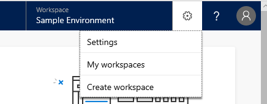

# Responding to GDPR Data Subject Delete Requests for Dynamics 365 AI for Customer Service

The “right to erasure” by the removal of personal data from an organization’s customer data is a key protection in the GDPR. Removing personal data includes removing all personal data and system-generated logs, except audit log information.

## Manage Delete requests

Dynamics 365 AI for Customer Service Insights offers the following experiences to delete personal data for a specific user:

* Delete customer data (Tenant admin)
* Delete customer data (Self)

### Delete customer data (Tenant admin)

A tenant administrator can follow these steps to delete data:

1. Send email to [ccinsightadmins@microsoft.com](ccinsightadmins@microsoft.com) specifying the user’s AAD objectId in the request.

    An administrator from the Dynamics 365 AI for Customer Service Insights team will send an email to the address registered in the AAD user account, asking for confirmation to delete data.
2. Acknowledge the confirmation to delete the data and receive a confirmation that the data has been deleted.

### Delete customer data (Self)

You can follow these steps to delete data from AI for Customer Service Insights:

1. Navigate to [https://csi.ai.dynamics.com/](https://csi.ai.dynamics.com/).
2. On the Settings menu, click **My workspaces**.

    

3. Delete the target workspace. All data will be immediately deleted.