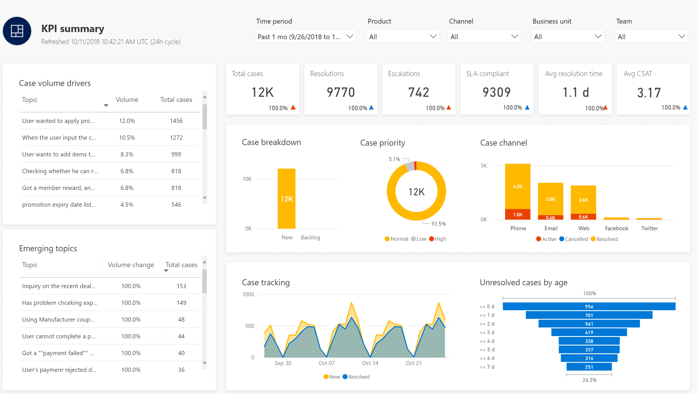

# Dynamics 365 AI for Customer Service overview

Dynamics 365 AI for Customer Service Insights gives you actionable insights into critical performance metrics, operational data, and emerging trends from your customer support system. Built-in dashboards, interactive charts, and visual filters provide views into support operations data across channels, and highlight areas for improvement that can have the greatest impact, helping you quickly evaluate and respond to key performance indicators (KPIs) and customer satisfaction levels.

AI for Customer Service Insights uses artificial intelligence technology to enable you to discover and adapt to current and emerging trends, improve brand sentiment, and increase customer loyalty. By using forecasting to pinpoint and fix issues before they impact customers, you can deliver better customer service experiences.

The AI-driven technology empowers informed decision making about how to improve resolution rates, reduce wait times, and decrease customer service costs. You can use case resolution insights, backlog trends, and historical comparisons to evaluate agent performance and business impact, and address inefficiencies in your system.

*The KPI summary dashboard gives you a snapshot of key performance indicators for measuring customer service.*

For a walkthrough of how to connect to your customer service data to gain insights into your customer support system, see [Quickstart - Get immediate insights into your customer service system](ai-csi-quickstart.md).

For more information about how workspaces can help you get different views of your customer support data, see [Use workspaces to manage your customer service data insights](ai-csi-workspaces.md).

For more information about how to use the dashboards and sample data, see [Work with AI for Customer Service Insights dashboards and sample data](ai-csi-use-dash-sample-data.md).

For more information and examples of how to use the AI for Customer Service dashboards to help you identify areas of improvement, see [Identify areas of improvement in your customer support system](ai-csi-improve-system.md).

For details on the AI for Customer Service Insights dashboards, see the following topics:

* [KPI summary dashboard](ai-csi-dash-kpi-summary.md)
* [Incoming cases dashboard](ai-csi-dash-incoming-cases.md)
* [Case resolutions dashboard](ai-csi-dash-case-resolutions.md)
* [CSAT dashboard](ai-csi-dash-CSAT.md)
* [Topic details dashboard](ai-csi-topic-details.md)

For information about improving the results shown by AI Insights charts on the dashboards, see [Improve your AI Insights data by cleansing support case titles](ai-csi-settings.md).