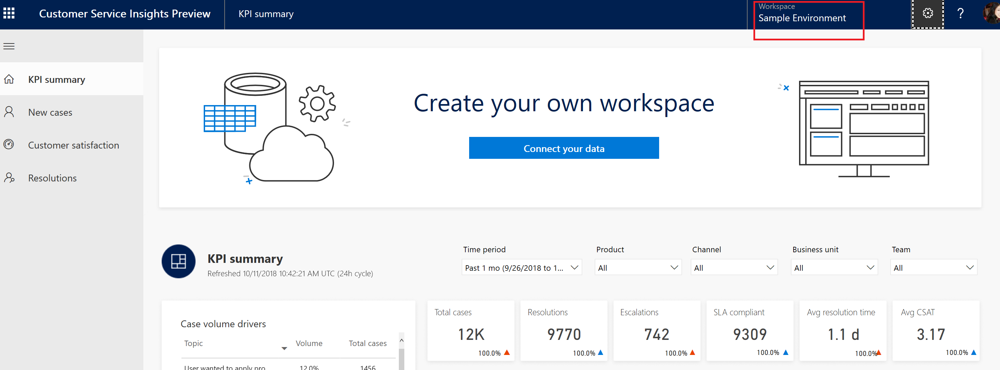

# Quickstart - Get immediate insights into your customer service system's performance

Dynamics 365 AI for Customer Service Insights lets you quickly connect to your existing Dynamics 365 customer service data to gain immediate insights into your system's performance. You can also explore with sample data.

## To connect to your customer service data

1. Launch AI for Customer Service Insights in your browser to display the **Connect your data** screen.

    

2. Click **Dynamics 365** to create a workspace using Dynamics 365 customer service data. AI for Customer Service displays the **Choose an environment** screen.

    

    For more information on working with workspaces, see [Use workspaces to manage your customer service data insights](ai-csi-workspaces.md).

3. Click the Dynamics 365 environment that contains the customer service data that you want to use.

    AI for Customer Service Insights configures the workspace to use the environment you selected and displays the environment's customer service data in the KPI Summary dashboard.

    

If you want to explore working with the dashboards using sample data before connecting to live data, use the AI for Customer Service Insights built-in demo workspace. To open the demo workspace, click **demo workspace** on the **Connect your data** screen.

For more information about how to use the dashboards and sample data, see [Work with AI for Customer Service Insights dashboards](ai-csi-use-dash-sample-data.md).

For more information and examples of how to use the AI for Customer Service Insights dashboards to help you identify areas of improvement, see [Identify areas for improvement in your customer support system](ai-csi-improve-system.md).

For details on the AI for Customer Service Insights dashboards, see the following topics:

* [KPI Summary Dashboard](ai-csi-dash-kpi-summary.md)
* [Incoming Cases Dashboard](ai-csi-dash-incoming-cases.md)
* [Case Resolutions Dashboard](ai-csi-dash-case-resolutions.md)
* [CSAT Dashboard](ai-csi-dash-CSAT.md)
* [Topic Details Dashboard](ai-csi-topic-details.md)

For information about improving the results shown by AI Insights charts on the dashboards, see [Improve your AI Insights data by cleansing support case titles](ai-csi-settings.md).