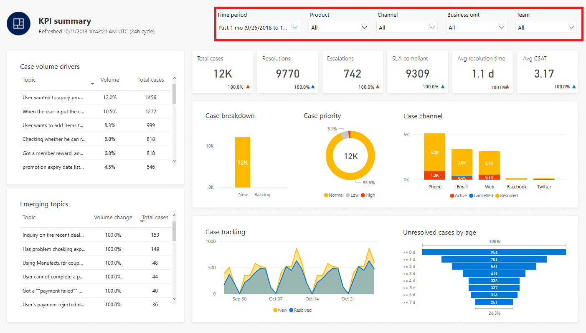
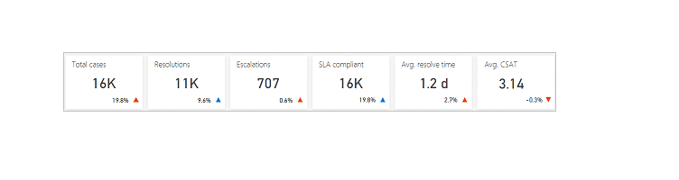

# Work with dashboards and sample data

The dashboards included in AI for Customer Service Insights provide a rich set of analytic tools to give you a clear picture of your customer service system. Whether you connect immediately to your customer service data or spend time exploring the sample environment, becoming familiar with the dashboards can help you gain a variety of insights to help you improve system performance.

Some key features of the dashboards include:

* Filters to let you view customer service data for a specific time period, product, support channel, business unit, or team.
* Key performance indicator charts that give you the basics of how your system is performing.
* Graphical charts showing trends and breakdowns of cases from a variety of views.
* AI Insights charts that use language understanding artificial intelligence technology to show trends for groups of cases related to specific support topics.

## Dashboard filters

Filters let you view a subset of your customer service data. You can view information for support cases for a specific time period, or according to one or more specific product areas, support channels, business units, or teams associated with your case data.

By default, dashboards display information for the past seven days, but you also display information for the past day or month by selecting **Past 01 Days** or **Past 1 Month**.

Specify the value or values to use to filter data by selecting the check boxes in the filter drop-down lists. User **Ctrl+Click** to select multiple values.

## Key performance indicator charts

Key performance indicator charts give you a view of the key performance data in your customer service system for the specified time period. For example, the key performance indicator charts on the KPI Summary dashboard show you:

* The total number of cases during the period.
* The number of resolved cases during the period.
* The number of escalated cases during the period.
* The number of SLA compliant cases during the period.
* The average resolution time during the period.
* The average customer satisfaction (CSAT) score during the period.

Each key performance indicator chart includes a blue or red up and down indicator next the value. A blue arrow indicates the positive percent change in that direction. A red indicator indicates a negative percent change in that direction.

The KPI Summary and Topic details dashboards include key performance indicator charts.

## Graphical trend and breakdown charts

