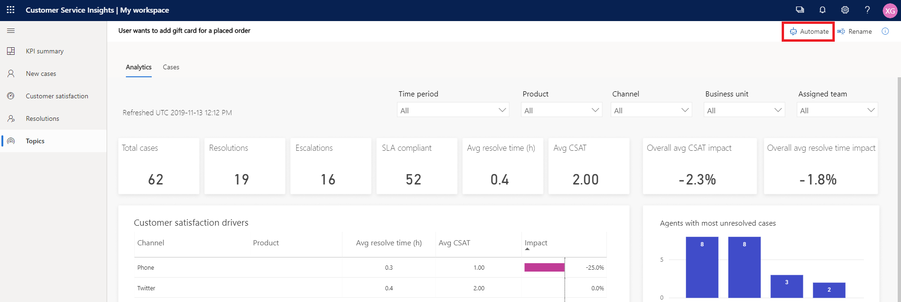
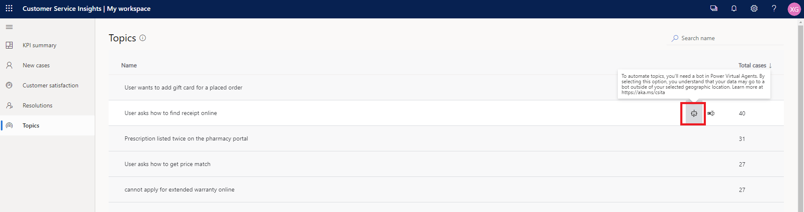

# Automate topics for a Power Virtual Agents bot

[Power Virtual Agents](/power-virtual-agents/index) empowers teams to easily create powerful bots and automate support conversations using a guided, no-code graphical interface without the need for data scientists or developers. 

You can automate the creation of topics in Power Virtual Agents by copying over topics discovered by Customer Service Insights. This is helpful if you have a support topic in Customer Service Insights that you'd like to add to a support bot, to help drive resolution rates and customer satisfaction rates.

>[!NOTE]
>If your Power Virtual Agents bot is created in a geographic location that is different from your Customer Service Insights workspace, the data of topics you selected for automation will go to the geogrpahic location of your bot outside from Customer Service Insights. For more information about Power Virtual Agents geographic location support, see [Data locations for organizations using Power Virtual Agents](/power-virtual-agents/data-location). For geographic locations supported in Customer Service Insights, see [Where an organization's Customer Service Insights data is located](data-location.md).

## Prerequisite to automate topics

You musth have the following to automate a topic from Customer Service Insights to Power Virtual Agents:

- A valid license to access Power Virtual Agents. Go to https://aka.ms/TryPVA for more information and to sign up for a trial. 

- A [bot created in Power Virtual Agents](/power-virtual-agents/authoring-first-bot).

## Identify topics for automation 

Consider topics as good candidates for automation if they are:

* Straightforward to resolve, so that it's more likely a bot can handle or resolve the issue. 
    
    For example, a topic that has lower average resolution time, higher resolution rate, and/or fewer escalations is one that could be considered straightforward to resolve.

* Topics that have a high volume, so that the automation can bring you more business benefit and impact. 

    You can determine volume from [case volume drivers](dashboard-kpi-summary.md#case-volume-drivers-chart) and [emerging topics](dashboard-kpi-summary.md#emerging-topics-chart) in Customer Service Insights.

Customer Service Insights also calculates the [resolution time impact for each topic](dashboard-case-resolutions.md#resolution-time-drivers-chart), which has already taken into account both average resolution time and case volume. 

To view topic details analytics, see the [Topic details analytics dashboard](dashboard-topic-details.md) article for more information. 

## Automate topics from the topic details page
After reviewing topic details and identifying a candiate for automation, you can automate the topic right away from the topic details page:

1. In the topic details page, select **Automate** at the top. 

    

2. Customer Service Insights creates a new topic in Power Virtual Agents in a new browser tab. 

    The **Name** and **Trigger phrases** are prefilled from the topic you selected for automation. 
    
    Customer Service Insights prefills **Trigger phrases** with non-duplicated case titles from the most relevant cases (up to three cases). 

3. Review the topic name and trigger phrases, and follow the other steps in the [Create custom topics for your bot](/power-virtual-agents/getting-started-create-topics) article to complete the creation of your bot topic. 

## Automate topics from the Topics page
You can also automate topics from  the Topics page: hover over the topic you want to automate in the topic list, then select the **Automate** icon. 

