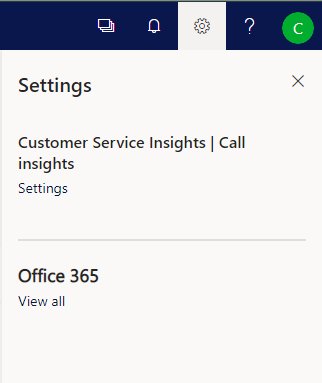
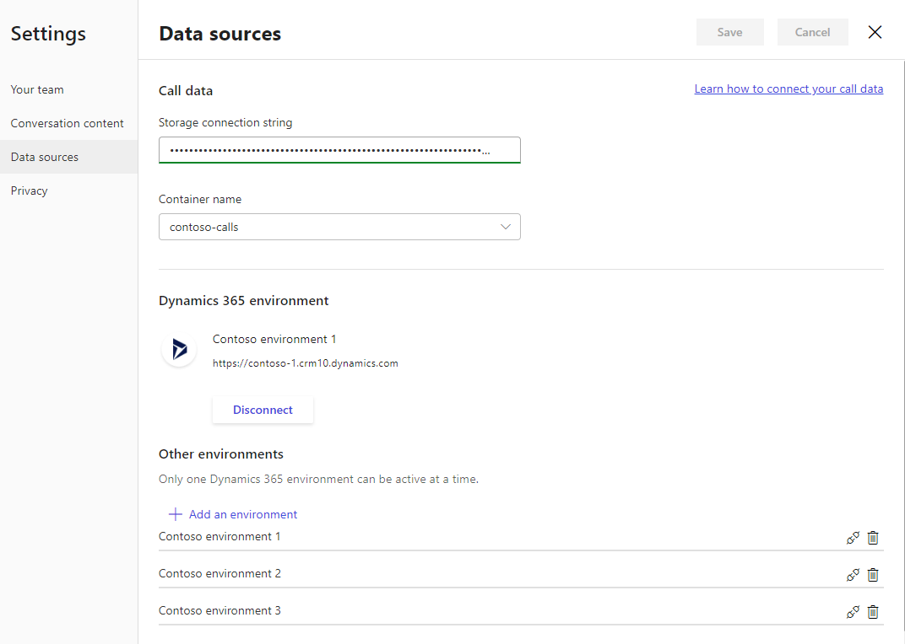

# Configure call insights to connect call data

[!INCLUDE cc-beta-prerelease-disclaimer]

Call insights in Dynamics 365 Customer Service Insights helps supervisors in your organization have an overview of the call center and drill down to get call statistics for individual agents. This helps the supervisors change the shape of the business by giving smarter coaching and enhancing performance to improve customer satisfaction.

You must have administrative privileges to configure **Call insights** for your organization. To configure **Call insights**, perform the following steps:

1. [Review the prerequisites](ci-admin-prereqs.md)

2. [Create a call recording repository](#create-call-recording-repository).

3. [Upload call recordings](#upload-call-recordings).

> [!NOTE] 
> If you want to update the storage container and connection string, see [Update configuration of call data](#update-configuration-of-call-data).

## Create call recording repository

Create a call recording repository (blob container) in an Azure storage account to help you upload the call recordings in the repository for **Call intelligence** to assess.

> [!NOTE]
> While creating the repository, ensure that the repository is created in the same region as your tenant to upload the call recordings. For example, if your tenant is in NAM (North America), ensure that you create the repository in the NAM region only.
 
1. Sign in to the Azure dashboard.

2. On the navigation pane, select **All resources**, and open the desired storage account.

    > [!div class="mx-imgBorder"]
    > 

3. From **Blob service**, select **Blobs** then **+ Container**.

    > [!div class="mx-imgBorder"]
    > 

4. Specify the container information, such as name and public access level.

5. Select **OK**.

   The container is created. To learn more, see [Create a container](/azure/storage/blobs/storage-quickstart-blobs-portal#create-a-container)<br> 

6. From **Settings**, go to **Access keys** and note the **Connection string** of the storage account. This connection string is used to connect **Call insights** to your Azure storage account.

    > [!div class="mx-imgBorder"]
    > 

Now you are ready to upload call recordings to the blob container and configure the call data for call insights.

## Upload call recordings

You can upload the recordings in audio formats, such as MP3 and WAV, in the created call recording repository (blob container) in Azure. Along with the audio format file, you must upload the corresponding metadata file in JSON format.

> [!NOTE]
> - You must have at least 10 call recording files in the call recording repository to process and display the data in **Call insights**. 
> - The **conversation-intelligence-managed** container is created and managed automatically by the application.


Review the following requirements for audio and JSON files before you upload:

- The file names for the audio and its corresponding JSON files must be the same. For example, if you name the audio file **call-recording-10-dec-2018.wav**, the corresponding JSON file should be named **call-recording-10-dec-2018.json**. 
- The file name cannot contain reserved characters, such as **!*'();:@&=+$,/?%#[]"**.
- The length of the file name should be fewer than 260 characters.
- The call recording should be a stereo type recording only.
- The JSON file parameters must be properly configured. The JSON file contains the following parameters:

  |Parameter|Description|
  |---------|-----------|
  | `AgentAADUserId` | Specifies the unique identification code of your agent. | 
  | `AgentCrmUserId` | Specifies the unique identification code of the agent in your Dynamics 365 Customer Service organization. |
  | `AgentAccountEmail`| Specifies the email account of the agent in your Dynamics 365 Customer Service organization. | 
  | | **Note**: You must use at least one parameter from `AgentAADUserId`, `AgentCrmUserId`, or `AgentAccountEmail` while creating a JSON file. When you use other parameters, ensure that the details are specific to the same agent. In the below example JSON file, we have used `AgentAADUserId`. |
  | `CreatedTimestamp`| Specifies the time at which the audio file is created in milliseconds and calculated based on the UNIX Epoch time. For example, when the audio file is **14 Dec 2018 15:00:00 GMT**, then the corresponding Epoch timestamp in milliseconds is **1544779800000**.|
  | `Locale` | Specifies the language used in the call. Currently, we support en-US, en-GB, de-DE, fr-FR, it-IT, es-ES, es-MX, ja-JP, pt-BR, and zh-CN. |
  | `Id`| Specifies the unique identification code of the call. Generate this code using the GUID generator. |
  | `StartTime` | Specifies the start time of the call in milliseconds and calculated based on the UNIX Epoch time. For example, when the call start time is **14 Dec 2018 12:39:56 GMT**, then the corresponding Epoch timestamp in milliseconds is **1544791196000**. |
  | `Direction` | Specifies whether the call is inbound or outbound. |
  | `FileName` | Specifies the name of the audio file. |
  | `Title` | Specifies the title of the call.|
  | `AgentPhoneNumber`| (Optional) Specifies the phone number of the agent.|
  | `CustomerPhoneNumber` | (Optional) Specifies the phone number of the customer whom your agent contacted. |
  | `CallOpportunityCrmId` |  (Optional) Specifies the ID (GUID) of the related opportunity entity in Dynamics 365 Customer Service. |
  | `CallLeadCrmId` |  (Optional) Specifies the ID (GUID) of the related lead entity in Dynamics 365 Customer Service. |
  | `CallAccountCrmId` |  (Optional) Specifies the ID (GUID) of the related account entity in Dynamics 365 Customer Service. |
  | `CallPhoneCallCrmId` | (Optional) Specifies the ID (GUID) of the related phone call activity entity in Dynamics 365 Customer Service. |
  | `IsAgentRecordingOnly` | (Optional) Specifies the audio file contains only the voice of your agent. The value is specified in True or False. By default, the value is False. |
  | `QueueId`| (Optional) Specifies the unique identification code for the queue. |    
  | `QueueName`| (Optional) Specifies the name of the queue in which the agent is on. |  
  | `Provider`| (Optional) Specifies the service provider of the call, such as Skype. |  
  | `Region`| (Optional) Specifies from which region the call originated, such as NA (North America). |  
  | `country`| (Optional) Specifies from which country the call originated. | 
  <!--| `fileChannelType`| (Optional) Specifies the call channel type such as OneWay or TwoWay. TwoWay represents stereo type audio.|-->
  
    The following sample is an example of JSON file format:
    ```
    {
        "AgentAADUserId": "6b105575-g55a-e611-00ka-5065f38b0211",
        "StartTime": "1554890363917",
        "Direction": "OutBound",
        "CallerPhoneNumber": "Your caller phone number",
        "CreatedTimestamp": "1554890368934",
        "CustomerPhoneNumber": "Your customer phone number",
        "FileName": "Sample.mp3",
        "IsAgentRecordingOnly": true,
        "Locale": "en-US",
        "Provider": "SkypeCTI",
        "Region": "Commercial Sales",
        "Title": "Sales call",
        "CallPhoneCallCrmId": "33840960-a186-0a0b-ae0a-db69afd6b8e5"
        "Country": "United States",
        "Id": "4a14995b-4fd0-493e-85d4-9eb48d28e799",
        "Title": "Contoso Deal",
    }
    ```
    <!--"fileChannelType": "TwoWay",-->
> [!div class="nextstepaction"] 
> [Continue with the first-run set up experience](ci-admin-fre-setup.md#administrator-setting-up-application)

## Update configuration of call data

Configuring the call data helps us to fetch the call recording from your repository and process the audio file for call analytics. The analysis includes creating transcripts and providing insights for the call recordings. To configure the call data:

1.	Open **call insights** in Customer Service Insights. 

2.	Select the settings icon on the top-right of the page and then select **Settings**.

    > [!div class="mx-imgBorder"]
    > 
 
3.	On the **Settings** page, select **Data source**. 

    > [!div class="mx-imgBorder"]
    > 
 
4.	In the **Call data** section, enter the **Storage connection** string that you configured in Azure.

    > [!div class="mx-imgBorder"]
    > 

    The list of containers that are available is displayed in the **Container name** drop-down.

5.	Select **Container name** from the list.

    > [!div class="mx-imgBorder"]
    > 

6.	Select **Save**.

The call data storage container is updated, and you can start uploading the call data into the new container.


### See also

[Overview of call insights in Dynamics 365 Customer Service Insights](ci-overview.md)

[Prerequisites to configure call insights](ci-admin-prereqs.md)

[First-run setup experience](ci-admin-fre-setup.md)


