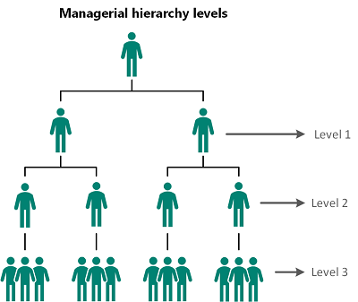
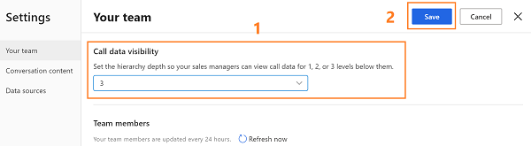
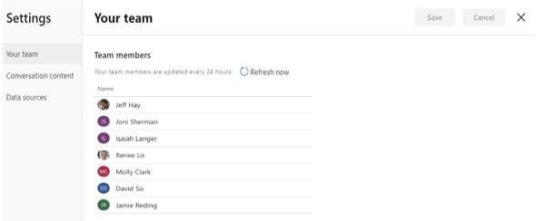

# Configure and view your team page

[!INCLUDE [cc-beta-prerelease-disclaimer](../includes/cc-beta-prerelease-disclaimer.md)]

> [!IMPORTANT]
> - [!INCLUDE[cc_preview_features_definition](../includes/cc-preview-features-definition.md)]  
> - [!INCLUDE[cc_preview_features_expect_changes](../includes/cc-preview-features-expect-changes.md)]
> - Microsoft doesn't provide support for this preview feature. Microsoft Technical Support won’t be able to help you with issues or questions. Preview features aren't meant for production use and are subject to a separate [supplemental terms of use](/dynamics365/legal/supp-dynamics365-preview).

As an administrator, you can configure the levels of hierarchy for which customer service managers can view in call insights. When configured, customer service managers will be able to view the hierarchy under **Your team**.

Let’s look at the example to understand hierarchy levels:

The matrix explains which data you’ll view as a customer service manager, for different hierarchy levels. 

> [!div class="mx-imgBorder"]
> 

| Managerial level	| View user hierarchy |
|-------------------|---------------------|
| Level 1 | Choose this option to get insights on your direct team members. |
| Level 2 | Choose this option to get insights on both your direct team members and their direct team members. |
| Level 3 | Choose this option to get insights on level 1, level 2, and level 2’s team members. |

> [!NOTE]
> Call insights supports up to three levels of hierarchy. To learn more about hierarchy, see [Set up Manager and Position hierarchies](/power-platform/admin/hierarchy-security#set-up-manager-and-position-hierarchies).

## Configure hierarchy levels

1.	Review the prerequisites. To learn more, see [Prerequisites to configure call insights](ci-admin-prereqs.md).

2.	Open the **call insights** workspace. 

3.	Select the **Settings** icon on the top-right of the page and then select **Settings**.

    > [!div class="mx-imgBorder"]
    > 

4.	On the **Settings** page, select **Your team**. 

5.	Choose the hierarchy level from the **Call data visibility** list to display team members for managers.

    > [!div class="mx-imgBorder"]
    > 

6.	Save and close the settings.

    Customer service managers can see the employees in the hierarchy levels as configured.

## View your team

As a customer service manager, when you open the Your team page in settings, you can view the list of employees who are part of your hierarchy as configured by the administrator. 

> [!NOTE]
> To view this page, customer service managers must have a manager hierarchy defined under them, with agents or individuals added to the hierarchy. Currently, only administrators can change levels of hierarchy. For customer service managers to change it, they should contact an administrator to change the hierarchy on their behalf.

1.	Open the **call insights** workspace. 

2.	Select the **Settings** icon on the top-right of the page and then select **Settings**.

    > [!div class="mx-imgBorder"]
    > 

3.	On the **Settings** page, select **Your team**. 
    
    > [!div class="mx-imgBorder"]
    > 

    The list is updated every 24 hours to display the current active agents in the manager's hierarchy. Also, you can select **Refresh now** to refresh the list right away and view any changes.

### See also

[Prerequisites to configure call insights](ci-admin-prereqs.md)

[Overview of call insights in Dynamics 365 Customer Service Insights](ci-overview.md)

[!INCLUDE[footer-include](../includes/footer-banner.md)]