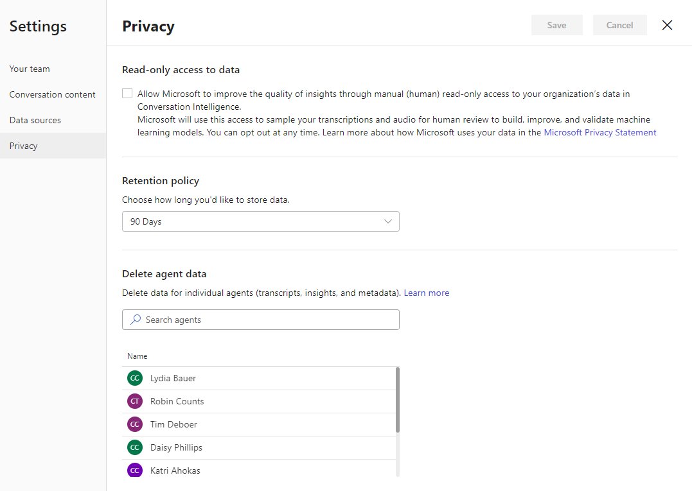
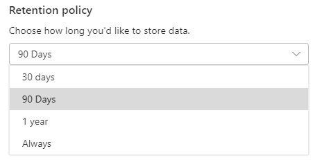

# Data retention and deletion through Privacy

[!INCLUDE cc-beta-prerelease-disclaimer]

>[!IMPORTANT]
>This feature is intended to help supervisors enhance their team’s performance. This feature is not intended for use in making, and should not be used to make, decisions that affect the employment of an employee or group of employees, including compensation, rewards, seniority, or other rights or entitlements. Customers are solely responsible for using Dynamics 365, this feature, and any associated feature or service in compliance with all applicable laws, including laws relating to accessing individual employee analytics and monitoring, recording, and storing communications with end users. This also includes adequately notifying end users that their communications with sales persons may be monitored, recorded, or stored and, as required by applicable laws, obtaining consent from end users before using the feature with them. Customers are also encouraged to have a mechanism in place to inform their sales persons that their communications with end users may be monitored, recorded, or stored.

When you configure call insights, call recordings of agents are processed and analyzed to provide necessary insights such as overall customer sentiments, sentiment trends, and identify keywords that customers have used during calls. Call insights provides the following options to configure your retention period:

-	[Retention policy](#retention-policy)

-	[Delete agent data](#delete-agent-data)

## Retention Policy

Retention policy allows you to determine how long you want to keep the analyzed call recording data in call insights by specifying a time limit. When you specify a retention time limit, the feature retains the call recording data for the specified time limit. Call insights deletes the data when the time limit is reached. 

For example, retention time limit is set 30 days. At any given time, call insights retains the call data from the time it is analyzed to 30 days. On the 31st day, the application deletes the analyzed call data.

To configure the retention policy:

1.	Review the perquisites. To learn more, see [Prerequisites to set up call insights](ci-admin-prereqs.md).

2.	Open **Call insights (Preview)**. 

3.	Select the **Settings** icon on the top-right of the page and then select **Settings**.

    > [!div class="mx-imgBorder"]
    > 
 
4.	On the **Settings** page, select **Privacy**. 
    
    > [!div class="mx-imgBorder"]
    > 
 
5.	In the **Retention policy** section, select the drop-down and choose how many days you want to retain the analyzed data. You have the following options to choose: **30 days**, **90 days**, **1 year**, or **Always**.
    
    > [!div class="mx-imgBorder"]
    > 
 
6.	Select **Save**.

Retention policy configuration is saved, and the analyzed call recording data will be retained until the selected option.

## Delete seller data

You can delete seller’s data when a seller is not reporting to you, moved to another team, leaving your organization, or seller requests to delete his data. This data includes the seller’s statistics and call history. To delete a seller’s data that you don’t want to see in your insights:

1.	Review the perquisites. To learn more, see [Prerequisites to setup Conversation Intelligence](prereq-sales-insights-app.md).

2.	Open the **Conversation Intelligence** application. 

3.	Select the **Settings** icon on the top-right of the page and then select **Settings**.

    > [!div class="mx-imgBorder"]
    > 
 
4.	On the **Settings** page, select **Privacy**. 

    > [!div class="mx-imgBorder"]
    > 
 
5.	In the **Delete seller data** section, select the seller for whom you want to delete the data and then select **Delete data**.

    > [!NOTE]
    > You can also you use the search option to find and select the seller. 

    In this example we are deleting the seller Robin Counts’s data.

    > [!div class="mx-imgBorder"]
    > 

6.	On the confirmation message, select **Delete**.

    > [!div class="mx-imgBorder"]
    > 

    The selected seller data is deleted from Conversation Intelligence.

    > [!div class="mx-imgBorder"]
    > 

To learn more on Microsoft Dynamics 365 and GDPR, see [Microsoft Dynamics 365 and GDPR](https://docs.microsoft.com/dynamics365/get-started/gdpr/index).

### See also

[Discover insights about AI-based call data](ci-overview.md)

[Prerequisites to use call insights](ci-admin-prereqs.md)

[First-run setup experience](ci-admin-fre-setup.md)

[Configure call insights to connect call data](ci-admin-config-call-data.md)

[Configure keywords and products to track](ci-admin-config-keywords-products.md)

[Connect to Dynamics 365 Customer Service environment](ci-connect-customer-service-env.md)
