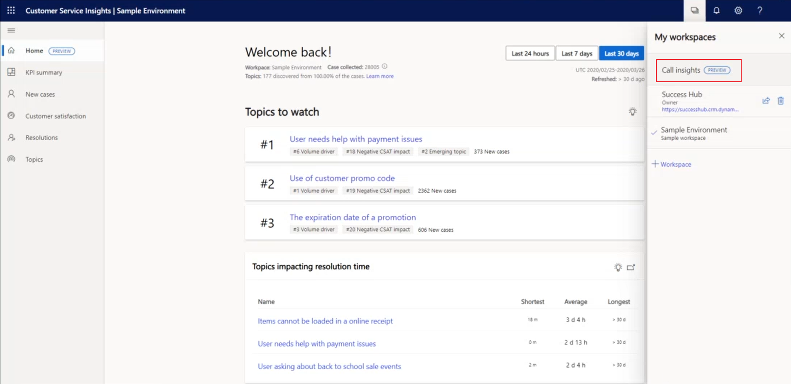
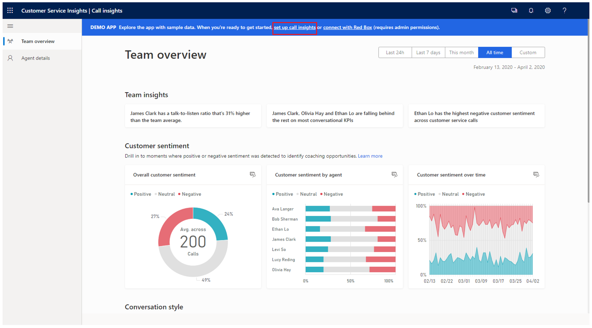
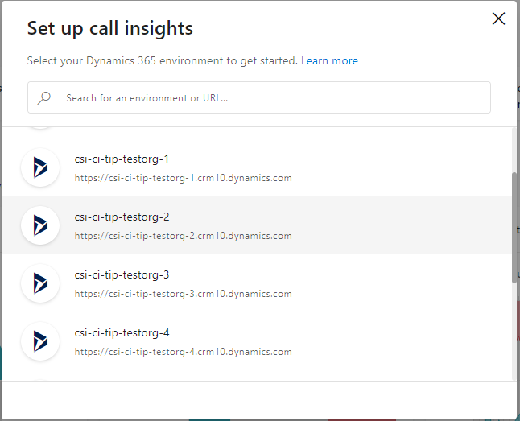

# Improve supervisor coaching and agent experience with call insights

The call insights feature in Dynamics 365 Customer Service Insights uses analytics and data science to gather data from agents’ call recordings. Call insights analyzes the data to provide you with the information and insights to intelligently manage your team and proactively coach agents. To achieve this, call insights displays relevant key performance indicators (KPIs) and intelligent call data KPIs by team, agent, and call.

Call insights is designed to help supervisors and agents in their day-to-day jobs, providing the tools they need to track their performance in calls with leads and customers.

**As a supervisor, you can:**

-	View and compare what’s happening in agent calls and get insights into best practices by learning more about the behaviors of your top agents. 

-	View your team’s performance with insights, customer sentiment, and conversational style.

-	View and understand each individual agent’s conversation style, customer sentiment, insights, and call history. 

-	Listen to calls, read transcripts, see possible action items, and view business-critical insights.

**As an administrator, you can:**

-	Configure tracked keywords that your supervisors want to track for their teams’ calls with customers.

-	Configure how long you want to retain a team’s or individual agent’s data from your organization.

-	Manage environments and configure call data.

-	Monitor call and insight processing data.

-	Configure the levels of hierarchy for which supervisorss can view the call data.

The next sections describe:

- Recommendations for using call insights

- How to access call insights

## Recommendations before using call insights

Before you start using call insights, we suggest you review the following requirements for effective use:

-	Verify that you have a subscription to Microsoft Dynamics 365 Customer Service Insights. To learn more, see [About licensing and license management](https://docs.microsoft.com/power-platform/admin/wp-license-management). 

-	As an administrator, verify that the proper hierarchy is defined for you, and that supervisors or agents are added to it. 

## How to access call insights

As an administrator, you must configure call insights so users (supervisors and agents) can see the relevant organization and call data. 

As a user (supervisor or agent), when you sign in to the application for the first time, you might see the following:

- **Sample data**: This occurs if the administrator hasn't configured call insights for you. The sample data helps you to explore the features and functionalities so you can shorten your learning curve.

- **Relevant organization and call data**: You’ll be able to view your organization’s data if the administrator has configured the call insights feature for you.

The following procedure explains how to access call insights:

1.	Sign in to the Dynamics 365 Customer Service Insights application.

2.	Select **My workspaces** > **Call insights (preview)**.

    > [!div class="mx-imgBorder"]
    > 

3.	If you are viewing call insights for the first time, you will see a banner-type message at the top that is prefaced with **DEMO APP: Explore the app with sample data.** To set up call insights, select the **set up call insights** link in the banner message.

    > [!div class="mx-imgBorder"]
    > 
    
4.	Select your Dynamics 365 environment to connect to. This helps to compute and consolidate the necessary insights about your team.

    > [!div class="mx-imgBorder"]
    > 

5.	In the **Terms and conditions** dialog box, accept the terms and conditions and then select **Agree and continue**.

    > [!div class="mx-imgBorder"]
    > 

	The application validates your credentials and gives you further instructions, depending on your role. If you have an administrator role assigned to you, you can proceed with configuring call insights. To learn more, see [First-run setup experience](fre-setup-sales-insight-app.md).
    
    If you don't have the administrator role assigned to you, a status message is displayed on the top of the page, requesting that you contact your administrator to configure the feature. You can continue using call insights (with the demo data to explore the features and functionalities) until your administrator configures the feature.

### See also

[Administer call insights](intro-admin-guide-sales-insights.md#administer-conversation-intelligence)

[View overall agent insights](dynamics365-sales-insights-app-home-page.md)
