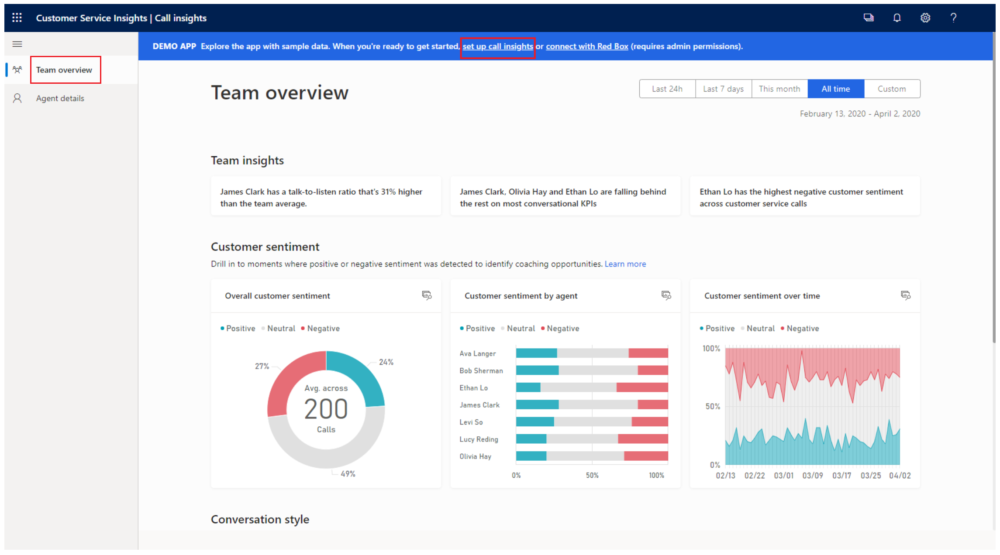

# Analyze overall team's behavior on customer calls

[!INCLUDE cc-beta-prerelease-disclaimer]

Customer Service calls are one of the most important part of your business, as these calls help you to change the shape of your business by improving customer satisfaction. The **Team overview** page in call insights helps supervisors analyze the overall behavior of their team during customer calls. This helps in identifying coaching scenarios for the team to increase customer satisfaction and activity gains for the business.

As a supervisor, these KPIs and insights help you to: 

- Assess overall customer sentiments and sentiment trends.
  
- Assess your team's contributions toward customer sentiment.

- Gain insight into what’s going on with your team.

- Analyze your team's conversational style.

To view the **Team overview** page, sign in to  **Call insights (Preview)**, then select **Team overview**. 

> [!div class="mx-imgBorder"]
> 

|KPI/Insights|Description|
|------------|-----------|
|**1. Date filter**|Provides a time period for which you can your team's call data and insight.|
|**2. Team insights**|Displays what’s happening in your team and the latest trends, such as which agents are scoring high in customer satisfaction as well as those who might need coaching based on the customer sentiments they are generating and keywords that are trending.|
|**3. Customer sentiment**|• **Overall customer sentiment:** Specifies the customer sentiment in percentage—positive, negative, or neutral. •	**Customer sentiment over time:** Displays how the three customer sentiments (positive, negative, and neutral) are spanning across the specified timeframe.  •	**Customer sentiment by agent:** Specifies how each of your agents contributed toward generating the overall customer sentiment. Also shows which agents have the highest or lowest contributions.|
|**4. Conversation style**|• **Talk to listen ratio:** Specifies the average listen and talk ratio of agents in conversations with customers. •	**Talking speed:** Displays the average number of words used per minute by agents.  • **Switches per hour:** Displays the average switches between an agent and customer in a conversation, meaning the amount of times the conversation switched from one person to another. This is a sign of engagement during conversations. • **Pause before speaking:** Displays how many milliseconds the agent paused before responding to customer queries; this is a signal of patience by the agent. • **Longest customer monologue:** Displays the longest length of speech without a break by the customer with an agent in seconds; this is a signal that agents are asking good questions and showing understanding of customer needs.|

### See also

[Overview of call insights](ci-overview.md)

[Prerequisites to use call insights](ci-admin-prereqs.md)

[First-run setup experience](ci-admin-fre-setup.md)
