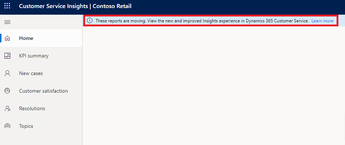
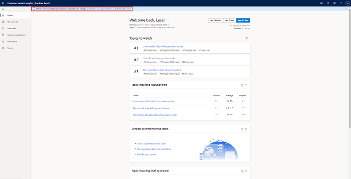
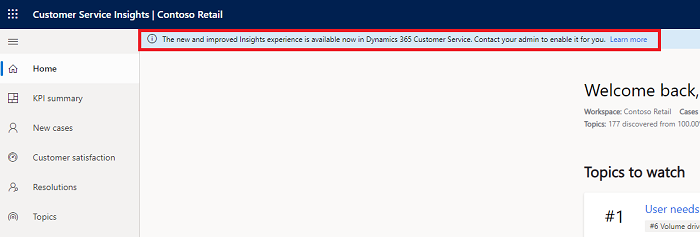

# Redirection messaging for Customer Service Insights

Customer Service Insights capabilities are becoming deeply integrated into the D365 Customer Service agent and manager experiences instead of through the current standalone Customer Service Insights application. As a result, you may see any of the following banner messages in your standalone application workspaces:

#### Banner Message: "These reports are moving. View the new and improved Insights experience in Dynamics 365 Customer Service."

**Explanation**: We've identified that you've either only interacted with the sample workspace previously or don't have access to the core Dynamics 365 Customer Service apps.

#### Banner Message: "The new and improved Customer Service Insights experience is available now. Navigate to Dynamics 365 Customer Service to try it out."

**Explanation**: We've identified that the workspace you've provisioned is available in one of the core Dynamics 365 Customer Service applications. Navigate there to try out the latest features.

#### Banner Message: "The new and improved Customer Service Insights experience is available now in Dynamics 365 Customer Service. Contact your admin to enable it for you."

**Explanation**: We've identified that the environment you've connected this workspace to has access to the latest insights experience. The integrated experience requires an admin to opt in to make the reports available. We recommend that you ask your admin to enable it for you.

