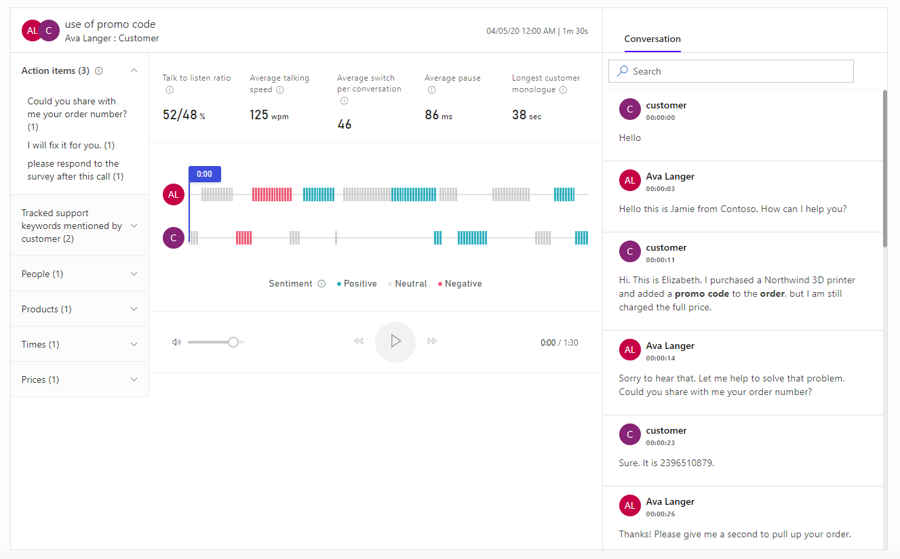

# View and understand call summary  

[!INCLUDE [cc-beta-prerelease-disclaimer](../includes/cc-beta-prerelease-disclaimer.md)]

Agents and their supervisors need an easy way to review their conversations with their customers and quickly find relevant talking points, keywords, and insights.

The call summary page provides a high-level view of how the call went, and includes signals (such as identified action items and relevant keywords mentioned), the call timeline, a transcript, and more.

The information on the call summary page helps:

- Agents quickly ramp up on past conversations with customers and highlight important topics and commitments.

- Supervisors get a high-level view of how their team is managing their relationships with customers.

## Understand the call summary page

The following image is an example of the call summary page:

> [!div class="mx-imgBorder"]
> 

Let's look at the KPIs and insights on the call summary page in detail:

**Call details**: Displays the names of the participants, the subject of call, and time when the phone call happened.

**Signals pane**: Displays relevant talking points that were mentioned during the call:

   -	**Action items**: Displays the list of actionable items mentioned during the call; for example, **I'll send you an email** or **I'll follow up with Michelle tomorrow**. When you select an action item, you can see where it was mentioned on the timeline.

   -	**Tracked support keywords mentioned by customer**: Displays keywords mentioned during the call. When you select a keyword, you can see where it was mentioned on the timeline.

   -	**People**: Displays the names of people mentioned during the call; for example, **Sarah** calling from Contoso. When you select a name, you can see where it was mentioned on the timeline.

   -	**Products**: Displays the names of the products mentioned during the call; for example, I only know how to use a **Fabrikam LED TV**. When you select a product, you can see where it was mentioned on the timeline.

   -	**Times**: Displays times mentioned during the call; for example, let’s talk next **week**. When you select a time, you can see where it was mentioned on the timeline.

   -	**Prices**: Displays prices mentioned during the call; for example, the product will cost **$50**. When you select a price, you can see where it was mentioned on the timeline.

**Core conversation information**: Displays metrics such as average talking speed, switch per conversations, average pause, and longest customer monologue.

**Call playback timeline**: Displays the call playback timeline with the sentiments highlighted (such as positive, neutral, and negative). You can go to a specific moment on the call by clicking on the timeline. The call transcript (on the right) will automatically scroll to that moment in the call. You can also pause the call, rewind, forward, and adjust volume as required. 

**Call transcript**: Provides a written record of the call. As a manager, you can review the transcript and leave a comment (for example, suggesting how the seller could possibly handle such a situation in the future). 

   As a seller, you can review the transcript and comments that are posted by your manager or coach on the timeline. You can provide replies to the comments appropriately.

   On a selected timeline, select **Add comment** to provide necessary replies or self-comments, and then select **Save**. 

   The bolded text in the transcript are the brands, tracked keywords, and products mentioned in the conversation. 

### See also

## [Overview of call insights](ci-overview.md)

## [Prerequisites to use call insights](ci-admin-prereqs.md)

## [First-run setup experience](ci-admin-fre-setup.md)

## [Configure keywords and products to track](ci-admin-config-keywords-products.md)

## [Analyze overall team performance](ci-team-overview.md)

## [Analyze agent performance](ci-agent-overview.md)
