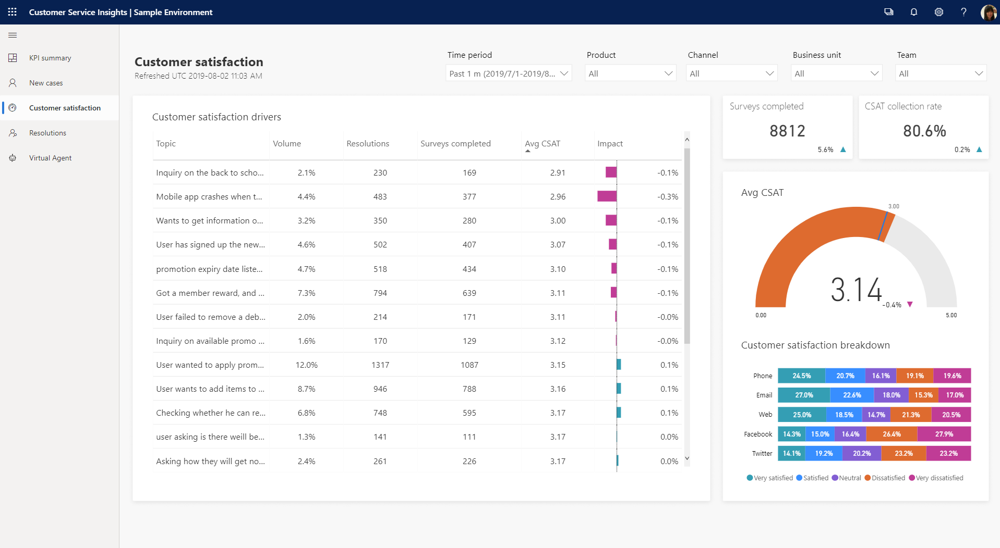
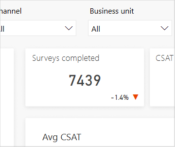
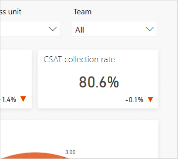
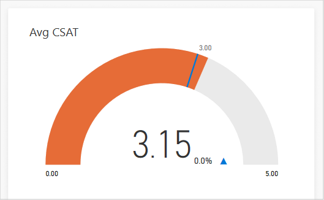
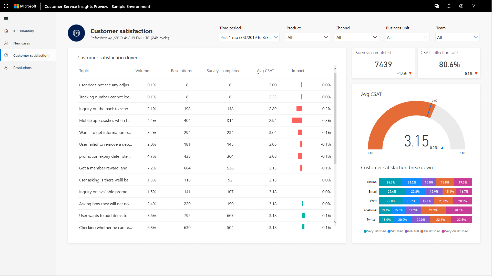
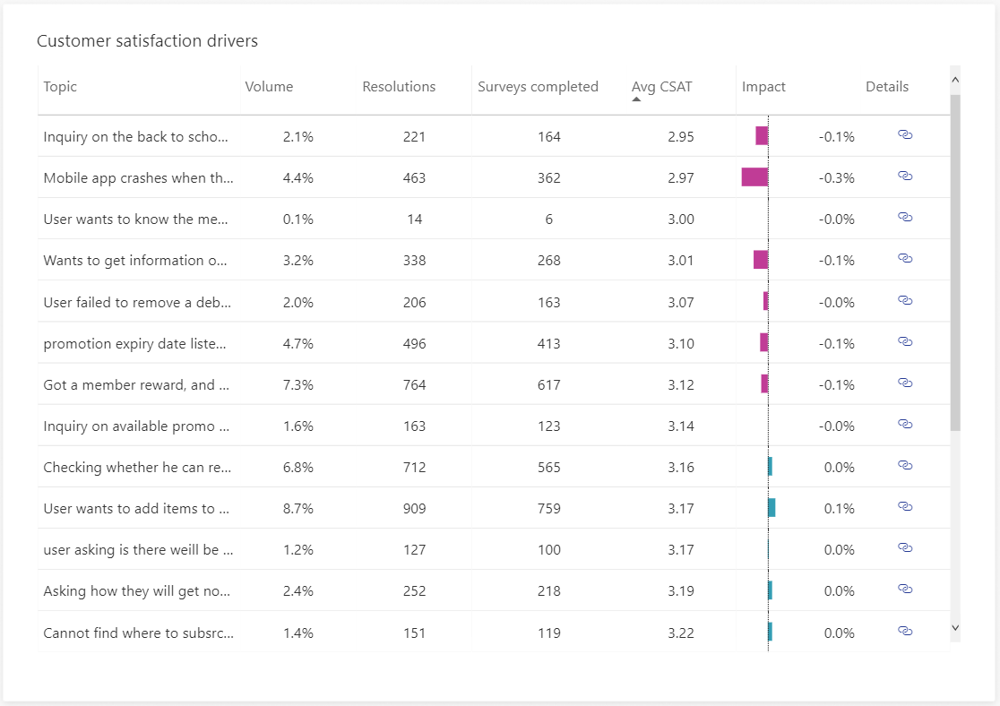

# Customer satisfaction dashboard

> 

The Customer satisfaction dashboard gives you an overview of customer satisfaction (CSAT), including using artificial intelligence (AI) technology to show you topics that are having the greatest impact on CSAT scores.

The Customer satisfaction dashboard includes a variety of charts with graphical views of your system's customer satisfaction data. For information about each chart, click the link for the chart in the following list or scroll to locate the chart later in this topic.

* [Surveys completed](#surveys-completed-chart)
* [CSAT collection rate](#csat-collection-rate-chart)
* [Average CSAT](#average-csat-chart)
* [Customer satisfaction breakdown](#customer-satisfaction-breakdown)
* [Customer satisfaction drivers (AI Insights)](#customer-satisfaction-drivers-chart)

The Customer satisfaction drivers chart uses natural language understanding to group support cases as *topics* that are a collection of related cases. This chart shows you the customer support topics that are having the most impact on customer satisfaction, helping you identify areas to focus on that will make the greatest impact on improving the customer's experience.

By default, the dashboard shows you key performance indicators for the past month and for all products, channels, business units, and teams in your system. To change the time period, select a value from the **Time Period** drop-down list at the top of the dashboard. You can select past day, past week, or past month.

To filter data by product, channel, business unit, or team, select a value from the **Product**, **Channel**, **Business Unit**, or **Team** drop-down list. If you switch to a different dashboard, the filter you specify persists and is applied to the data on all dashboards. For more information on working with filters, see [Work with Customer Service Insights dashboards](use-dashboard-sample-data.md).

## Surveys completed chart

> 

The Surveys completed chart shows the total number of customer satisfaction surveys completed during the specified time period and the percent change over the period.

Description | Details
----------- | -------
Total surveys completed | The number of completed customer satisfaction (CSAT) surveys

A blue up-and-down indicator next to the value indicates the percent change in a positive direction. A red indicator indicates the percent change in a negative direction.

## CSAT collection rate chart

> 

The CSAT collection rate chart shows the percentage of customer-satisfaction surveys completed during the specified time period and the percent change over the period.

Description | Details
----------- | -------
CSAT collection rate | The number of completed customer-satisfaction surveys divided by the total number of surveys

A blue up-and-down indicator next to the value indicates the positive percent change in that direction. A red indicator indicates a negative percent change.

## Average CSAT chart

> 

The Average CSAT chart shows the average customer satisfaction survey score during the specified time period, where that score falls on the satisfaction scale used in the survey, and the percent change over the period.

Description | Details
----------- | -------
Average CSAT | The sum of CSAT scores divided by the count of resolved cases that have CSAT values

A blue up-and-down indicator next to the value indicates the positive percent change in that direction. A red indicator indicates a negative percent change.

## Customer satisfaction breakdown

> 

The Customer satisfaction breakdown chart shows the breakdown of customer satisfaction by support channel during the specified time period.

Description | Details
----------- | -------
Customer satisfaction breakdown | CSAT score breakdown by support channel

## Customer satisfaction drivers chart

> 

The Customer satisfaction drivers chart uses artificial intelligence technology to group related support cases as support topics and then display topics in the order of impact they are having on customer satisfaction.

Description | Details
----------- | -------
Topic | Artificial intelligence clustering of cases based on language understanding applied to case titles
Volume | The number of cases associated with the topic divided by total cases
Resolutions | The number of resolved cases associated with the topic
Surveys completed | The count of resolved cases associated with the topic that have CSAT values
Average CSAT | The sum of CSAT scores associated with the topic divided by the count of resolved cases associated with the topic that have CSAT values
Impact | 1 – (Average CSAT score not including the current topic divided by overall average CSAT score for all topics)

The chart displays the impact as a red or blue-green bar. The midpoint is the overall average CSAT score. A red bar indicates that the topic's CSAT score is lower than the average CSAT score, resulting in a negative impact on overall customer satisfaction. A blue-green bar indicates that the CSAT score is higher, resulting in a positive impact on overall customer satisfaction. Improving customer satisfaction for the top CSAT topics in red will have the greatest impact on improving overall customer satisfaction.

To see additional information about each topic, right-click the topic name, hover over **Drillthrough**, and then select **Topic drillthrough** to display the Topic details dashboard. For more information, see [Topic details dashboard](dashboard-topic-details.md).
