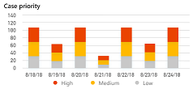
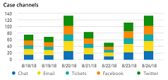
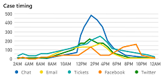
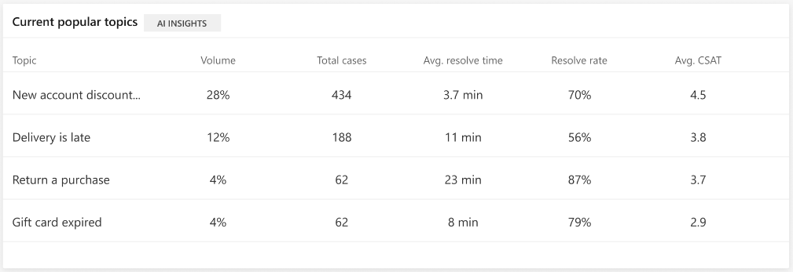
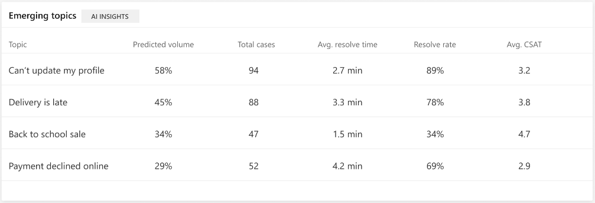

# New cases dashboard​

> [!div class="mx-imgBorder"]
> 

The New cases dashboard gives you an overview of the new cases in your customer service system, including using artificial intelligence (AI) technology to help you identify emerging issues.

The New cases dashboard includes a variety of charts with graphical views of your system's incoming support cases. For information about each chart, click the link for the chart in the following list, or scroll down to the chart's section below.

* [Case priority](#case-priority-chart)
* [Case channel](#case-channel-chart)
* [Case timing](#case-timing-chart)
* [Current popular topics (AI Insights)](#current-popular-topics-chart)
* [Emerging topics (AI Insights)](#emerging-topics-chart)

The *Current popular topics* and *Emerging topics* charts use natural language understanding artificial intelligence technology to group support cases as *topics* that are a collection of related cases. These charts show you the new customer support topics that are generating the most case volume, and the topics that are showing the biggest change in volume. This can help you identify emerging issues in your system.

By default, the dashboard shows you key performance indicators for the last month, and for all products, channels, business units, and teams in your system. To change the time period, select a value from the Time Period drop-down list at the top of the dashboard. You can select either last day, last week, or last month.

To filter data by product, channel, business unit, or team, select a value from the Product, Channel, Business Unit, or Team drop-down list. For more information on working with filters, see [Work with AI for Customer Service Insights dashboards](use-dashboard-sample-data.md).

## Case priority chart

> [!div class="mx-imgBorder"]
> 

The case priority chart shows the breakdown in new support cases each day in the specified time period between high, medium, and low priority cases.

Description | Details
----------- | -------
Case priority | *Daily incoming case breakdown by case priority*

## Case channel chart

> [!div class="mx-imgBorder"]
> 

The case channel chart shows the breakdown in new support cases each day in the specified time period between different support channels.

Description | Details
----------- | -------
Case channel | *Daily incoming case breakdown by channel*

## Case timing chart

> [!div class="mx-imgBorder"]
> 

The case timing chart shows the trends in the time of day of new support cases for each channel during the time period.

Description | Details
----------- | -------
Case timing | *Incoming case breakdown by channel and time of day*

## Current popular topics chart

> [!div class="mx-imgBorder"]
> 

The current popular topics chart uses artificial intelligence technology to group related incoming support cases as support topics, and then display topics in order of volume over the specified time period.

Description | Details
----------- | -------
Topic | *Artificial intelligence clustering of cases based on language understanding applied to case titles*
Volume | *The new cases associated with this topic divided by total new cases*
Number of cases | *The new cases associated with this topic*
Volume change | *The incoming volume of cases associated with this topic in the current period minus the incoming volume of cases associated with this topic in the previous period*
Average resolve time | *The average resolution time of resolved new cases associated with this topic*
Resolve rate | *The resolved new cases associated with this topic divided by the total new cases associated with this topic*
Average CSAT  | *The sum of CSAT scores associated with this topic divided by the count of resolved cases associated with this topic that have CSAT values*

To see additional information about each topic, right-click the topic name, hover over **Drillthrough**, and then select **Topic Drill Through** to display the Topic Details dashboard. For more information, see [Topic details dashboard](dashboard-topic-details.md).

## Emerging topics chart

> [!div class="mx-imgBorder"]
> 

The emerging topics chart uses artificial intelligence technology to group related incoming support cases as support topics, and then display the topics in order of the change in volume over the specified time period.

Description | Details
----------- | -------
Topic | *Artificial intelligence clustering of cases based on language understanding applied to case titles*
Volume | *The percent change in volume over the specified time period*
Number of cases | *The new cases associated with this topic*
Volume change | *The incoming volume of cases associated with this topic in the current period minus the incoming volume of cases associated with this topic in the previous period*
Average resolve time | *The average resolution time of resolved new cases associated with this topic*
Resolve rate | *The resolved new cases associated with this topic divided by the total new cases associated with this topic*
Average CSAT  | *The sum of CSAT scores associated with this topic divided by the count of resolved cases associated with this topic that have CSAT values*

To see additional information about each topic, right-click the topic name, hover over **Drillthrough**, and then select **Topic Drill Through** to display the Topic Details dashboard. For more information, see [Topic details dashboard](dashboard-topic-details.md).
